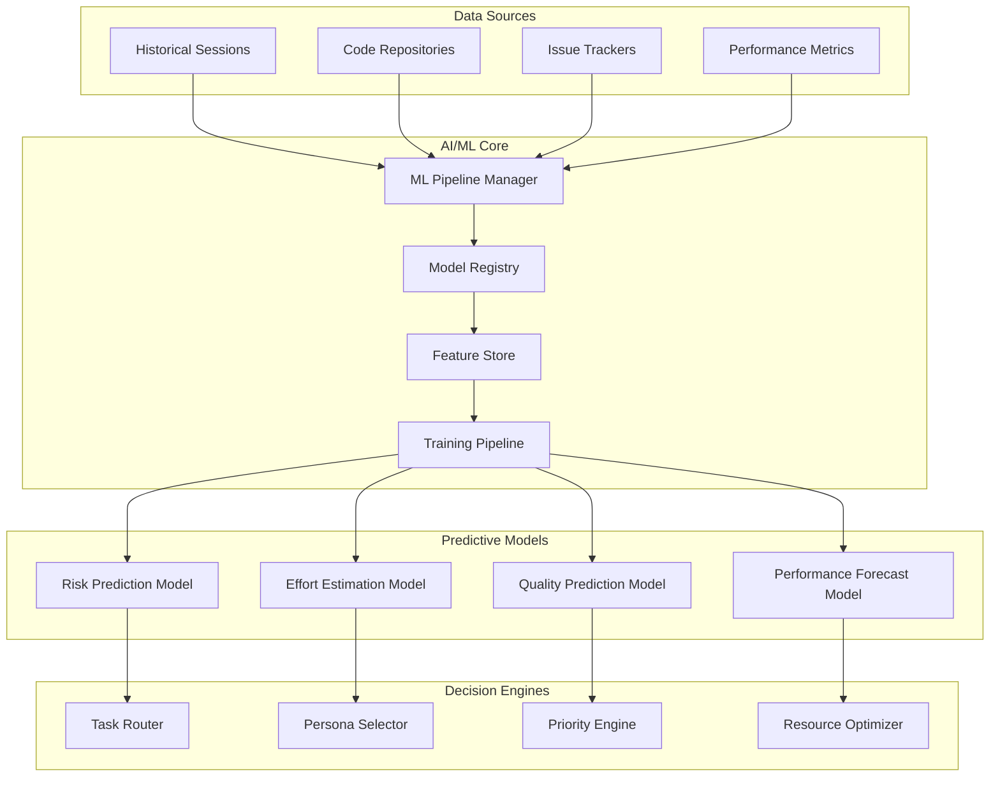

# AI/ML Features

This guide covers advanced artificial intelligence and machine learning capabilities built into the APM framework for intelligent automation and predictive analytics.

## Overview

APM's AI/ML features provide:
- **Predictive Analytics** for project outcomes and risk assessment
- **Intelligent Task Routing** based on complexity and team capabilities
- **Anomaly Detection** for quality and performance issues
- **Natural Language Processing** for requirement analysis and documentation
- **Machine Learning Models** for effort estimation and optimization
- **Automated Decision Making** with explainable AI principles

## AI/ML Architecture

### Intelligent Agent Framework



### Model Architecture

```python
class APMMLFramework:
    """Core AI/ML framework for APM intelligence"""
    
    def __init__(self, config):
        self.model_registry = ModelRegistry(config['models'])
        self.feature_store = FeatureStore(config['features'])
        self.ml_pipeline = MLPipelineManager(config['pipeline'])
        self.inference_engine = InferenceEngine(config['inference'])
        
    def initialize_models(self):
        """Initialize and load all AI/ML models"""
        models = {
            'risk_predictor': self._load_risk_prediction_model(),
            'effort_estimator': self._load_effort_estimation_model(),
            'quality_forecaster': self._load_quality_forecasting_model(),
            'anomaly_detector': self._load_anomaly_detection_model(),
            'nlp_processor': self._load_nlp_model(),
            'optimization_engine': self._load_optimization_model()
        }
        
        for name, model in models.items():
            self.model_registry.register(name, model)
            
        return models
        
    def predict_project_risk(self, project_data):
        """Predict project risk using ML models"""
        features = self.feature_store.extract_risk_features(project_data)
        risk_score = self.model_registry.get('risk_predictor').predict(features)
        
        return {
            'risk_score': float(risk_score[0]),
            'confidence': float(risk_score[1]),
            'risk_factors': self._explain_risk_factors(features, risk_score),
            'mitigation_recommendations': self._generate_risk_mitigation(risk_score)
        }
        
    def estimate_effort(self, task_description, context):
        """Estimate task effort using ML models"""
        features = self.feature_store.extract_effort_features(
            task_description, context
        )
        effort_estimate = self.model_registry.get('effort_estimator').predict(features)
        
        return {
            'estimated_hours': float(effort_estimate[0]),
            'confidence_interval': [
                float(effort_estimate[1]), 
                float(effort_estimate[2])
            ],
            'complexity_factors': self._analyze_complexity(features),
            'historical_similar_tasks': self._find_similar_tasks(features)
        }
```

## Predictive Analytics

### 1. Project Risk Prediction

#### Risk Assessment Model

```python
class ProjectRiskPredictor:
    """ML model for predicting project success and risk factors"""
    
    def __init__(self):
        self.model = self._load_trained_model()
        self.feature_extractors = self._initialize_feature_extractors()
        self.risk_thresholds = self._load_risk_thresholds()
        
    def assess_project_risk(self, project_data):
        """Comprehensive project risk assessment"""
        
        # Extract multiple feature categories
        features = {
            'team_features': self._extract_team_features(project_data),
            'technical_features': self._extract_technical_features(project_data),
            'historical_features': self._extract_historical_features(project_data),
            'external_features': self._extract_external_features(project_data)
        }
        
        # Combine features for prediction
        combined_features = self._combine_feature_vectors(features)
        
        # Generate prediction with uncertainty quantification
        prediction = self.model.predict_with_uncertainty(combined_features)
        
        risk_assessment = {
            'overall_risk_score': prediction['risk_score'],
            'risk_category': self._categorize_risk(prediction['risk_score']),
            'confidence': prediction['confidence'],
            'risk_breakdown': {
                'team_risk': prediction['team_risk'],
                'technical_risk': prediction['technical_risk'],
                'schedule_risk': prediction['schedule_risk'],
                'quality_risk': prediction['quality_risk']
            },
            'key_risk_factors': self._identify_top_risk_factors(features, prediction),
            'recommendations': self._generate_risk_recommendations(prediction),
            'mitigation_strategies': self._suggest_mitigation_strategies(prediction)
        }
        
        return risk_assessment
        
    def _extract_team_features(self, project_data):
        """Extract team-related risk features"""
        team_data = project_data.get('team', {})
        
        return {
            'team_size': len(team_data.get('members', [])),
            'experience_avg': np.mean([m.get('experience_years', 0) for m in team_data.get('members', [])]),
            'skill_diversity': self._calculate_skill_diversity(team_data),
            'past_collaboration': self._assess_past_collaboration(team_data),
            'workload_distribution': self._analyze_workload_distribution(team_data),
            'team_stability': self._calculate_team_stability(team_data)
        }
        
    def _extract_technical_features(self, project_data):
        """Extract technical complexity risk features"""
        technical_data = project_data.get('technical', {})
        
        return {
            'architecture_complexity': self._assess_architecture_complexity(technical_data),
            'technology_maturity': self._assess_technology_maturity(technical_data),
            'integration_complexity': self._assess_integration_complexity(technical_data),
            'performance_requirements': self._assess_performance_requirements(technical_data),
            'security_requirements': self._assess_security_requirements(technical_data),
            'scalability_requirements': self._assess_scalability_requirements(technical_data)
        }
```

#### Predictive Dashboards

```yaml
# Risk prediction dashboard configuration
risk_dashboard:
  widgets:
    - type: "risk_heatmap"
      title: "Project Risk Heatmap"
      data_source: "ml_predictions"
      refresh_interval: "1h"
      dimensions: ["team", "technology", "timeline"]
      
    - type: "trend_analysis"
      title: "Risk Trend Analysis"
      data_source: "historical_predictions"
      timeframe: "6_months"
      metrics: ["overall_risk", "team_risk", "technical_risk"]
      
    - type: "early_warning"
      title: "Early Warning System"
      data_source: "real_time_monitoring"
      alert_thresholds:
        high_risk: 0.8
        medium_risk: 0.6
        low_risk: 0.3
        
  automated_actions:
    - condition: "risk_score > 0.85"
      action: "escalate_to_management"
      notification: "immediate"
      
    - condition: "risk_trend_increasing AND risk_score > 0.7"
      action: "recommend_intervention"
      notification: "daily_summary"
```

### 2. Quality Prediction and Optimization

#### Quality Forecasting Model

```python
class QualityPredictor:
    """ML model for predicting code quality and defect likelihood"""
    
    def __init__(self):
        self.defect_model = self._load_defect_prediction_model()
        self.quality_model = self._load_quality_assessment_model()
        self.performance_model = self._load_performance_prediction_model()
        
    def predict_code_quality(self, code_changes, context):
        """Predict code quality metrics for changes"""
        
        # Extract code metrics
        code_metrics = self._extract_code_metrics(code_changes)
        
        # Extract contextual features
        context_features = self._extract_context_features(context)
        
        # Combine features
        features = {**code_metrics, **context_features}
        
        # Generate predictions
        predictions = {
            'defect_probability': self.defect_model.predict_proba(features)[0][1],
            'maintainability_score': self.quality_model.predict(features)[0],
            'performance_impact': self.performance_model.predict(features)[0],
            'technical_debt_increase': self._estimate_technical_debt(features),
            'review_complexity': self._estimate_review_effort(features)
        }
        
        # Generate recommendations
        recommendations = self._generate_quality_recommendations(predictions, features)
        
        return {
            'predictions': predictions,
            'recommendations': recommendations,
            'confidence_scores': self._calculate_confidence_scores(predictions),
            'explanation': self._explain_predictions(features, predictions)
        }
        
    def optimize_testing_strategy(self, project_data):
        """Optimize testing strategy using ML insights"""
        
        # Analyze historical test data
        test_history = self._analyze_test_history(project_data)
        
        # Identify high-risk areas
        risk_areas = self._identify_high_risk_areas(project_data)
        
        # Optimize test allocation
        optimal_strategy = {
            'unit_test_coverage': self._optimize_unit_test_coverage(risk_areas),
            'integration_test_focus': self._optimize_integration_tests(risk_areas),
            'e2e_test_scenarios': self._optimize_e2e_tests(risk_areas),
            'performance_test_plan': self._optimize_performance_tests(risk_areas),
            'security_test_priorities': self._optimize_security_tests(risk_areas)
        }
        
        return optimal_strategy
        
    def _extract_code_metrics(self, code_changes):
        """Extract comprehensive code metrics"""
        metrics = {}
        
        for file_change in code_changes:
            file_metrics = {
                'cyclomatic_complexity': self._calculate_cyclomatic_complexity(file_change),
                'lines_of_code': len(file_change['lines']),
                'code_churn': self._calculate_code_churn(file_change),
                'function_count': self._count_functions(file_change),
                'class_count': self._count_classes(file_change),
                'comment_ratio': self._calculate_comment_ratio(file_change),
                'duplication_ratio': self._calculate_duplication_ratio(file_change)
            }
            
            metrics[file_change['filename']] = file_metrics
            
        return self._aggregate_file_metrics(metrics)
```

### 3. Intelligent Task Routing

#### Smart Task Assignment

```python
class IntelligentTaskRouter:
    """AI-powered task routing and assignment system"""
    
    def __init__(self):
        self.skill_model = self._load_skill_matching_model()
        self.workload_model = self._load_workload_optimization_model()
        self.preference_model = self._load_preference_learning_model()
        
    def route_task(self, task, available_personas, team_context):
        """Intelligently route task to optimal persona"""
        
        # Analyze task characteristics
        task_features = self._extract_task_features(task)
        
        # Analyze persona capabilities
        persona_capabilities = self._analyze_persona_capabilities(available_personas)
        
        # Consider team context
        team_features = self._extract_team_features(team_context)
        
        # Calculate match scores
        routing_scores = {}
        for persona in available_personas:
            score = self._calculate_routing_score(
                task_features, persona_capabilities[persona], team_features
            )
            routing_scores[persona] = score
            
        # Select optimal persona
        optimal_persona = max(routing_scores.keys(), key=lambda k: routing_scores[k])
        
        routing_result = {
            'recommended_persona': optimal_persona,
            'confidence': routing_scores[optimal_persona]['confidence'],
            'reasoning': routing_scores[optimal_persona]['reasoning'],
            'alternative_options': self._get_alternative_options(routing_scores),
            'estimated_completion_time': routing_scores[optimal_persona]['estimated_time'],
            'success_probability': routing_scores[optimal_persona]['success_probability']
        }
        
        return routing_result
        
    def optimize_parallel_execution(self, task_list, available_resources):
        """Optimize parallel task execution using AI"""
        
        # Analyze task dependencies
        dependency_graph = self._build_dependency_graph(task_list)
        
        # Estimate task durations
        duration_estimates = {}
        for task in task_list:
            duration_estimates[task['id']] = self._estimate_task_duration(task)
            
        # Optimize scheduling
        optimal_schedule = self._solve_scheduling_optimization(
            dependency_graph, duration_estimates, available_resources
        )
        
        return {
            'execution_plan': optimal_schedule,
            'estimated_total_time': optimal_schedule['total_duration'],
            'resource_utilization': optimal_schedule['resource_usage'],
            'parallelization_factor': optimal_schedule['parallelization_ratio'],
            'bottleneck_analysis': optimal_schedule['bottlenecks']
        }
        
    def learn_from_outcomes(self, task_id, actual_outcome):
        """Learn from task outcomes to improve future routing"""
        
        # Collect outcome data
        outcome_data = {
            'task_id': task_id,
            'predicted_persona': self._get_prediction_for_task(task_id),
            'actual_persona': actual_outcome['persona'],
            'predicted_duration': self._get_duration_prediction(task_id),
            'actual_duration': actual_outcome['duration'],
            'quality_score': actual_outcome['quality_score'],
            'success': actual_outcome['success']
        }
        
        # Update models with new data
        self._update_routing_model(outcome_data)
        self._update_duration_model(outcome_data)
        self._update_quality_model(outcome_data)
        
        # Retrain if enough new data
        if self._should_retrain():
            self._retrain_models()
```

## Natural Language Processing

### 1. Requirement Analysis

#### NLP-Powered Requirement Processing

```python
class RequirementAnalyzer:
    """NLP system for analyzing and processing requirements"""
    
    def __init__(self):
        self.nlp_model = self._load_nlp_model()
        self.entity_extractor = self._load_entity_extractor()
        self.sentiment_analyzer = self._load_sentiment_analyzer()
        self.complexity_analyzer = self._load_complexity_analyzer()
        
    def analyze_requirements(self, requirement_text):
        """Comprehensive NLP analysis of requirements"""
        
        # Basic text processing
        doc = self.nlp_model(requirement_text)
        
        # Extract entities and concepts
        entities = self.entity_extractor.extract(requirement_text)
        
        # Analyze sentiment and tone
        sentiment = self.sentiment_analyzer.analyze(requirement_text)
        
        # Assess complexity
        complexity = self.complexity_analyzer.assess(requirement_text)
        
        analysis_result = {
            'entities': {
                'actors': entities.get('actors', []),
                'actions': entities.get('actions', []),
                'objects': entities.get('objects', []),
                'constraints': entities.get('constraints', []),
                'quality_attributes': entities.get('quality_attributes', [])
            },
            'sentiment': {
                'polarity': sentiment['polarity'],
                'confidence': sentiment['confidence'],
                'emotional_tone': sentiment['tone']
            },
            'complexity': {
                'technical_complexity': complexity['technical'],
                'business_complexity': complexity['business'],
                'linguistic_complexity': complexity['linguistic'],
                'overall_score': complexity['overall']
            },
            'classification': self._classify_requirement_type(doc, entities),
            'quality_indicators': self._assess_requirement_quality(doc, entities),
            'ambiguity_score': self._detect_ambiguity(doc),
            'completeness_score': self._assess_completeness(doc, entities)
        }
        
        # Generate improvement suggestions
        analysis_result['improvement_suggestions'] = self._generate_improvement_suggestions(
            analysis_result
        )
        
        return analysis_result
        
    def extract_acceptance_criteria(self, requirement_text):
        """Extract and structure acceptance criteria from requirements"""
        
        # Use NLP to identify potential acceptance criteria
        criteria_candidates = self._identify_criteria_patterns(requirement_text)
        
        # Structure and validate criteria
        structured_criteria = []
        for candidate in criteria_candidates:
            structured_criterion = {
                'condition': candidate['condition'],
                'expected_outcome': candidate['outcome'],
                'priority': self._assess_criterion_priority(candidate),
                'testability': self._assess_testability(candidate),
                'clarity_score': self._assess_clarity(candidate)
            }
            structured_criteria.append(structured_criterion)
            
        return {
            'criteria': structured_criteria,
            'coverage_assessment': self._assess_coverage(structured_criteria),
            'quality_score': self._calculate_criteria_quality(structured_criteria),
            'suggestions': self._suggest_additional_criteria(requirement_text, structured_criteria)
        }
        
    def generate_user_stories(self, requirements_list):
        """Generate user stories from requirements using NLP"""
        
        user_stories = []
        for requirement in requirements_list:
            # Extract user story components
            user_story_components = self._extract_story_components(requirement)
            
            if user_story_components:
                story = {
                    'title': self._generate_story_title(user_story_components),
                    'as_a': user_story_components['user_role'],
                    'i_want': user_story_components['goal'],
                    'so_that': user_story_components['benefit'],
                    'acceptance_criteria': self.extract_acceptance_criteria(requirement['text'])['criteria'],
                    'estimated_effort': self._estimate_story_effort(user_story_components),
                    'dependencies': self._identify_dependencies(requirement, requirements_list)
                }
                user_stories.append(story)
                
        return self._optimize_story_structure(user_stories)
```

### 2. Automated Documentation

#### Intelligent Documentation Generation

```python
class DocumentationGenerator:
    """AI-powered documentation generation system"""
    
    def __init__(self):
        self.doc_model = self._load_documentation_model()
        self.template_engine = self._load_template_engine()
        self.quality_checker = self._load_quality_checker()
        
    def generate_technical_documentation(self, code_analysis, requirements):
        """Generate comprehensive technical documentation"""
        
        documentation_sections = {
            'overview': self._generate_overview(requirements),
            'architecture': self._generate_architecture_doc(code_analysis['architecture']),
            'api_reference': self._generate_api_docs(code_analysis['apis']),
            'database_schema': self._generate_schema_docs(code_analysis['database']),
            'deployment_guide': self._generate_deployment_docs(code_analysis['deployment']),
            'troubleshooting': self._generate_troubleshooting_guide(code_analysis['common_issues'])
        }
        
        # Generate complete documentation
        full_documentation = self.template_engine.render(
            template='technical_documentation',
            sections=documentation_sections
        )
        
        # Quality check and improvement
        quality_assessment = self.quality_checker.assess(full_documentation)
        improved_documentation = self._improve_documentation(
            full_documentation, quality_assessment
        )
        
        return {
            'documentation': improved_documentation,
            'quality_score': quality_assessment['overall_score'],
            'improvement_suggestions': quality_assessment['suggestions'],
            'generated_sections': list(documentation_sections.keys()),
            'estimated_reading_time': self._calculate_reading_time(improved_documentation)
        }
        
    def generate_user_guide(self, feature_analysis, user_personas):
        """Generate user-friendly documentation"""
        
        user_guide_sections = {}
        
        for persona in user_personas:
            persona_guide = {
                'getting_started': self._generate_getting_started(feature_analysis, persona),
                'feature_guides': self._generate_feature_guides(feature_analysis, persona),
                'tutorials': self._generate_tutorials(feature_analysis, persona),
                'faq': self._generate_faq(feature_analysis, persona),
                'troubleshooting': self._generate_user_troubleshooting(feature_analysis, persona)
            }
            user_guide_sections[persona['name']] = persona_guide
            
        return user_guide_sections
        
    def maintain_documentation_freshness(self, existing_docs, code_changes):
        """Automatically maintain documentation freshness"""
        
        # Analyze what documentation needs updates
        update_analysis = self._analyze_documentation_staleness(existing_docs, code_changes)
        
        # Generate updates
        updates = {}
        for doc_section, staleness_info in update_analysis.items():
            if staleness_info['needs_update']:
                updates[doc_section] = self._generate_documentation_update(
                    existing_docs[doc_section], 
                    staleness_info['changes']
                )
                
        return {
            'updates': updates,
            'staleness_analysis': update_analysis,
            'update_priority': self._prioritize_updates(update_analysis)
        }
```

## Anomaly Detection

### 1. Performance Anomaly Detection

```python
class PerformanceAnomalyDetector:
    """ML-based anomaly detection for performance metrics"""
    
    def __init__(self):
        self.anomaly_models = self._load_anomaly_detection_models()
        self.baseline_calculator = BaselineCalculator()
        self.alert_manager = AlertManager()
        
    def detect_performance_anomalies(self, metrics_data, time_window='1h'):
        """Detect performance anomalies in real-time"""
        
        # Calculate baselines
        baselines = self.baseline_calculator.calculate_baselines(
            metrics_data, time_window
        )
        
        # Run anomaly detection
        anomalies = {}
        for metric_name, metric_values in metrics_data.items():
            if metric_name in self.anomaly_models:
                model = self.anomaly_models[metric_name]
                anomaly_scores = model.detect(metric_values)
                
                # Identify actual anomalies
                threshold = self._get_anomaly_threshold(metric_name)
                anomaly_points = self._identify_anomaly_points(
                    anomaly_scores, threshold
                )
                
                if anomaly_points:
                    anomalies[metric_name] = {
                        'anomaly_points': anomaly_points,
                        'severity': self._calculate_anomaly_severity(anomaly_points),
                        'baseline': baselines[metric_name],
                        'deviation': self._calculate_deviation(metric_values, baselines[metric_name]),
                        'trend': self._analyze_trend(metric_values),
                        'potential_causes': self._identify_potential_causes(metric_name, anomaly_points)
                    }
                    
        # Generate alerts if needed
        if anomalies:
            alerts = self.alert_manager.generate_alerts(anomalies)
            
        return {
            'anomalies': anomalies,
            'alerts': alerts if anomalies else [],
            'baselines': baselines,
            'overall_health_score': self._calculate_health_score(metrics_data, anomalies)
        }
        
    def predict_performance_degradation(self, historical_data, forecast_horizon='24h'):
        """Predict potential performance degradation"""
        
        forecasting_models = self._load_forecasting_models()
        predictions = {}
        
        for metric_name, historical_values in historical_data.items():
            if metric_name in forecasting_models:
                model = forecasting_models[metric_name]
                
                # Generate forecast
                forecast = model.forecast(historical_values, forecast_horizon)
                
                # Detect predicted anomalies
                predicted_anomalies = self._detect_predicted_anomalies(forecast)
                
                predictions[metric_name] = {
                    'forecast': forecast,
                    'predicted_anomalies': predicted_anomalies,
                    'confidence_interval': model.get_confidence_interval(),
                    'risk_score': self._calculate_degradation_risk(forecast, predicted_anomalies)
                }
                
        return predictions
```

### 2. Quality Anomaly Detection

```python
class QualityAnomalyDetector:
    """Detect quality anomalies in development processes"""
    
    def __init__(self):
        self.quality_models = self._load_quality_models()
        self.pattern_analyzer = PatternAnalyzer()
        
    def detect_code_quality_anomalies(self, code_metrics, team_context):
        """Detect anomalies in code quality metrics"""
        
        anomalies = []
        
        # Analyze individual metrics
        for metric_name, metric_value in code_metrics.items():
            baseline = self._get_team_baseline(team_context['team_id'], metric_name)
            
            if self._is_anomalous(metric_value, baseline):
                anomaly = {
                    'metric': metric_name,
                    'value': metric_value,
                    'baseline': baseline,
                    'severity': self._calculate_severity(metric_value, baseline),
                    'explanation': self._explain_anomaly(metric_name, metric_value, baseline),
                    'recommendations': self._generate_quality_recommendations(metric_name, metric_value)
                }
                anomalies.append(anomaly)
                
        # Analyze metric patterns
        pattern_anomalies = self.pattern_analyzer.detect_pattern_anomalies(code_metrics)
        
        return {
            'metric_anomalies': anomalies,
            'pattern_anomalies': pattern_anomalies,
            'overall_quality_score': self._calculate_overall_quality_score(code_metrics),
            'trend_analysis': self._analyze_quality_trends(code_metrics, team_context)
        }
        
    def detect_process_anomalies(self, development_metrics):
        """Detect anomalies in development processes"""
        
        process_anomalies = {}
        
        # Analyze development velocity
        velocity_anomalies = self._detect_velocity_anomalies(
            development_metrics['velocity_data']
        )
        
        # Analyze bug introduction rates
        bug_anomalies = self._detect_bug_rate_anomalies(
            development_metrics['bug_data']
        )
        
        # Analyze review process
        review_anomalies = self._detect_review_anomalies(
            development_metrics['review_data']
        )
        
        process_anomalies = {
            'velocity': velocity_anomalies,
            'bug_rates': bug_anomalies,
            'review_process': review_anomalies
        }
        
        return process_anomalies
```

## Model Training and Management

### 1. Continuous Learning Pipeline

```python
class MLPipelineManager:
    """Manage ML model training and deployment pipeline"""
    
    def __init__(self, config):
        self.data_collector = DataCollector(config['data'])
        self.feature_engineer = FeatureEngineer(config['features'])
        self.model_trainer = ModelTrainer(config['training'])
        self.model_evaluator = ModelEvaluator(config['evaluation'])
        self.model_deployer = ModelDeployer(config['deployment'])
        
    def run_training_pipeline(self, model_name):
        """Run complete model training pipeline"""
        
        pipeline_run = {
            'model_name': model_name,
            'start_time': datetime.utcnow(),
            'status': 'running'
        }
        
        try:
            # Data collection
            raw_data = self.data_collector.collect_training_data(model_name)
            pipeline_run['data_collected'] = len(raw_data)
            
            # Feature engineering
            features, labels = self.feature_engineer.process(raw_data)
            pipeline_run['features_engineered'] = features.shape[1]
            
            # Model training
            trained_model = self.model_trainer.train(features, labels)
            pipeline_run['training_metrics'] = trained_model.training_metrics
            
            # Model evaluation
            evaluation_results = self.model_evaluator.evaluate(trained_model, features, labels)
            pipeline_run['evaluation_results'] = evaluation_results
            
            # Model deployment (if evaluation passes)
            if evaluation_results['meets_quality_threshold']:
                deployment_result = self.model_deployer.deploy(trained_model)
                pipeline_run['deployment_result'] = deployment_result
                pipeline_run['status'] = 'success'
            else:
                pipeline_run['status'] = 'failed_evaluation'
                pipeline_run['failure_reason'] = 'Quality threshold not met'
                
        except Exception as e:
            pipeline_run['status'] = 'failed'
            pipeline_run['error'] = str(e)
            
        pipeline_run['end_time'] = datetime.utcnow()
        pipeline_run['duration'] = (pipeline_run['end_time'] - pipeline_run['start_time']).total_seconds()
        
        return pipeline_run
        
    def schedule_periodic_retraining(self, model_name, schedule):
        """Schedule periodic model retraining"""
        
        retraining_job = {
            'model_name': model_name,
            'schedule': schedule,  # cron format
            'last_run': None,
            'next_run': self._calculate_next_run(schedule),
            'performance_threshold': 0.95,  # Retrain if performance drops below this
            'data_drift_threshold': 0.1     # Retrain if data drift exceeds this
        }
        
        self._schedule_job(retraining_job)
        
        return retraining_job
```

### 2. Model Performance Monitoring

```python
class ModelPerformanceMonitor:
    """Monitor ML model performance in production"""
    
    def __init__(self):
        self.performance_tracker = PerformanceTracker()
        self.drift_detector = DriftDetector()
        self.alert_manager = AlertManager()
        
    def monitor_model_performance(self, model_name, predictions, actuals):
        """Monitor model performance with predictions vs actuals"""
        
        # Calculate performance metrics
        performance_metrics = self._calculate_performance_metrics(predictions, actuals)
        
        # Track performance over time
        self.performance_tracker.record(model_name, performance_metrics)
        
        # Detect performance degradation
        degradation = self._detect_performance_degradation(model_name, performance_metrics)
        
        # Check for data drift
        drift_analysis = self.drift_detector.detect_drift(model_name, predictions)
        
        monitoring_result = {
            'model_name': model_name,
            'timestamp': datetime.utcnow(),
            'performance_metrics': performance_metrics,
            'performance_degradation': degradation,
            'data_drift': drift_analysis,
            'recommendations': self._generate_monitoring_recommendations(
                degradation, drift_analysis
            )
        }
        
        # Generate alerts if needed
        if degradation['detected'] or drift_analysis['drift_detected']:
            alerts = self.alert_manager.create_model_alerts(monitoring_result)
            monitoring_result['alerts'] = alerts
            
        return monitoring_result
        
    def generate_model_health_report(self, model_name, time_period='7d'):
        """Generate comprehensive model health report"""
        
        health_data = self.performance_tracker.get_historical_data(model_name, time_period)
        
        report = {
            'model_name': model_name,
            'reporting_period': time_period,
            'overall_health_score': self._calculate_health_score(health_data),
            'performance_trends': self._analyze_performance_trends(health_data),
            'stability_analysis': self._analyze_model_stability(health_data),
            'accuracy_distribution': self._analyze_accuracy_distribution(health_data),
            'prediction_confidence': self._analyze_prediction_confidence(health_data),
            'recommendations': self._generate_health_recommendations(health_data)
        }
        
        return report
```

## AI/ML Configuration

### Model Configuration

```yaml
# AI/ML model configuration
ml_models:
  risk_predictor:
    type: "gradient_boosting"
    parameters:
      n_estimators: 100
      max_depth: 8
      learning_rate: 0.1
    features:
      - team_size
      - project_complexity
      - timeline_pressure
      - technology_maturity
    target: "project_risk_score"
    retraining_schedule: "weekly"
    
  effort_estimator:
    type: "neural_network"
    parameters:
      hidden_layers: [64, 32, 16]
      activation: "relu"
      optimizer: "adam"
    features:
      - task_complexity
      - historical_similar_tasks
      - team_experience
      - technology_stack
    target: "estimated_hours"
    retraining_schedule: "daily"
    
  quality_predictor:
    type: "random_forest"
    parameters:
      n_estimators: 200
      max_features: "sqrt"
      min_samples_split: 5
    features:
      - code_metrics
      - team_metrics
      - historical_quality
    target: "quality_score"
    retraining_schedule: "daily"

feature_engineering:
  text_processing:
    vectorizer: "tfidf"
    max_features: 10000
    ngram_range: [1, 3]
    
  time_series:
    window_size: 30
    aggregation_methods: ["mean", "std", "trend"]
    
  categorical_encoding:
    method: "target_encoding"
    smoothing: 0.1

model_evaluation:
  metrics:
    classification: ["accuracy", "precision", "recall", "f1", "auc_roc"]
    regression: ["mse", "mae", "r2", "mape"]
  validation_strategy: "time_series_split"
  test_size: 0.2
  cross_validation_folds: 5
```

### Training Pipeline Configuration

```yaml
training_pipeline:
  data_sources:
    - type: "database"
      connection: "postgresql://apm:password@db:5432/apm_data"
      tables: ["sessions", "tasks", "outcomes", "metrics"]
      
    - type: "file_system" 
      path: "/data/apm/historical/"
      format: "parquet"
      
    - type: "api"
      endpoint: "https://api.apm.company.com/training-data"
      authentication: "bearer_token"
      
  preprocessing:
    missing_value_strategy: "iterative_imputer"
    outlier_detection: "isolation_forest"
    feature_scaling: "standard_scaler"
    feature_selection: "recursive_feature_elimination"
    
  training:
    split_strategy: "stratified"
    validation_method: "cross_validation"
    hyperparameter_tuning: "bayesian_optimization"
    early_stopping: true
    model_checkpointing: true
    
  evaluation:
    performance_threshold: 0.85
    fairness_metrics: ["demographic_parity", "equalized_odds"]
    explainability_required: true
    
  deployment:
    model_registry: "mlflow"
    serving_platform: "kubernetes"
    monitoring_enabled: true
    a_b_testing: true
```

---

**Next Steps**: Review [Parallel Orchestration](parallel-orchestration.md) for advanced coordination patterns and [Debugging Agents](debugging-agents.md) for monitoring and troubleshooting capabilities.