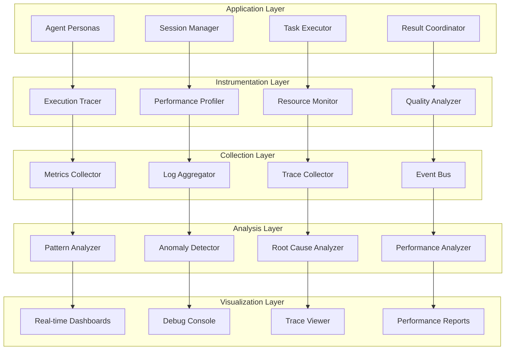

# Debugging and Monitoring Agent Behavior

This guide covers comprehensive debugging, monitoring, and troubleshooting techniques for APM agents and their interactions.

## Overview

Advanced debugging and monitoring capabilities in APM provide:
- **Real-time Agent Behavior Analysis** with detailed execution traces
- **Performance Profiling** for identifying bottlenecks and optimization opportunities
- **Session Debugging** with step-by-step execution analysis
- **Intelligent Error Detection** and automatic resolution suggestions
- **Comprehensive Logging** with structured analytics
- **Visual Debugging Tools** for complex interaction patterns

## Debugging Architecture

### Multi-Layer Monitoring System



## Agent Behavior Analysis

### 1. Execution Tracing

```python
class AgentExecutionTracer:
    """Comprehensive execution tracing for APM agents"""
    
    def __init__(self, config):
        self.trace_config = config
        self.trace_storage = TraceStorage(config['storage'])
        self.trace_analyzer = TraceAnalyzer()
        self.real_time_viewer = RealTimeTraceViewer()
        
    def start_tracing(self, session_id, trace_options=None):
        """Start comprehensive tracing for agent session"""
        
        default_options = {
            'trace_level': 'detailed',
            'include_performance': True,
            'include_memory': True,
            'include_network': True,
            'include_file_io': True,
            'trace_dependencies': True,
            'sample_rate': 1.0
        }
        
        options = {**default_options, **(trace_options or {})}
        
        trace_session = TraceSession(
            session_id=session_id,
            start_time=datetime.utcnow(),
            options=options,
            tracer_id=self._generate_tracer_id()
        )
        
        # Initialize tracing components
        self._initialize_execution_tracer(trace_session)
        self._initialize_performance_tracer(trace_session)
        self._initialize_resource_tracer(trace_session)
        self._initialize_interaction_tracer(trace_session)
        
        return trace_session
        
    def trace_agent_execution(self, agent_id, execution_context):
        """Trace detailed agent execution"""
        
        execution_trace = ExecutionTrace(
            agent_id=agent_id,
            timestamp=datetime.utcnow(),
            context=execution_context
        )
        
        # Trace persona activation
        persona_trace = self._trace_persona_activation(agent_id, execution_context)
        execution_trace.add_event('persona_activation', persona_trace)
        
        # Trace task processing
        task_traces = []
        for task in execution_context.tasks:
            task_trace = self._trace_task_execution(agent_id, task, execution_context)
            task_traces.append(task_trace)
            execution_trace.add_event('task_execution', task_trace)
            
        # Trace inter-agent communications
        communication_traces = self._trace_agent_communications(agent_id, execution_context)
        for comm_trace in communication_traces:
            execution_trace.add_event('agent_communication', comm_trace)
            
        # Trace resource usage
        resource_trace = self._trace_resource_usage(agent_id, execution_context)
        execution_trace.add_event('resource_usage', resource_trace)
        
        # Store trace
        self.trace_storage.store_execution_trace(execution_trace)
        
        # Real-time visualization
        self.real_time_viewer.update_trace(execution_trace)
        
        return execution_trace
        
    def _trace_task_execution(self, agent_id, task, context):
        """Trace individual task execution with detailed metrics"""
        
        task_trace = TaskExecutionTrace(
            task_id=task.id,
            agent_id=agent_id,
            start_time=datetime.utcnow()
        )
        
        # Trace task initialization
        init_trace = self._trace_task_initialization(task, context)
        task_trace.add_phase('initialization', init_trace)
        
        # Trace task execution phases
        execution_phases = task.get_execution_phases()
        for phase in execution_phases:
            phase_trace = self._trace_execution_phase(phase, context)
            task_trace.add_phase(phase.name, phase_trace)
            
        # Trace task completion
        completion_trace = self._trace_task_completion(task, context)
        task_trace.add_phase('completion', completion_trace)
        
        task_trace.end_time = datetime.utcnow()
        task_trace.duration = task_trace.end_time - task_trace.start_time
        
        return task_trace
        
    def analyze_execution_patterns(self, trace_data, analysis_window='1h'):
        """Analyze execution patterns from trace data"""
        
        pattern_analysis = {
            'execution_patterns': self._identify_execution_patterns(trace_data),
            'performance_patterns': self._identify_performance_patterns(trace_data),
            'error_patterns': self._identify_error_patterns(trace_data),
            'resource_patterns': self._identify_resource_patterns(trace_data),
            'interaction_patterns': self._identify_interaction_patterns(trace_data)
        }
        
        # Generate insights
        insights = self._generate_pattern_insights(pattern_analysis)
        
        # Identify optimization opportunities
        optimizations = self._identify_optimization_opportunities(pattern_analysis)
        
        return ExecutionPatternReport(
            analysis_window=analysis_window,
            patterns=pattern_analysis,
            insights=insights,
            optimizations=optimizations,
            recommendations=self._generate_pattern_recommendations(insights, optimizations)
        )
```

### 2. Performance Profiling

```python
class AgentPerformanceProfiler:
    """Advanced performance profiling for APM agents"""
    
    def __init__(self):
        self.cpu_profiler = CPUProfiler()
        self.memory_profiler = MemoryProfiler()
        self.io_profiler = IOProfiler()
        self.network_profiler = NetworkProfiler()
        
    def profile_agent_performance(self, agent_id, profiling_duration=300):
        """Comprehensive performance profiling of agent"""
        
        profiling_session = ProfilingSession(
            agent_id=agent_id,
            duration=profiling_duration,
            start_time=datetime.utcnow()
        )
        
        # Start all profilers
        cpu_profile = self.cpu_profiler.start_profiling(agent_id)
        memory_profile = self.memory_profiler.start_profiling(agent_id)
        io_profile = self.io_profiler.start_profiling(agent_id)
        network_profile = self.network_profiler.start_profiling(agent_id)
        
        # Wait for profiling duration
        time.sleep(profiling_duration)
        
        # Stop profilers and collect results
        cpu_results = self.cpu_profiler.stop_and_analyze(cpu_profile)
        memory_results = self.memory_profiler.stop_and_analyze(memory_profile)
        io_results = self.io_profiler.stop_and_analyze(io_profile)
        network_results = self.network_profiler.stop_and_analyze(network_profile)
        
        # Compile comprehensive profile
        performance_profile = {
            'agent_id': agent_id,
            'profiling_duration': profiling_duration,
            'cpu_profile': cpu_results,
            'memory_profile': memory_results,
            'io_profile': io_results,
            'network_profile': network_results,
            'overall_metrics': self._calculate_overall_metrics(
                cpu_results, memory_results, io_results, network_results
            )
        }
        
        # Identify performance bottlenecks
        bottlenecks = self._identify_performance_bottlenecks(performance_profile)
        
        # Generate optimization recommendations
        optimizations = self._generate_performance_optimizations(performance_profile, bottlenecks)
        
        return PerformanceProfile(
            profile_data=performance_profile,
            bottlenecks=bottlenecks,
            optimizations=optimizations,
            benchmark_comparison=self._compare_with_benchmarks(performance_profile)
        )
        
    def real_time_performance_monitoring(self, agent_id):
        """Real-time performance monitoring with alerts"""
        
        monitor = RealTimePerformanceMonitor(agent_id)
        
        # Setup performance thresholds
        thresholds = {
            'cpu_usage': 80,  # Alert if CPU > 80%
            'memory_usage': 85,  # Alert if memory > 85%
            'response_time': 5000,  # Alert if response > 5s
            'error_rate': 0.05,  # Alert if error rate > 5%
            'throughput': 10  # Alert if throughput < 10 tasks/min
        }
        
        monitor.set_thresholds(thresholds)
        
        # Setup alert handlers
        monitor.on_threshold_exceeded(self._handle_performance_alert)
        monitor.on_anomaly_detected(self._handle_performance_anomaly)
        
        # Start monitoring
        monitor.start()
        
        return monitor
        
    def _identify_performance_bottlenecks(self, performance_profile):
        """Identify specific performance bottlenecks"""
        
        bottlenecks = []
        
        # CPU bottleneck analysis
        if performance_profile['cpu_profile']['avg_usage'] > 90:
            cpu_bottleneck = {
                'type': 'cpu',
                'severity': 'high',
                'description': 'High CPU utilization detected',
                'hotspots': performance_profile['cpu_profile']['hotspots'],
                'recommendations': self._generate_cpu_recommendations(
                    performance_profile['cpu_profile']
                )
            }
            bottlenecks.append(cpu_bottleneck)
            
        # Memory bottleneck analysis
        memory_profile = performance_profile['memory_profile']
        if memory_profile['peak_usage'] / memory_profile['available'] > 0.9:
            memory_bottleneck = {
                'type': 'memory',
                'severity': 'high',
                'description': 'High memory utilization detected',
                'memory_leaks': memory_profile.get('potential_leaks', []),
                'gc_pressure': memory_profile.get('gc_metrics', {}),
                'recommendations': self._generate_memory_recommendations(memory_profile)
            }
            bottlenecks.append(memory_bottleneck)
            
        # I/O bottleneck analysis
        io_profile = performance_profile['io_profile']
        if io_profile['avg_wait_time'] > 1000:  # > 1 second
            io_bottleneck = {
                'type': 'io',
                'severity': 'medium',
                'description': 'High I/O wait times detected',
                'slow_operations': io_profile['slow_operations'],
                'recommendations': self._generate_io_recommendations(io_profile)
            }
            bottlenecks.append(io_bottleneck)
            
        return bottlenecks
```

### 3. Session Debugging

```python
class SessionDebugger:
    """Advanced session debugging with interactive capabilities"""
    
    def __init__(self):
        self.session_tracer = SessionTracer()
        self.breakpoint_manager = BreakpointManager()
        self.variable_inspector = VariableInspector()
        self.step_debugger = StepDebugger()
        
    def start_debug_session(self, session_id, debug_config=None):
        """Start interactive debugging session"""
        
        default_config = {
            'break_on_errors': True,
            'break_on_warnings': False,
            'trace_all_agents': True,
            'capture_variables': True,
            'enable_step_debugging': True,
            'auto_breakpoints': []
        }
        
        config = {**default_config, **(debug_config or {})}
        
        debug_session = DebugSession(
            session_id=session_id,
            config=config,
            start_time=datetime.utcnow()
        )
        
        # Initialize debugging components
        self._initialize_session_tracer(debug_session)
        self._setup_breakpoints(debug_session)
        self._initialize_variable_capture(debug_session)
        
        return debug_session
        
    def debug_agent_interaction(self, interaction_id, debug_options):
        """Debug specific agent interactions"""
        
        interaction_debug = InteractionDebugger(
            interaction_id=interaction_id,
            options=debug_options
        )
        
        # Capture interaction state
        interaction_state = self._capture_interaction_state(interaction_id)
        
        # Trace communication flow
        communication_flow = self._trace_communication_flow(interaction_id)
        
        # Analyze message passing
        message_analysis = self._analyze_message_passing(interaction_id)
        
        # Identify interaction issues
        interaction_issues = self._identify_interaction_issues(
            interaction_state, communication_flow, message_analysis
        )
        
        debug_result = InteractionDebugResult(
            interaction_id=interaction_id,
            state=interaction_state,
            flow=communication_flow,
            analysis=message_analysis,
            issues=interaction_issues,
            recommendations=self._generate_interaction_recommendations(interaction_issues)
        )
        
        return debug_result
        
    def step_through_execution(self, session_id, execution_point):
        """Step through execution with detailed analysis"""
        
        step_debugger = self.step_debugger.attach(session_id, execution_point)
        
        while not step_debugger.is_complete():
            # Get current execution state
            current_state = step_debugger.get_current_state()
            
            # Display debugging information
            self._display_debug_info(current_state)
            
            # Wait for user input
            user_command = self._get_debug_command()
            
            # Process debug command
            if user_command == 'step':
                step_debugger.step_forward()
            elif user_command == 'step_into':
                step_debugger.step_into()
            elif user_command == 'step_over':
                step_debugger.step_over()
            elif user_command == 'continue':
                step_debugger.continue_execution()
            elif user_command.startswith('inspect'):
                variable_name = user_command.split(' ', 1)[1]
                self._inspect_variable(variable_name, current_state)
            elif user_command == 'breakpoint':
                self._set_breakpoint(current_state)
            elif user_command == 'quit':
                step_debugger.stop()
                break
                
        return step_debugger.get_execution_summary()
        
    def analyze_session_health(self, session_id):
        """Comprehensive session health analysis"""
        
        health_analyzer = SessionHealthAnalyzer(session_id)
        
        health_metrics = {
            'performance_health': health_analyzer.analyze_performance(),
            'resource_health': health_analyzer.analyze_resource_usage(),
            'interaction_health': health_analyzer.analyze_agent_interactions(),
            'quality_health': health_analyzer.analyze_output_quality(),
            'stability_health': health_analyzer.analyze_stability()
        }
        
        # Calculate overall health score
        overall_health = self._calculate_overall_health_score(health_metrics)
        
        # Identify health issues
        health_issues = self._identify_health_issues(health_metrics)
        
        # Generate health recommendations
        health_recommendations = self._generate_health_recommendations(
            health_metrics, health_issues
        )
        
        return SessionHealthReport(
            session_id=session_id,
            health_metrics=health_metrics,
            overall_health=overall_health,
            issues=health_issues,
            recommendations=health_recommendations
        )
```

## Error Detection and Resolution

### 1. Intelligent Error Detection

```python
class IntelligentErrorDetector:
    """AI-powered error detection and classification"""
    
    def __init__(self):
        self.error_classifier = ErrorClassifier()
        self.pattern_matcher = ErrorPatternMatcher()
        self.root_cause_analyzer = RootCauseAnalyzer()
        self.resolution_engine = ErrorResolutionEngine()
        
    def detect_and_analyze_errors(self, agent_logs, execution_traces):
        """Detect and analyze errors using AI"""
        
        # Extract potential errors from logs
        potential_errors = self._extract_potential_errors(agent_logs)
        
        # Classify errors using ML model
        classified_errors = []
        for error in potential_errors:
            classification = self.error_classifier.classify(error)
            classified_errors.append({
                'error': error,
                'classification': classification,
                'confidence': classification.confidence,
                'severity': classification.severity
            })
            
        # Match against known error patterns
        pattern_matches = []
        for classified_error in classified_errors:
            matches = self.pattern_matcher.find_matches(
                classified_error['error'], 
                classified_error['classification']
            )
            pattern_matches.extend(matches)
            
        # Perform root cause analysis
        root_causes = []
        for error_info in classified_errors:
            if error_info['severity'] in ['high', 'critical']:
                root_cause = self.root_cause_analyzer.analyze(
                    error_info, execution_traces
                )
                root_causes.append(root_cause)
                
        # Generate resolution suggestions
        resolutions = []
        for root_cause in root_causes:
            resolution = self.resolution_engine.suggest_resolution(
                root_cause, execution_traces
            )
            resolutions.append(resolution)
            
        return ErrorAnalysisResult(
            detected_errors=classified_errors,
            pattern_matches=pattern_matches,
            root_causes=root_causes,
            resolution_suggestions=resolutions
        )
        
    def _extract_potential_errors(self, agent_logs):
        """Extract potential errors from agent logs using NLP"""
        
        error_indicators = [
            r'error|exception|failure|failed|crash',
            r'timeout|deadlock|race condition',
            r'memory.*leak|out of memory',
            r'permission denied|access denied',
            r'connection.*failed|network.*error'
        ]
        
        potential_errors = []
        
        for log_entry in agent_logs:
            for pattern in error_indicators:
                if re.search(pattern, log_entry.message, re.IGNORECASE):
                    error_context = self._extract_error_context(log_entry, agent_logs)
                    potential_errors.append({
                        'log_entry': log_entry,
                        'context': error_context,
                        'pattern': pattern,
                        'severity_hint': self._estimate_severity(log_entry.message)
                    })
                    
        return potential_errors
        
    def auto_resolve_errors(self, error_analysis, execution_context):
        """Automatically resolve errors where possible"""
        
        auto_resolution_results = []
        
        for resolution in error_analysis.resolution_suggestions:
            if resolution.confidence > 0.8 and resolution.auto_resolvable:
                # Attempt automatic resolution
                resolution_result = self._attempt_auto_resolution(
                    resolution, execution_context
                )
                auto_resolution_results.append(resolution_result)
                
        return auto_resolution_results
        
    def _attempt_auto_resolution(self, resolution, context):
        """Attempt automatic resolution of error"""
        
        try:
            if resolution.type == 'restart_agent':
                result = self._restart_agent(resolution.target_agent, context)
            elif resolution.type == 'retry_operation':
                result = self._retry_operation(resolution.operation, context)
            elif resolution.type == 'adjust_resources':
                result = self._adjust_resources(resolution.adjustments, context)
            elif resolution.type == 'configuration_fix':
                result = self._apply_configuration_fix(resolution.config_changes, context)
            else:
                result = AutoResolutionResult(
                    success=False,
                    error="Unknown resolution type"
                )
                
            return result
            
        except Exception as e:
            return AutoResolutionResult(
                success=False,
                error=f"Auto-resolution failed: {str(e)}"
            )
```

### 2. Proactive Issue Prevention

```python
class ProactiveIssuePreventor:
    """Proactive issue detection and prevention system"""
    
    def __init__(self):
        self.anomaly_detector = AnomalyDetector()
        self.predictive_model = IssuePredicitionModel()
        self.prevention_engine = PreventionEngine()
        
    def monitor_for_potential_issues(self, agents, monitoring_window='1h'):
        """Continuously monitor for potential issues"""
        
        monitoring_session = ProactiveMonitoringSession(
            agents=agents,
            window=monitoring_window,
            start_time=datetime.utcnow()
        )
        
        while monitoring_session.is_active():
            # Collect current metrics
            current_metrics = self._collect_current_metrics(agents)
            
            # Detect anomalies
            anomalies = self.anomaly_detector.detect_anomalies(current_metrics)
            
            # Predict potential issues
            issue_predictions = self.predictive_model.predict_issues(
                current_metrics, monitoring_session.historical_data
            )
            
            # Generate prevention actions
            prevention_actions = self.prevention_engine.generate_prevention_actions(
                anomalies, issue_predictions
            )
            
            # Execute prevention actions
            if prevention_actions:
                prevention_results = self._execute_prevention_actions(
                    prevention_actions, agents
                )
                monitoring_session.record_prevention_actions(
                    prevention_actions, prevention_results
                )
                
            # Update monitoring session
            monitoring_session.update_metrics(current_metrics)
            
            # Brief pause before next monitoring cycle
            time.sleep(10)  # Check every 10 seconds
            
        return monitoring_session.get_summary()
        
    def _execute_prevention_actions(self, actions, agents):
        """Execute prevention actions to avoid potential issues"""
        
        results = []
        
        for action in actions:
            try:
                if action.type == 'scale_resources':
                    result = self._scale_agent_resources(action.agent_id, action.scaling_factor)
                elif action.type == 'redistribute_load':
                    result = self._redistribute_agent_load(action.load_redistribution)
                elif action.type == 'preemptive_restart':
                    result = self._preemptive_agent_restart(action.agent_id)
                elif action.type == 'adjust_priorities':
                    result = self._adjust_task_priorities(action.priority_adjustments)
                else:
                    result = PreventionResult(
                        success=False,
                        error=f"Unknown prevention action: {action.type}"
                    )
                    
                results.append(result)
                
            except Exception as e:
                error_result = PreventionResult(
                    success=False,
                    error=f"Prevention action failed: {str(e)}",
                    action=action
                )
                results.append(error_result)
                
        return results
```

## Logging and Analytics

### 1. Structured Logging

```python
class StructuredLogger:
    """Advanced structured logging for APM agents"""
    
    def __init__(self, config):
        self.log_config = config
        self.log_processors = self._initialize_log_processors()
        self.log_destinations = self._initialize_log_destinations()
        self.log_enricher = LogEnricher()
        
    def log_agent_event(self, agent_id, event_type, event_data, context=None):
        """Log structured agent event with rich metadata"""
        
        # Create base log entry
        log_entry = StructuredLogEntry(
            timestamp=datetime.utcnow(),
            agent_id=agent_id,
            event_type=event_type,
            data=event_data,
            context=context or {}
        )
        
        # Enrich log entry with additional metadata
        enriched_entry = self.log_enricher.enrich(log_entry)
        
        # Process log entry through configured processors
        processed_entry = enriched_entry
        for processor in self.log_processors:
            processed_entry = processor.process(processed_entry)
            
        # Send to configured destinations
        for destination in self.log_destinations:
            destination.write(processed_entry)
            
        return processed_entry
        
    def create_agent_logger(self, agent_id, agent_type):
        """Create specialized logger for specific agent"""
        
        agent_logger = AgentLogger(
            agent_id=agent_id,
            agent_type=agent_type,
            base_logger=self
        )
        
        # Configure agent-specific logging rules
        agent_logger.configure_logging_rules(self._get_agent_logging_rules(agent_type))
        
        # Setup performance logging
        agent_logger.enable_performance_logging()
        
        # Setup error logging
        agent_logger.enable_error_logging()
        
        return agent_logger
        
    def _initialize_log_processors(self):
        """Initialize log processing pipeline"""
        
        processors = []
        
        # Add correlation ID processor
        if self.log_config.get('enable_correlation_ids', True):
            processors.append(CorrelationIdProcessor())
            
        # Add sensitive data redaction
        if self.log_config.get('redact_sensitive_data', True):
            processors.append(SensitiveDataRedactor())
            
        # Add performance metrics extraction
        if self.log_config.get('extract_performance_metrics', True):
            processors.append(PerformanceMetricsExtractor())
            
        # Add log aggregation
        if self.log_config.get('enable_aggregation', False):
            processors.append(LogAggregator(
                window_size=self.log_config.get('aggregation_window', '1m')
            ))
            
        return processors
```

### 2. Analytics and Insights

```python
class APMAnalytics:
    """Advanced analytics for APM agent behavior and performance"""
    
    def __init__(self, config):
        self.analytics_engine = AnalyticsEngine(config)
        self.data_warehouse = DataWarehouse(config['warehouse'])
        self.ml_models = self._load_analytics_models()
        
    def analyze_agent_performance_trends(self, time_range='7d'):
        """Analyze performance trends across agents"""
        
        # Query performance data
        performance_data = self.data_warehouse.query_performance_data(time_range)
        
        # Analyze trends
        trend_analysis = {
            'response_time_trends': self._analyze_response_time_trends(performance_data),
            'throughput_trends': self._analyze_throughput_trends(performance_data),
            'error_rate_trends': self._analyze_error_rate_trends(performance_data),
            'resource_usage_trends': self._analyze_resource_usage_trends(performance_data)
        }
        
        # Generate insights
        insights = self._generate_performance_insights(trend_analysis)
        
        # Predict future performance
        performance_forecast = self._forecast_performance(performance_data, '7d')
        
        return PerformanceTrendReport(
            time_range=time_range,
            trends=trend_analysis,
            insights=insights,
            forecast=performance_forecast,
            recommendations=self._generate_performance_recommendations(insights)
        )
        
    def analyze_agent_interaction_patterns(self, interaction_data):
        """Analyze patterns in agent interactions"""
        
        interaction_analyzer = InteractionPatternAnalyzer()
        
        patterns = {
            'communication_patterns': interaction_analyzer.analyze_communication(interaction_data),
            'collaboration_patterns': interaction_analyzer.analyze_collaboration(interaction_data),
            'dependency_patterns': interaction_analyzer.analyze_dependencies(interaction_data),
            'coordination_patterns': interaction_analyzer.analyze_coordination(interaction_data)
        }
        
        # Identify optimization opportunities
        optimization_opportunities = self._identify_interaction_optimizations(patterns)
        
        # Generate interaction insights
        interaction_insights = self._generate_interaction_insights(patterns)
        
        return InteractionAnalysisReport(
            patterns=patterns,
            optimization_opportunities=optimization_opportunities,
            insights=interaction_insights
        )
        
    def generate_executive_dashboard_data(self):
        """Generate data for executive dashboard"""
        
        dashboard_data = {
            'kpis': self._calculate_executive_kpis(),
            'trends': self._calculate_executive_trends(),
            'health_scores': self._calculate_health_scores(),
            'cost_metrics': self._calculate_cost_metrics(),
            'roi_analysis': self._calculate_roi_analysis(),
            'recommendations': self._generate_executive_recommendations()
        }
        
        return dashboard_data
```

## Visual Debugging Tools

### 1. Real-time Debug Dashboard

```python
class DebugDashboard:
    """Real-time visual debugging dashboard"""
    
    def __init__(self):
        self.dashboard_server = DashboardServer()
        self.visualization_engine = VisualizationEngine()
        self.real_time_updater = RealTimeUpdater()
        
    def create_agent_debug_view(self, agent_id):
        """Create real-time debug view for specific agent"""
        
        debug_view = AgentDebugView(
            agent_id=agent_id,
            layout=self._create_debug_layout()
        )
        
        # Add real-time components
        debug_view.add_component('execution_timeline', ExecutionTimelineComponent(agent_id))
        debug_view.add_component('performance_metrics', PerformanceMetricsComponent(agent_id))
        debug_view.add_component('resource_usage', ResourceUsageComponent(agent_id))
        debug_view.add_component('error_log', ErrorLogComponent(agent_id))
        debug_view.add_component('interaction_graph', InteractionGraphComponent(agent_id))
        
        # Setup real-time updates
        self.real_time_updater.register_view(debug_view)
        
        return debug_view
        
    def create_session_debug_view(self, session_id):
        """Create comprehensive session debug view"""
        
        session_view = SessionDebugView(
            session_id=session_id,
            layout=self._create_session_layout()
        )
        
        # Add session-level components
        session_view.add_component('session_overview', SessionOverviewComponent(session_id))
        session_view.add_component('agent_coordination', AgentCoordinationComponent(session_id))
        session_view.add_component('execution_flow', ExecutionFlowComponent(session_id))
        session_view.add_component('quality_metrics', QualityMetricsComponent(session_id))
        
        return session_view
```

### 2. Interactive Trace Viewer

```python
class InteractiveTraceViewer:
    """Interactive viewer for execution traces"""
    
    def __init__(self):
        self.trace_renderer = TraceRenderer()
        self.interaction_handler = InteractionHandler()
        self.filter_engine = TraceFilterEngine()
        
    def render_execution_trace(self, trace_data, view_options=None):
        """Render interactive execution trace"""
        
        default_options = {
            'show_performance_metrics': True,
            'show_resource_usage': True,
            'show_agent_interactions': True,
            'enable_filtering': True,
            'enable_drill_down': True,
            'color_code_by_performance': True
        }
        
        options = {**default_options, **(view_options or {})}
        
        # Create trace visualization
        trace_viz = self.trace_renderer.render(trace_data, options)
        
        # Add interactive capabilities
        if options['enable_filtering']:
            trace_viz.add_filter_controls(self._create_filter_controls())
            
        if options['enable_drill_down']:
            trace_viz.add_drill_down_handlers(self._create_drill_down_handlers())
            
        # Setup event handlers
        trace_viz.on_trace_point_selected(self._handle_trace_point_selection)
        trace_viz.on_time_range_selected(self._handle_time_range_selection)
        trace_viz.on_agent_selected(self._handle_agent_selection)
        
        return trace_viz
        
    def create_trace_comparison_view(self, trace_data_list):
        """Create comparison view for multiple traces"""
        
        comparison_view = TraceComparisonView(traces=trace_data_list)
        
        # Add comparison visualizations
        comparison_view.add_timeline_comparison()
        comparison_view.add_performance_comparison()
        comparison_view.add_resource_usage_comparison()
        comparison_view.add_interaction_pattern_comparison()
        
        return comparison_view
```

## Configuration and Best Practices

### Debug Configuration

```yaml
# Comprehensive debugging configuration
debugging:
  tracing:
    enabled: true
    level: "detailed"  # basic, detailed, comprehensive
    sample_rate: 1.0
    include_performance: true
    include_memory: true
    include_network: true
    trace_dependencies: true
    
  profiling:
    enabled: true
    cpu_profiling: true
    memory_profiling: true
    io_profiling: true
    auto_profile_slow_operations: true
    profile_threshold_ms: 1000
    
  logging:
    level: "debug"
    structured_logging: true
    include_stack_traces: true
    redact_sensitive_data: true
    enable_correlation_ids: true
    
  monitoring:
    real_time_monitoring: true
    performance_thresholds:
      response_time_ms: 5000
      memory_usage_percent: 85
      cpu_usage_percent: 80
      error_rate_percent: 5
      
  error_detection:
    intelligent_detection: true
    pattern_matching: true
    auto_resolution: false
    notification_channels:
      - slack
      - email
      
  dashboards:
    real_time_dashboard: true
    agent_debug_views: true
    session_debug_views: true
    trace_viewer: true
    
  storage:
    trace_retention_days: 30
    log_retention_days: 90
    performance_data_retention_days: 180
```

### Best Practices

1. **Enable Comprehensive Tracing** for complex debugging scenarios
2. **Use Structured Logging** for better searchability and analysis
3. **Set Appropriate Thresholds** for performance alerts
4. **Implement Gradual Debug Levels** (basic → detailed → comprehensive)
5. **Regular Performance Profiling** to identify optimization opportunities
6. **Automated Error Detection** with manual review of resolution suggestions
7. **Real-time Monitoring** for production environments
8. **Correlation IDs** for tracking requests across multiple agents

---

This completes the advanced APM documentation templates covering custom personas, performance optimization, enterprise deployment, integration patterns, AI/ML features, parallel orchestration, and debugging/monitoring capabilities.