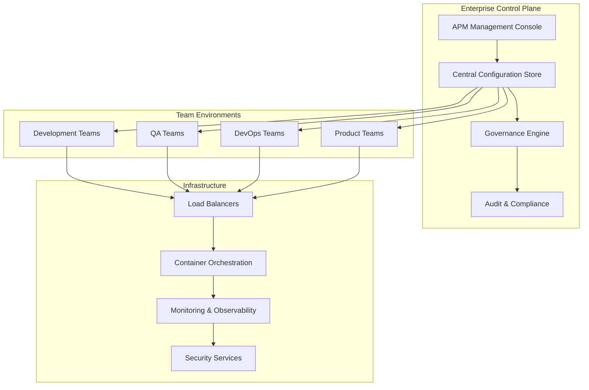

# Enterprise Deployment Guide

This guide covers large-scale APM deployment strategies for organizations with hundreds of developers and complex governance requirements.

## Overview

Enterprise APM deployment addresses:
- **Multi-team coordination** across departments and business units
- **Centralized governance** with decentralized execution
- **Security and compliance** at organizational scale
- **Performance at scale** handling 500+ concurrent sessions
- **Integration with existing** enterprise systems and workflows

## Architecture Overview

### Enterprise APM Architecture



### Deployment Models

#### 1. Centralized Deployment
- **Single APM instance** serving entire organization
- **Shared resources** and centralized management
- **Simplified governance** but potential scalability limits
- **Best for**: Organizations with standardized processes

#### 2. Federated Deployment
- **Multiple APM instances** per business unit/team
- **Centralized policies** with decentralized execution
- **Balanced governance** and team autonomy
- **Best for**: Large organizations with diverse needs

#### 3. Hybrid Deployment
- **Core services centralized** with team-specific extensions
- **Shared infrastructure** with customizable personas
- **Flexible governance** model
- **Best for**: Complex organizations with varying maturity levels

## Deployment Strategy

### Phase 1: Foundation Setup

#### Infrastructure Preparation

```yaml
# enterprise-infrastructure.yaml
infrastructure:
  compute:
    kubernetes_cluster:
      node_count: 12
      instance_type: "c5.4xlarge"
      auto_scaling:
        min_nodes: 8
        max_nodes: 50
        cpu_threshold: 70
    
  storage:
    persistent_volumes:
      - name: "apm-config"
        size: "100Gi"
        storage_class: "fast-ssd"
      - name: "session-data"
        size: "1Ti"
        storage_class: "standard-ssd"
    
  networking:
    load_balancer:
      type: "application"
      ssl_termination: true
      health_checks: true
    ingress:
      domain: "apm.enterprise.com"
      tls_cert: "enterprise-wildcard"
    
  security:
    network_policies: true
    pod_security_standards: "restricted"
    rbac_enabled: true
    service_mesh: "istio"
```

#### Central Configuration Management

```json
{
  "enterprise_config": {
    "organization": {
      "name": "Enterprise Corp",
      "id": "ent-corp-001",
      "domains": ["enterprise.com", "subsidiary.com"]
    },
    "governance": {
      "approval_workflows": {
        "persona_deployment": "manager_approval",
        "configuration_changes": "architecture_review",
        "security_modifications": "security_team_approval"
      },
      "compliance_frameworks": ["SOC2", "ISO27001", "GDPR"],
      "audit_retention_days": 2555
    },
    "resource_allocation": {
      "default_quotas": {
        "cpu_cores": 4,
        "memory_gb": 8,
        "storage_gb": 100,
        "concurrent_sessions": 10
      },
      "team_overrides": {
        "platform-team": {
          "cpu_cores": 16,
          "memory_gb": 32,
          "concurrent_sessions": 50
        }
      }
    }
  }
}
```

### Phase 2: Multi-Team Rollout

#### Team Onboarding Strategy

```bash
#!/bin/bash
# Enterprise team onboarding script

onboard_team() {
    local team_name="$1"
    local team_lead="$2"
    local business_unit="$3"
    
    echo "Onboarding team: ${team_name}"
    
    # Create team namespace
    kubectl create namespace "apm-${team_name}"
    
    # Apply team-specific RBAC
    apply_team_rbac "${team_name}" "${team_lead}"
    
    # Deploy team APM instance
    deploy_team_apm "${team_name}" "${business_unit}"
    
    # Configure team personas
    configure_team_personas "${team_name}"
    
    # Setup monitoring and alerts
    setup_team_monitoring "${team_name}"
    
    # Generate team documentation
    generate_team_docs "${team_name}"
    
    echo "✅ Team ${team_name} onboarded successfully"
}

apply_team_rbac() {
    local team_name="$1"
    local team_lead="$2"
    
    cat <<EOF | kubectl apply -f -
apiVersion: rbac.authorization.k8s.io/v1
kind: RoleBinding
metadata:
  namespace: apm-${team_name}
  name: ${team_name}-admin
subjects:
- kind: User
  name: ${team_lead}
  apiGroup: rbac.authorization.k8s.io
roleRef:
  kind: ClusterRole
  name: apm-team-admin
  apiGroup: rbac.authorization.k8s.io
EOF
}
```

#### Persona Distribution Strategy

```yaml
# Persona distribution across teams
persona_distribution:
  development_teams:
    required_personas:
      - developer
      - architect
      - qa
    optional_personas:
      - analyst
      - design-architect
    custom_personas:
      - backend-specialist
      - frontend-specialist
      
  product_teams:
    required_personas:
      - pm
      - po
      - analyst
    optional_personas:
      - sm
      - qa
    custom_personas:
      - user-researcher
      - market-analyst
      
  platform_teams:
    required_personas:
      - architect
      - developer
      - qa
    optional_personas:
      - pm
    custom_personas:
      - sre
      - security-engineer
      - data-engineer
```

### Phase 3: Governance and Compliance

#### Centralized Policy Management

```python
class EnterprisePolicyManager:
    """Centralized policy management for enterprise APM"""
    
    def __init__(self):
        self.policies = {}
        self.compliance_rules = {}
        self.audit_log = []
        
    def define_security_policy(self, policy_name, rules):
        """Define organization-wide security policy"""
        policy = {
            'name': policy_name,
            'version': '1.0',
            'rules': rules,
            'enforcement_level': 'strict',
            'created_by': self._get_current_user(),
            'created_at': datetime.utcnow(),
            'applies_to': ['all_teams']
        }
        
        self.policies[policy_name] = policy
        self._notify_teams_of_policy_update(policy)
        
    def validate_persona_deployment(self, team, persona_config):
        """Validate persona deployment against enterprise policies"""
        violations = []
        
        for policy_name, policy in self.policies.items():
            for rule in policy['rules']:
                if not self._check_rule_compliance(persona_config, rule):
                    violations.append({
                        'policy': policy_name,
                        'rule': rule,
                        'severity': rule.get('severity', 'medium')
                    })
                    
        return violations
        
    def generate_compliance_report(self, timeframe_days=30):
        """Generate enterprise compliance report"""
        end_date = datetime.utcnow()
        start_date = end_date - timedelta(days=timeframe_days)
        
        report = {
            'period': f"{start_date.date()} to {end_date.date()}",
            'total_deployments': self._count_deployments(start_date, end_date),
            'policy_violations': self._count_violations(start_date, end_date),
            'compliance_score': self._calculate_compliance_score(),
            'top_violations': self._get_top_violations(),
            'recommendations': self._generate_recommendations()
        }
        
        return report
```

#### Audit and Compliance Framework

```yaml
# Enterprise audit configuration
audit:
  logging:
    level: "comprehensive"
    destinations:
      - type: "elasticsearch"
        endpoint: "https://logs.enterprise.com:9200"
        index_pattern: "apm-audit-*"
      - type: "splunk"
        endpoint: "https://splunk.enterprise.com:8088"
        sourcetype: "apm:audit"
      - type: "file"
        path: "/var/log/apm/audit.log"
        rotation: "daily"
        retention_days: 2555
        
  events_tracked:
    - persona_activation
    - configuration_changes
    - policy_violations
    - security_events
    - performance_anomalies
    - user_access_events
    - data_access_events
    
  compliance_validation:
    frameworks:
      - name: "SOC2"
        controls: ["CC6.1", "CC6.2", "CC6.3"]
        validation_frequency: "daily"
      - name: "ISO27001"
        controls: ["A.9.1", "A.12.4", "A.14.2"]
        validation_frequency: "weekly"
      - name: "GDPR"
        controls: ["Art.32", "Art.35"]
        validation_frequency: "monthly"
        
  reporting:
    automated_reports:
      - type: "daily_summary"
        recipients: ["security-team@enterprise.com"]
        format: "json"
      - type: "weekly_compliance"
        recipients: ["compliance-team@enterprise.com"]
        format: "pdf"
      - type: "monthly_executive"
        recipients: ["executives@enterprise.com"]
        format: "dashboard"
```

### Phase 4: Scale and Performance

#### High Availability Configuration

```yaml
# High availability deployment
high_availability:
  replication:
    apm_orchestrator:
      replicas: 3
      anti_affinity: "strict"
      rolling_update:
        max_unavailable: 1
        max_surge: 1
        
  load_balancing:
    algorithm: "least_connections"
    health_checks:
      path: "/health"
      interval: 10
      timeout: 5
      retries: 3
    session_affinity: "client_ip"
    
  disaster_recovery:
    backup_frequency: "every_6_hours"
    backup_retention: "30_days"
    recovery_time_objective: "15_minutes"
    recovery_point_objective: "1_hour"
    
  monitoring:
    sla_targets:
      availability: "99.9%"
      response_time_p95: "5s"
      error_rate: "<0.1%"
    alerting:
      channels: ["pagerduty", "slack", "email"]
      escalation_policy: "enterprise_critical"
```

#### Global Distribution

```yaml
# Multi-region deployment
global_distribution:
  regions:
    - name: "us-east"
      location: "Virginia, USA"
      capacity: "primary"
      users: ["americas"]
      
    - name: "eu-west"
      location: "Ireland, EU"
      capacity: "primary" 
      users: ["emea"]
      
    - name: "ap-southeast"
      location: "Singapore, APAC"
      capacity: "secondary"
      users: ["apac"]
      
  data_sovereignty:
    eu_data_residency: true
    gdpr_compliance: true
    local_encryption: true
    cross_border_controls: "strict"
    
  network_optimization:
    cdn_enabled: true
    edge_caching: true
    connection_pooling: true
    compression: "gzip"
```

## Security and Compliance

### Enterprise Security Framework

#### Identity and Access Management

```yaml
# Enterprise IAM integration
identity_management:
  providers:
    - type: "active_directory"
      endpoint: "ldaps://ad.enterprise.com"
      base_dn: "DC=enterprise,DC=com"
      user_filter: "(&(objectClass=user)(memberOf=CN=APM-Users,OU=Groups,DC=enterprise,DC=com))"
      
    - type: "okta"
      endpoint: "https://enterprise.okta.com"
      app_id: "apm-enterprise"
      scopes: ["openid", "profile", "groups"]
      
  authorization:
    rbac_enabled: true
    attribute_based_access: true
    fine_grained_permissions: true
    
  role_definitions:
    - name: "apm_admin"
      permissions: ["*"]
      members: ["platform-team"]
      
    - name: "team_lead"
      permissions: ["team:*", "persona:deploy", "config:modify"]
      scope: "team_namespace"
      
    - name: "developer"
      permissions: ["persona:use", "session:create", "config:read"]
      scope: "team_namespace"
      
  session_management:
    max_session_duration: "8_hours"
    idle_timeout: "2_hours"
    concurrent_sessions_limit: 5
    mfa_required: true
```

#### Data Protection and Privacy

```python
class EnterpriseDataProtection:
    """Enterprise data protection and privacy controls"""
    
    def __init__(self):
        self.encryption_config = self._load_encryption_config()
        self.privacy_rules = self._load_privacy_rules()
        
    def encrypt_sensitive_data(self, data, classification):
        """Encrypt data based on classification level"""
        encryption_method = self.encryption_config[classification]
        
        if classification == "confidential":
            return self._aes_256_encrypt(data)
        elif classification == "restricted":
            return self._rsa_4096_encrypt(data)
        elif classification == "public":
            return data  # No encryption needed
            
    def apply_data_retention(self, data_type, created_date):
        """Apply data retention policies"""
        retention_policy = self.privacy_rules['retention'][data_type]
        retention_days = retention_policy['days']
        
        if (datetime.utcnow() - created_date).days > retention_days:
            if retention_policy['action'] == 'delete':
                self._secure_delete(data_type, created_date)
            elif retention_policy['action'] == 'archive':
                self._archive_data(data_type, created_date)
                
    def handle_data_subject_request(self, request_type, subject_id):
        """Handle GDPR data subject requests"""
        if request_type == "access":
            return self._export_subject_data(subject_id)
        elif request_type == "deletion":
            return self._delete_subject_data(subject_id)
        elif request_type == "rectification":
            return self._update_subject_data(subject_id)
```

### Compliance Automation

#### Continuous Compliance Monitoring

```python
class ComplianceMonitor:
    """Continuous compliance monitoring and reporting"""
    
    def __init__(self):
        self.compliance_frameworks = self._load_frameworks()
        self.monitoring_rules = self._load_monitoring_rules()
        
    def run_compliance_scan(self, scope="all"):
        """Run comprehensive compliance scan"""
        results = {}
        
        for framework in self.compliance_frameworks:
            if scope == "all" or framework['name'] in scope:
                framework_results = self._scan_framework(framework)
                results[framework['name']] = framework_results
                
        return self._generate_compliance_report(results)
        
    def _scan_framework(self, framework):
        """Scan specific compliance framework"""
        results = {
            'framework': framework['name'],
            'controls_tested': 0,
            'controls_passed': 0,
            'violations': [],
            'recommendations': []
        }
        
        for control in framework['controls']:
            test_result = self._test_control(control)
            results['controls_tested'] += 1
            
            if test_result['passed']:
                results['controls_passed'] += 1
            else:
                results['violations'].append({
                    'control': control['id'],
                    'description': control['description'],
                    'finding': test_result['finding'],
                    'severity': test_result['severity']
                })
                
        return results
        
    def generate_executive_dashboard(self):
        """Generate executive compliance dashboard"""
        dashboard_data = {
            'overall_compliance_score': self._calculate_overall_score(),
            'framework_scores': self._get_framework_scores(),
            'trend_analysis': self._analyze_compliance_trends(),
            'top_risks': self._identify_top_risks(),
            'remediation_timeline': self._estimate_remediation_time()
        }
        
        return self._render_executive_dashboard(dashboard_data)
```

## Monitoring and Observability

### Enterprise Monitoring Stack

```yaml
# Comprehensive monitoring configuration
monitoring:
  metrics:
    prometheus:
      retention: "90d"
      storage: "1TB"
      federation: true
      remote_write:
        - url: "https://metrics.enterprise.com/api/v1/receive"
          
  logging:
    elasticsearch:
      cluster_size: 5
      retention: "1y"
      indices:
        - pattern: "apm-application-*"
          shards: 3
          replicas: 1
        - pattern: "apm-audit-*"
          shards: 5
          replicas: 2
          
  tracing:
    jaeger:
      sampling_rate: 0.1
      retention: "30d"
      storage: "elasticsearch"
      
  alerting:
    rules:
      - name: "high_error_rate"
        condition: "error_rate > 5%"
        duration: "5m"
        severity: "critical"
        
      - name: "performance_degradation"
        condition: "response_time_p95 > 10s"
        duration: "10m"
        severity: "warning"
        
      - name: "compliance_violation"
        condition: "compliance_score < 90%"
        duration: "1m"
        severity: "high"
```

### Performance Analytics

```python
class EnterpriseAnalytics:
    """Enterprise-scale performance analytics"""
    
    def __init__(self):
        self.data_sources = self._initialize_data_sources()
        self.ml_models = self._load_ml_models()
        
    def analyze_usage_patterns(self, timeframe_days=30):
        """Analyze enterprise usage patterns"""
        usage_data = self._collect_usage_data(timeframe_days)
        
        analysis = {
            'total_sessions': usage_data['session_count'],
            'active_teams': len(usage_data['teams']),
            'persona_popularity': self._rank_personas(usage_data),
            'peak_usage_times': self._identify_peak_times(usage_data),
            'resource_utilization': self._calculate_resource_usage(usage_data)
        }
        
        return analysis
        
    def predict_capacity_needs(self, forecast_months=6):
        """Predict future capacity requirements"""
        historical_data = self._get_historical_capacity_data()
        growth_trends = self._analyze_growth_trends(historical_data)
        
        predictions = self.ml_models['capacity_forecasting'].predict(
            features=self._extract_features(historical_data, growth_trends),
            horizon_months=forecast_months
        )
        
        return {
            'predicted_sessions': predictions['session_growth'],
            'predicted_resource_needs': predictions['resource_requirements'],
            'scaling_recommendations': self._generate_scaling_plan(predictions),
            'cost_projections': self._estimate_costs(predictions)
        }
        
    def generate_roi_report(self):
        """Generate APM return on investment report"""
        metrics = {
            'development_velocity': self._measure_velocity_improvement(),
            'defect_reduction': self._calculate_defect_reduction(),
            'time_to_market': self._measure_time_to_market_improvement(),
            'developer_satisfaction': self._survey_developer_satisfaction(),
            'cost_savings': self._calculate_cost_savings()
        }
        
        roi_calculation = self._calculate_roi(metrics)
        
        return {
            'metrics': metrics,
            'roi_percentage': roi_calculation['percentage'],
            'payback_period_months': roi_calculation['payback_period'],
            'business_impact': self._quantify_business_impact(metrics)
        }
```

## Integration Patterns

### Enterprise System Integration

#### CI/CD Pipeline Integration

```yaml
# GitLab CI/CD integration
stages:
  - validate
  - test
  - deploy
  - monitor

apm_validate:
  stage: validate
  script:
    - apm-cli validate --config .apm/personas/
    - apm-cli security-scan --personas all
    - apm-cli compliance-check --framework SOC2
  rules:
    - if: '$CI_MERGE_REQUEST_ID'
    
apm_test:
  stage: test
  script:
    - apm-cli test --parallel --coverage
    - apm-cli performance-test --load 50
  artifacts:
    reports:
      junit: test-results.xml
      coverage: coverage.xml
      performance: performance-report.json
      
apm_deploy:
  stage: deploy
  script:
    - apm-cli deploy --environment $CI_ENVIRONMENT_NAME
    - apm-cli health-check --timeout 300
  environment:
    name: $CI_ENVIRONMENT_NAME
    url: https://apm-$CI_ENVIRONMENT_NAME.enterprise.com
  rules:
    - if: '$CI_COMMIT_BRANCH == "main"'
    
apm_monitor:
  stage: monitor
  script:
    - apm-cli monitor --alerts-webhook $SLACK_WEBHOOK
    - apm-cli compliance-monitor --continuous
  when: always
```

#### Service Mesh Integration

```yaml
# Istio service mesh configuration
apiVersion: networking.istio.io/v1alpha3
kind: VirtualService
metadata:
  name: apm-routing
spec:
  http:
  - match:
    - headers:
        team:
          exact: "platform"
    route:
    - destination:
        host: apm-platform
        subset: v1
      weight: 100
  - match:
    - headers:
        team:
          exact: "product"
    route:
    - destination:
        host: apm-product
        subset: v1
      weight: 80
    - destination:
        host: apm-product
        subset: v2
      weight: 20
  - route:
    - destination:
        host: apm-default
---
apiVersion: security.istio.io/v1beta1
kind: AuthorizationPolicy
metadata:
  name: apm-rbac
spec:
  selector:
    matchLabels:
      app: apm
  rules:
  - from:
    - source:
        principals: ["cluster.local/ns/apm/sa/apm-service"]
    to:
    - operation:
        methods: ["GET", "POST"]
    when:
    - key: request.headers[team]
      values: ["platform", "product", "engineering"]
```

### Data Integration

#### Enterprise Data Lake Integration

```python
class DataLakeIntegration:
    """Integration with enterprise data lake for analytics"""
    
    def __init__(self):
        self.data_lake_client = self._initialize_data_lake()
        self.schemas = self._load_data_schemas()
        
    def export_session_analytics(self, date_range):
        """Export session analytics to data lake"""
        session_data = self._extract_session_data(date_range)
        
        # Transform to enterprise schema
        transformed_data = self._transform_to_schema(
            session_data, 
            self.schemas['session_analytics']
        )
        
        # Upload to data lake
        self.data_lake_client.upload(
            dataset='apm_session_analytics',
            data=transformed_data,
            partition_by='date'
        )
        
    def integrate_business_metrics(self):
        """Integrate APM data with business metrics"""
        apm_metrics = self._get_apm_performance_data()
        business_metrics = self.data_lake_client.query(
            "SELECT * FROM business_kpis WHERE date >= current_date - interval '30 days'"
        )
        
        correlation_analysis = self._correlate_metrics(
            apm_metrics, 
            business_metrics
        )
        
        return correlation_analysis
```

## Cost Management

### Resource Optimization

```python
class EnterpriseCostOptimizer:
    """Enterprise cost optimization for APM deployments"""
    
    def __init__(self):
        self.cost_models = self._load_cost_models()
        self.usage_analytics = self._initialize_usage_analytics()
        
    def analyze_cost_efficiency(self):
        """Analyze cost efficiency across teams and personas"""
        cost_data = {
            'compute_costs': self._calculate_compute_costs(),
            'storage_costs': self._calculate_storage_costs(),
            'network_costs': self._calculate_network_costs(),
            'licensing_costs': self._calculate_licensing_costs()
        }
        
        efficiency_metrics = {
            'cost_per_session': cost_data['total'] / self._get_total_sessions(),
            'cost_per_team': self._breakdown_costs_by_team(),
            'cost_per_persona_hour': self._calculate_persona_costs(),
            'utilization_rates': self._calculate_utilization_rates()
        }
        
        return {
            'current_costs': cost_data,
            'efficiency_metrics': efficiency_metrics,
            'optimization_opportunities': self._identify_savings_opportunities(),
            'recommendations': self._generate_cost_recommendations()
        }
        
    def optimize_resource_allocation(self):
        """Optimize resource allocation based on usage patterns"""
        usage_patterns = self._analyze_usage_patterns()
        current_allocation = self._get_current_allocation()
        
        optimal_allocation = self._calculate_optimal_allocation(
            usage_patterns, current_allocation
        )
        
        savings_projection = self._project_savings(
            current_allocation, optimal_allocation
        )
        
        return {
            'current_allocation': current_allocation,
            'optimal_allocation': optimal_allocation,
            'projected_savings': savings_projection,
            'migration_plan': self._create_migration_plan(optimal_allocation)
        }
```

### Cost Governance

```yaml
# Cost governance policies
cost_governance:
  budgets:
    teams:
      platform: "$50000/month"
      product: "$30000/month" 
      engineering: "$40000/month"
    alerts:
      - threshold: 80%
        action: "notify_team_lead"
      - threshold: 95%
        action: "restrict_scaling"
      - threshold: 100%
        action: "emergency_shutdown"
        
  resource_limits:
    development_teams:
      max_cpu_cores: 32
      max_memory_gb: 64
      max_storage_tb: 5
    production_teams:
      max_cpu_cores: 128
      max_memory_gb: 256
      max_storage_tb: 20
      
  cost_optimization:
    automated_scaling: true
    rightsizing_enabled: true
    unused_resource_cleanup: true
    scheduled_scaling:
      business_hours: "09:00-18:00"
      weekend_scaling_factor: 0.3
```

## Disaster Recovery

### Business Continuity Planning

```yaml
# Disaster recovery configuration
disaster_recovery:
  rto_objectives:
    critical_systems: "15_minutes"
    standard_systems: "4_hours"
    development_systems: "24_hours"
    
  rpo_objectives:
    critical_data: "1_hour"
    standard_data: "6_hours"
    development_data: "24_hours"
    
  backup_strategy:
    frequency:
      configuration: "every_hour"
      session_data: "every_6_hours"
      audit_logs: "every_24_hours"
    retention:
      daily_backups: "30_days"
      weekly_backups: "12_weeks"
      monthly_backups: "12_months"
      yearly_backups: "7_years"
    storage:
      primary: "enterprise_nas"
      secondary: "cloud_storage"
      offsite: "disaster_recovery_site"
      
  failover_procedures:
    automatic_failover: true
    health_check_interval: "30_seconds"
    failover_timeout: "5_minutes"
    recovery_verification: true
    
  recovery_testing:
    test_frequency: "quarterly"
    full_recovery_test: "annually"
    documentation_update: "after_each_test"
```

### Recovery Procedures

```bash
#!/bin/bash
# Enterprise disaster recovery script

RECOVERY_MODE="${1:-partial}"
DR_SITE="${2:-secondary}"

initiate_disaster_recovery() {
    echo "🚨 Initiating disaster recovery in ${RECOVERY_MODE} mode to ${DR_SITE}"
    
    # Step 1: Assess damage and scope
    assess_system_status
    
    # Step 2: Activate DR site
    activate_dr_site "${DR_SITE}"
    
    # Step 3: Restore data from backups
    restore_data_from_backups
    
    # Step 4: Verify system integrity
    verify_system_integrity
    
    # Step 5: Redirect traffic
    redirect_traffic_to_dr_site
    
    # Step 6: Notify stakeholders
    notify_stakeholders "disaster_recovery_complete"
    
    echo "✅ Disaster recovery completed successfully"
}

assess_system_status() {
    echo "Assessing system status..."
    
    # Check primary site availability
    if ! curl -f "https://apm.enterprise.com/health" >/dev/null 2>&1; then
        echo "❌ Primary site unavailable"
        PRIMARY_SITE_STATUS="down"
    else
        echo "✅ Primary site responding"
        PRIMARY_SITE_STATUS="up"
    fi
    
    # Check data center connectivity
    check_datacenter_connectivity
    
    # Assess backup integrity
    verify_backup_integrity
}

restore_data_from_backups() {
    echo "Restoring data from backups..."
    
    # Restore configuration data
    restore_configuration_backup
    
    # Restore session data
    restore_session_data_backup
    
    # Restore audit logs
    restore_audit_logs_backup
    
    # Verify data integrity
    verify_restored_data_integrity
}

# Execute recovery based on mode
case "${RECOVERY_MODE}" in
    "full")
        initiate_disaster_recovery
        ;;
    "partial")
        restore_specific_components
        ;;
    "test")
        run_recovery_test
        ;;
    *)
        echo "Usage: $0 {full|partial|test} [dr_site]"
        exit 1
        ;;
esac
```

---

**Next Steps**: Review [Integration Patterns](integration-patterns.md) for connecting APM with existing enterprise workflows and systems.