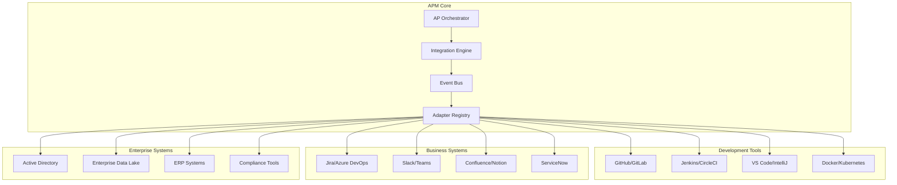

# Integration Patterns

This guide covers advanced patterns for integrating APM with existing enterprise workflows, tools, and systems.

## Overview

APM integration patterns enable seamless connection with:
- **Development Tools** (IDEs, version control, CI/CD pipelines)
- **Project Management** (Jira, Azure DevOps, Monday.com)
- **Communication Platforms** (Slack, Microsoft Teams, Discord)
- **Monitoring Systems** (Datadog, New Relic, Splunk)
- **Enterprise Systems** (ERP, CRM, data lakes)
- **Security Tools** (SIEM, vulnerability scanners, compliance platforms)

## Integration Architecture

### Hub-and-Spoke Model



### Event-Driven Integration

```yaml
# Event-driven integration configuration
event_system:
  event_bus:
    type: "apache_kafka"
    brokers: ["kafka1:9092", "kafka2:9092", "kafka3:9092"]
    topics:
      - name: "apm.session.events"
        partitions: 12
        replication_factor: 3
      - name: "apm.persona.events"
        partitions: 6
        replication_factor: 3
      - name: "apm.integration.events"
        partitions: 3
        replication_factor: 3
        
  event_schemas:
    session_started:
      properties:
        session_id: "string"
        persona: "string"
        user_id: "string"
        team: "string"
        timestamp: "datetime"
        context: "object"
        
    task_completed:
      properties:
        task_id: "string"
        session_id: "string"
        persona: "string"
        duration_seconds: "integer"
        outcome: "string"
        artifacts: "array"
        
  event_handlers:
    - event_type: "session_started"
      handlers: ["jira_integration", "slack_notification"]
    - event_type: "task_completed"
      handlers: ["metrics_collector", "audit_logger"]
```

## Development Tool Integrations

### 1. Version Control Integration

#### GitHub Integration

```python
class GitHubIntegration:
    """GitHub integration for APM workflow automation"""
    
    def __init__(self, config):
        self.github_client = self._initialize_github_client(config)
        self.webhook_handlers = self._setup_webhook_handlers()
        
    def handle_pull_request(self, pr_event):
        """Handle GitHub pull request events"""
        if pr_event['action'] == 'opened':
            self._trigger_apm_review_workflow(pr_event)
        elif pr_event['action'] == 'synchronize':
            self._update_apm_analysis(pr_event)
        elif pr_event['action'] == 'closed' and pr_event['merged']:
            self._complete_apm_story(pr_event)
            
    def _trigger_apm_review_workflow(self, pr_event):
        """Trigger APM review workflow for new PRs"""
        pr_details = {
            'repository': pr_event['repository']['name'],
            'pr_number': pr_event['number'],
            'author': pr_event['pull_request']['user']['login'],
            'title': pr_event['pull_request']['title'],
            'files_changed': self._get_changed_files(pr_event),
            'complexity_score': self._calculate_complexity(pr_event)
        }
        
        # Determine appropriate APM persona for review
        if pr_details['complexity_score'] > 8:
            persona = "architect"
        elif any('test' in f for f in pr_details['files_changed']):
            persona = "qa"
        else:
            persona = "developer"
            
        # Launch APM review session
        apm_session = self.apm_client.start_session(
            persona=persona,
            context=pr_details,
            task="code_review"
        )
        
        # Post review status to GitHub
        self._post_review_status(pr_event, apm_session.id)
        
    def integrate_branch_protection(self, repository):
        """Integrate APM reviews with branch protection"""
        protection_config = {
            'required_status_checks': {
                'strict': True,
                'contexts': [
                    'apm/code-review',
                    'apm/architecture-review',
                    'apm/security-scan'
                ]
            },
            'enforce_admins': True,
            'required_pull_request_reviews': {
                'required_approving_review_count': 2,
                'dismiss_stale_reviews': True,
                'require_code_owner_reviews': True
            }
        }
        
        self.github_client.update_branch_protection(
            repository, 'main', protection_config
        )
```

#### Git Hooks Integration

```bash
#!/bin/bash
# Git pre-commit hook with APM integration

APM_CONFIG_FILE=".apm/config.json"
APM_CLI="apm-cli"

# Check if APM is enabled for this repository
if [ ! -f "$APM_CONFIG_FILE" ]; then
    echo "APM not configured for this repository"
    exit 0
fi

echo "🤖 APM Pre-commit validation..."

# Run APM code analysis
if ! $APM_CLI analyze --staged-files; then
    echo "❌ APM code analysis failed"
    exit 1
fi

# Check coding standards compliance
if ! $APM_CLI standards-check --fix; then
    echo "❌ Coding standards violations found"
    echo "Run 'apm-cli standards-check --fix' to auto-fix issues"
    exit 1
fi

# Validate commit message format
COMMIT_MSG_FILE="$1"
if [ -f "$COMMIT_MSG_FILE" ]; then
    if ! $APM_CLI validate-commit-message < "$COMMIT_MSG_FILE"; then
        echo "❌ Commit message format validation failed"
        echo "Use: feat|fix|docs|style|refactor|test|chore: description"
        exit 1
    fi
fi

# Update backlog if story-related work
if $APM_CLI detect-story-work --staged-files; then
    echo "📋 Updating backlog with story progress..."
    $APM_CLI update-backlog --auto-detect
fi

echo "✅ APM pre-commit validation passed"
exit 0
```

### 2. CI/CD Pipeline Integration

#### Jenkins Pipeline Integration

```groovy
// Jenkins pipeline with APM integration
pipeline {
    agent any
    
    environment {
        APM_API_TOKEN = credentials('apm-api-token')
        APM_WEBHOOK_URL = credentials('apm-webhook-url')
    }
    
    stages {
        stage('APM Analysis') {
            parallel {
                stage('Architecture Review') {
                    steps {
                        script {
                            def apmSession = apm.startSession(
                                persona: 'architect',
                                task: 'architecture_review',
                                context: [
                                    repository: env.GIT_URL,
                                    branch: env.BRANCH_NAME,
                                    commit: env.GIT_COMMIT
                                ]
                            )
                            
                            def reviewResults = apm.waitForCompletion(apmSession.id)
                            
                            if (reviewResults.status == 'failed') {
                                error("Architecture review failed: ${reviewResults.issues}")
                            }
                            
                            // Archive review artifacts
                            archiveArtifacts artifacts: 'apm-reports/architecture-*.pdf'
                        }
                    }
                }
                
                stage('Security Scan') {
                    steps {
                        script {
                            def securitySession = apm.startSession(
                                persona: 'security-analyst',
                                task: 'security_scan',
                                context: [
                                    scanType: 'full',
                                    compliance: ['SOC2', 'GDPR']
                                ]
                            )
                            
                            def scanResults = apm.waitForCompletion(securitySession.id)
                            
                            publishHTML([
                                allowMissing: false,
                                alwaysLinkToLastBuild: true,
                                keepAll: true,
                                reportDir: 'apm-reports',
                                reportFiles: 'security-report.html',
                                reportName: 'APM Security Report'
                            ])
                        }
                    }
                }
                
                stage('Performance Analysis') {
                    steps {
                        script {
                            apm.runPerformanceTests(
                                loadProfile: 'production',
                                duration: '10m',
                                personas: ['qa', 'performance-engineer']
                            )
                        }
                    }
                }
            }
        }
        
        stage('Quality Gates') {
            steps {
                script {
                    def qualityGates = [
                        'architecture_score >= 8.0',
                        'security_score >= 9.0',
                        'performance_p95 <= 200ms',
                        'code_coverage >= 80%'
                    ]
                    
                    apm.enforceQualityGates(qualityGates)
                }
            }
        }
        
        stage('Deploy') {
            when {
                allOf {
                    branch 'main'
                    expression { apm.qualityGatesPassed() }
                }
            }
            steps {
                script {
                    apm.deployWithMonitoring(
                        environment: 'production',
                        monitoring_personas: ['sre', 'qa']
                    )
                }
            }
        }
    }
    
    post {
        always {
            // Send APM session summary
            script {
                apm.sendSessionSummary(
                    channel: '#engineering',
                    includeMetrics: true
                )
            }
        }
        failure {
            // Trigger APM incident response
            script {
                apm.triggerIncidentResponse(
                    severity: 'high',
                    assignee: 'platform-team'
                )
            }
        }
    }
}
```

#### GitHub Actions Integration

```yaml
# .github/workflows/apm-integration.yml
name: APM Integration Workflow

on:
  pull_request:
    branches: [main]
  push:
    branches: [main]

jobs:
  apm-analysis:
    runs-on: ubuntu-latest
    strategy:
      matrix:
        persona: [architect, developer, qa, security-analyst]
    
    steps:
      - name: Checkout code
        uses: actions/checkout@v3
        
      - name: Setup APM CLI
        uses: apm-framework/setup-apm@v1
        with:
          version: 'latest'
          api-token: ${{ secrets.APM_API_TOKEN }}
          
      - name: Run APM Analysis
        id: apm-analysis
        uses: apm-framework/analyze@v1
        with:
          persona: ${{ matrix.persona }}
          task: 'comprehensive_analysis'
          context: |
            {
              "pr_number": "${{ github.event.number }}",
              "branch": "${{ github.head_ref }}",
              "files_changed": "${{ toJson(github.event.pull_request.changed_files) }}"
            }
          parallel: true
          
      - name: Upload APM Reports
        uses: actions/upload-artifact@v3
        with:
          name: apm-reports-${{ matrix.persona }}
          path: apm-reports/
          
      - name: Comment on PR
        if: github.event_name == 'pull_request'
        uses: actions/github-script@v6
        with:
          script: |
            const analysis = ${{ steps.apm-analysis.outputs.results }};
            const comment = `## APM Analysis Results (${{ matrix.persona }})
            
            **Overall Score**: ${analysis.overall_score}/10
            **Issues Found**: ${analysis.issues.length}
            **Recommendations**: ${analysis.recommendations.length}
            
            ${analysis.summary}
            
            [View Detailed Report](${analysis.report_url})`;
            
            github.rest.issues.createComment({
              issue_number: context.issue.number,
              owner: context.repo.owner,
              repo: context.repo.repo,
              body: comment
            });

  quality-gate:
    needs: apm-analysis
    runs-on: ubuntu-latest
    
    steps:
      - name: Enforce Quality Gates
        uses: apm-framework/quality-gate@v1
        with:
          rules: |
            architecture_score >= 8.0
            security_score >= 9.0
            code_quality_score >= 8.5
            test_coverage >= 85%
          block_on_failure: true
```

### 3. IDE Integration

#### VS Code Extension

```typescript
// VS Code APM extension
import * as vscode from 'vscode';
import { APMClient } from './apm-client';

export class APMExtension {
    private apmClient: APMClient;
    private statusBarItem: vscode.StatusBarItem;
    
    constructor(context: vscode.ExtensionContext) {
        this.apmClient = new APMClient();
        this.setupStatusBar();
        this.registerCommands(context);
        this.setupEventHandlers();
    }
    
    private registerCommands(context: vscode.ExtensionContext) {
        // Register APM persona activation commands
        const personas = ['developer', 'architect', 'qa', 'analyst'];
        
        personas.forEach(persona => {
            const command = vscode.commands.registerCommand(
                `apm.activate.${persona}`,
                () => this.activatePersona(persona)
            );
            context.subscriptions.push(command);
        });
        
        // Register context-aware assistance
        const assistCommand = vscode.commands.registerCommand(
            'apm.contextAssist',
            () => this.provideContextualAssistance()
        );
        context.subscriptions.push(assistCommand);
        
        // Register code review command
        const reviewCommand = vscode.commands.registerCommand(
            'apm.reviewCode',
            () => this.initiateCodeReview()
        );
        context.subscriptions.push(reviewCommand);
    }
    
    private async activatePersona(persona: string) {
        try {
            const activeEditor = vscode.window.activeTextEditor;
            const workspaceFolder = vscode.workspace.workspaceFolders?.[0];
            
            const context = {
                file: activeEditor?.document.fileName,
                language: activeEditor?.document.languageId,
                project: workspaceFolder?.name,
                selectedText: activeEditor?.selection ? 
                    activeEditor.document.getText(activeEditor.selection) : undefined
            };
            
            const session = await this.apmClient.activatePersona(persona, context);
            
            // Update status bar
            this.statusBarItem.text = `$(person) APM: ${persona}`;
            this.statusBarItem.backgroundColor = new vscode.ThemeColor('statusBarItem.prominentBackground');
            
            // Show persona chat panel
            this.showPersonaPanel(session);
            
            vscode.window.showInformationMessage(
                `APM ${persona} persona activated`
            );
            
        } catch (error) {
            vscode.window.showErrorMessage(`Failed to activate APM persona: ${error.message}`);
        }
    }
    
    private async provideContextualAssistance() {
        const activeEditor = vscode.window.activeTextEditor;
        if (!activeEditor) return;
        
        const document = activeEditor.document;
        const position = activeEditor.selection.active;
        const line = document.lineAt(position);
        
        // Analyze current context
        const contextAnalysis = await this.apmClient.analyzeContext({
            file: document.fileName,
            lineNumber: position.line,
            currentLine: line.text,
            surroundingCode: this.getSurroundingCode(document, position),
            diagnostics: vscode.languages.getDiagnostics(document.uri)
        });
        
        // Show contextual suggestions
        const suggestions = await this.apmClient.getSuggestions(contextAnalysis);
        this.showSuggestions(suggestions, position);
    }
    
    private setupEventHandlers() {
        // Listen for file changes to provide proactive assistance
        vscode.workspace.onDidChangeTextDocument((event) => {
            this.handleDocumentChange(event);
        });
        
        // Listen for active editor changes
        vscode.window.onDidChangeActiveTextEditor((editor) => {
            this.handleEditorChange(editor);
        });
        
        // Listen for diagnostic changes (errors, warnings)
        vscode.languages.onDidChangeDiagnostics((event) => {
            this.handleDiagnosticChange(event);
        });
    }
    
    private async handleDocumentChange(event: vscode.TextDocumentChangeEvent) {
        // Provide real-time APM assistance as user types
        if (event.contentChanges.length > 0) {
            const change = event.contentChanges[0];
            
            // Check for common patterns that might benefit from APM assistance
            if (this.shouldTriggerAssistance(change.text)) {
                const suggestions = await this.apmClient.getRealtimeSuggestions({
                    document: event.document.fileName,
                    change: change.text,
                    position: change.range.start
                });
                
                this.showInlineAssistance(suggestions);
            }
        }
    }
}
```

## Business System Integrations

### 1. Project Management Integration

#### Jira Integration

```python
class JiraAPMIntegration:
    """Comprehensive Jira integration for APM workflow"""
    
    def __init__(self, config):
        self.jira_client = self._initialize_jira_client(config)
        self.apm_client = self._initialize_apm_client(config)
        self.field_mappings = self._load_field_mappings()
        
    def sync_backlog_to_jira(self, backlog_file):
        """Synchronize APM backlog with Jira issues"""
        backlog_data = self._parse_backlog(backlog_file)
        
        for story in backlog_data['stories']:
            jira_issue = self._find_or_create_jira_issue(story)
            self._update_jira_issue(jira_issue, story)
            self._sync_acceptance_criteria(jira_issue, story)
            
        for epic in backlog_data['epics']:
            jira_epic = self._find_or_create_jira_epic(epic)
            self._update_jira_epic(jira_epic, epic)
            self._link_stories_to_epic(jira_epic, epic['stories'])
            
    def handle_jira_webhook(self, webhook_data):
        """Handle Jira webhook events"""
        event_type = webhook_data['webhookEvent']
        
        if event_type == 'jira:issue_updated':
            self._handle_issue_update(webhook_data['issue'])
        elif event_type == 'jira:issue_created':
            self._handle_issue_creation(webhook_data['issue'])
        elif event_type == 'comment_created':
            self._handle_comment_creation(webhook_data['comment'])
            
    def _handle_issue_update(self, issue_data):
        """Handle Jira issue updates"""
        issue_key = issue_data['key']
        
        # Check if status changed
        if 'status' in issue_data['fields']:
            new_status = issue_data['fields']['status']['name']
            self._update_apm_backlog_status(issue_key, new_status)
            
        # Check if story points changed
        if 'customfield_10016' in issue_data['fields']:  # Story Points field
            new_points = issue_data['fields']['customfield_10016']
            self._update_story_points(issue_key, new_points)
            
        # Check if assignee changed
        if 'assignee' in issue_data['fields']:
            new_assignee = issue_data['fields']['assignee']
            self._assign_apm_persona(issue_key, new_assignee)
            
    def create_apm_smart_suggestions(self, issue_key):
        """Create smart APM persona suggestions based on Jira issue"""
        issue = self.jira_client.issue(issue_key)
        
        # Analyze issue content to suggest appropriate persona
        issue_analysis = {
            'issue_type': issue.fields.issuetype.name,
            'description': issue.fields.description,
            'labels': [label for label in issue.fields.labels],
            'components': [comp.name for comp in issue.fields.components],
            'priority': issue.fields.priority.name if issue.fields.priority else None
        }
        
        suggested_persona = self._analyze_issue_for_persona(issue_analysis)
        
        # Create APM session context
        apm_context = {
            'jira_issue': issue_key,
            'issue_summary': issue.fields.summary,
            'issue_type': issue_analysis['issue_type'],
            'priority': issue_analysis['priority'],
            'acceptance_criteria': self._extract_acceptance_criteria(issue),
            'business_value': self._extract_business_value(issue)
        }
        
        # Suggest APM workflow
        workflow_suggestion = self._suggest_apm_workflow(
            suggested_persona, amp_context
        )
        
        return {
            'suggested_persona': suggested_persona,
            'apm_context': apm_context,
            'workflow_suggestion': workflow_suggestion,
            'estimated_effort': self._estimate_effort(issue_analysis)
        }
        
    def _analyze_issue_for_persona(self, issue_analysis):
        """Analyze issue to suggest appropriate APM persona"""
        issue_type = issue_analysis['issue_type'].lower()
        description = issue_analysis['description'] or ''
        labels = [label.lower() for label in issue_analysis['labels']]
        
        # Rule-based persona suggestion
        if issue_type in ['bug', 'defect']:
            if any(label in ['security', 'vulnerability'] for label in labels):
                return 'security-analyst'
            elif any(label in ['performance', 'optimization'] for label in labels):
                return 'performance-engineer'
            else:
                return 'qa'
                
        elif issue_type in ['story', 'feature']:
            if 'architecture' in description.lower():
                return 'architect'
            elif any(label in ['ui', 'ux', 'frontend'] for label in labels):
                return 'design-architect'
            else:
                return 'developer'
                
        elif issue_type in ['epic']:
            return 'pm'
            
        elif issue_type in ['task']:
            if any(label in ['research', 'analysis'] for label in labels):
                return 'analyst'
            else:
                return 'developer'
                
        return 'orchestrator'  # Default fallback
```

#### Azure DevOps Integration

```python
class AzureDevOpsIntegration:
    """Azure DevOps integration for APM workflow"""
    
    def __init__(self, config):
        self.ado_client = self._initialize_ado_client(config)
        self.apm_client = self._initialize_apm_client(config)
        
    def setup_work_item_automation(self, project_id):
        """Setup automated work item processing with APM"""
        
        # Create custom work item types for APM
        self._create_apm_work_item_types(project_id)
        
        # Setup process automation rules
        automation_rules = [
            {
                'trigger': 'work_item_created',
                'condition': 'work_item_type == "APM Story"',
                'action': 'trigger_apm_analysis'
            },
            {
                'trigger': 'work_item_state_changed',
                'condition': 'state == "In Progress"',
                'action': 'activate_apm_persona'
            },
            {
                'trigger': 'work_item_state_changed', 
                'condition': 'state == "Done"',
                'action': 'update_apm_backlog'
            }
        ]
        
        for rule in automation_rules:
            self._create_automation_rule(project_id, rule)
            
    def integrate_with_pipelines(self, project_id):
        """Integrate APM with Azure Pipelines"""
        
        # Create APM pipeline templates
        apm_pipeline_template = {
            'stages': [
                {
                    'stage': 'APM_Analysis',
                    'displayName': 'APM Analysis',
                    'jobs': [
                        {
                            'job': 'ArchitectureReview',
                            'displayName': 'Architecture Review',
                            'steps': [
                                {
                                    'task': 'apm-cli@1',
                                    'inputs': {
                                        'persona': 'architect',
                                        'task': 'architecture_review',
                                        'parallel': 'true'
                                    }
                                }
                            ]
                        },
                        {
                            'job': 'SecurityScan',
                            'displayName': 'Security Analysis',
                            'steps': [
                                {
                                    'task': 'apm-cli@1',
                                    'inputs': {
                                        'persona': 'security-analyst',
                                        'task': 'security_scan',
                                        'compliance_frameworks': 'SOC2,GDPR'
                                    }
                                }
                            ]
                        }
                    ]
                }
            ]
        }
        
        self._create_pipeline_template(project_id, apm_pipeline_template)
        
    def create_apm_dashboard(self, project_id):
        """Create APM analytics dashboard in Azure DevOps"""
        
        dashboard_widgets = [
            {
                'name': 'APM Persona Usage',
                'type': 'chart',
                'query': self._build_persona_usage_query(),
                'visualization': 'pie_chart'
            },
            {
                'name': 'APM Performance Metrics',
                'type': 'chart',
                'query': self._build_performance_metrics_query(),
                'visualization': 'line_chart'
            },
            {
                'name': 'APM Quality Trends',
                'type': 'chart', 
                'query': self._build_quality_trends_query(),
                'visualization': 'area_chart'
            },
            {
                'name': 'Active APM Sessions',
                'type': 'count',
                'query': self._build_active_sessions_query(),
                'refresh_interval': 60
            }
        ]
        
        dashboard_config = {
            'name': 'APM Analytics Dashboard',
            'description': 'Comprehensive APM performance and usage analytics',
            'widgets': dashboard_widgets,
            'auto_refresh': True,
            'refresh_interval': 300
        }
        
        return self._create_dashboard(project_id, dashboard_config)
```

### 2. Communication Platform Integration

#### Slack Integration

```python
class SlackAPMIntegration:
    """Advanced Slack integration for APM collaboration"""
    
    def __init__(self, config):
        self.slack_client = self._initialize_slack_client(config)
        self.apm_client = self._initialize_apm_client(config)
        self.bot_user_id = self._get_bot_user_id()
        
    def setup_slash_commands(self):
        """Setup APM slash commands in Slack"""
        commands = [
            {
                'command': '/apm',
                'description': 'Launch APM Orchestrator',
                'usage_hint': '/apm [persona] [task]'
            },
            {
                'command': '/apm-status', 
                'description': 'Show current APM session status',
                'usage_hint': '/apm-status [team|user]'
            },
            {
                'command': '/apm-help',
                'description': 'Get APM assistance and documentation',
                'usage_hint': '/apm-help [topic]'
            }
        ]
        
        for cmd in commands:
            self._register_slash_command(cmd)
            
    def handle_slash_command(self, command_data):
        """Handle APM slash commands"""
        command = command_data['command']
        text = command_data.get('text', '')
        user_id = command_data['user_id']
        channel_id = command_data['channel_id']
        
        if command == '/apm':
            return self._handle_apm_activation(text, user_id, channel_id)
        elif command == '/apm-status':
            return self._handle_status_request(text, user_id, channel_id)
        elif command == '/apm-help':
            return self._handle_help_request(text, user_id, channel_id)
            
    def _handle_apm_activation(self, text, user_id, channel_id):
        """Handle APM persona activation via Slack"""
        parts = text.split() if text else []
        persona = parts[0] if parts else 'orchestrator'
        task = ' '.join(parts[1:]) if len(parts) > 1 else None
        
        # Get user context from Slack
        user_info = self.slack_client.users_info(user=user_id)
        user_profile = user_info['user']['profile']
        
        # Get channel context
        channel_info = self.slack_client.conversations_info(channel=channel_id)
        
        apm_context = {
            'user': {
                'slack_id': user_id,
                'name': user_profile.get('real_name', 'Unknown'),
                'email': user_profile.get('email'),
                'team': user_profile.get('team', 'Unknown')
            },
            'channel': {
                'id': channel_id,
                'name': channel_info['channel'].get('name', 'Unknown'),
                'is_private': channel_info['channel'].get('is_private', False)
            },
            'platform': 'slack'
        }
        
        # Start APM session
        try:
            session = self.apm_client.start_session(
                persona=persona,
                context=apm_context,
                task=task
            )
            
            # Create interactive message with session details
            return self._create_session_response(session, persona, channel_id)
            
        except Exception as e:
            return {
                'response_type': 'ephemeral',
                'text': f"❌ Failed to start APM session: {str(e)}"
            }
            
    def create_interactive_session_ui(self, session_id, channel_id):
        """Create interactive UI for APM session management"""
        
        session_info = self.apm_client.get_session_info(session_id)
        
        blocks = [
            {
                'type': 'header',
                'text': {
                    'type': 'plain_text',
                    'text': f"🤖 APM Session: {session_info['persona'].title()}"
                }
            },
            {
                'type': 'section',
                'fields': [
                    {
                        'type': 'mrkdwn',
                        'text': f"*Session ID:*\n{session_id}"
                    },
                    {
                        'type': 'mrkdwn',
                        'text': f"*Status:*\n{session_info['status'].title()}"
                    },
                    {
                        'type': 'mrkdwn',
                        'text': f"*Duration:*\n{session_info['duration']}"
                    },
                    {
                        'type': 'mrkdwn',
                        'text': f"*Tasks Completed:*\n{session_info['tasks_completed']}"
                    }
                ]
            },
            {
                'type': 'actions',
                'elements': [
                    {
                        'type': 'button',
                        'text': {
                            'type': 'plain_text',
                            'text': '📊 View Progress'
                        },
                        'action_id': 'view_progress',
                        'value': session_id
                    },
                    {
                        'type': 'button',
                        'text': {
                            'type': 'plain_text',
                            'text': '🔄 Switch Persona'
                        },
                        'action_id': 'switch_persona',
                        'value': session_id
                    },
                    {
                        'type': 'button',
                        'text': {
                            'type': 'plain_text',
                            'text': '⏸️ Pause Session'
                        },
                        'action_id': 'pause_session',
                        'value': session_id,
                        'style': 'primary'
                    },
                    {
                        'type': 'button',
                        'text': {
                            'type': 'plain_text', 
                            'text': '🛑 End Session'
                        },
                        'action_id': 'end_session',
                        'value': session_id,
                        'style': 'danger'
                    }
                ]
            }
        ]
        
        # Post interactive message
        response = self.slack_client.chat_postMessage(
            channel=channel_id,
            blocks=blocks
        )
        
        return response['ts']  # Return timestamp for future updates
        
    def setup_event_notifications(self):
        """Setup automatic Slack notifications for APM events"""
        
        notification_rules = [
            {
                'event': 'session_started',
                'condition': 'session.importance == "high"',
                'action': 'notify_team_channel'
            },
            {
                'event': 'task_completed',
                'condition': 'task.type == "architecture_review"',
                'action': 'notify_architecture_channel'
            },
            {
                'event': 'quality_gate_failed',
                'condition': 'failure.severity >= "medium"',
                'action': 'notify_quality_channel'
            },
            {
                'event': 'security_issue_found',
                'condition': 'issue.severity >= "high"', 
                'action': 'notify_security_channel_immediately'
            }
        ]
        
        for rule in notification_rules:
            self.apm_client.register_event_handler(
                event_type=rule['event'],
                condition=rule['condition'],
                handler=lambda event_data: self._send_notification(
                    rule['action'], event_data
                )
            )
```

#### Microsoft Teams Integration

```python
class TeamsAPMIntegration:
    """Microsoft Teams integration for APM collaboration"""
    
    def __init__(self, config):
        self.teams_client = self._initialize_teams_client(config)
        self.apm_client = self._initialize_apm_client(config)
        
    def create_apm_bot(self):
        """Create APM bot for Teams"""
        bot_manifest = {
            'manifestVersion': '1.12',
            'version': '1.0.0',
            'id': 'apm-assistant-bot',
            'packageName': 'com.company.apm.assistant',
            'developer': {
                'name': 'APM Framework',
                'websiteUrl': 'https://apm.company.com',
                'privacyUrl': 'https://apm.company.com/privacy',
                'termsOfUseUrl': 'https://apm.company.com/terms'
            },
            'name': {
                'short': 'APM Assistant',
                'full': 'Agentic Persona Mapping Assistant'
            },
            'description': {
                'short': 'AI-powered development workflow assistant',
                'full': 'APM Assistant helps teams with intelligent persona-based workflow automation and project management.'
            },
            'bots': [
                {
                    'botId': 'apm-bot-id',
                    'scopes': ['personal', 'team', 'groupchat'],
                    'commandLists': [
                        {
                            'scopes': ['personal', 'team', 'groupchat'],
                            'commands': [
                                {
                                    'title': 'Start APM Session',
                                    'description': 'Start a new APM persona session'
                                },
                                {
                                    'title': 'Show Status',
                                    'description': 'Show current APM session status'
                                },
                                {
                                    'title': 'Get Help',
                                    'description': 'Get APM assistance and documentation'
                                }
                            ]
                        }
                    ]
                }
            ],
            'composeExtensions': [
                {
                    'botId': 'apm-bot-id',
                    'commands': [
                        {
                            'id': 'createAPMTask',
                            'title': 'Create APM Task',
                            'description': 'Create a new APM-managed task',
                            'type': 'action',
                            'parameters': [
                                {
                                    'name': 'taskTitle',
                                    'title': 'Task Title',
                                    'description': 'Enter task title'
                                },
                                {
                                    'name': 'persona',
                                    'title': 'Recommended Persona',
                                    'description': 'Select APM persona for this task'
                                }
                            ]
                        }
                    ]
                }
            ]
        }
        
        return self._deploy_teams_app(bot_manifest)
        
    def handle_teams_message(self, activity):
        """Handle incoming Teams messages"""
        message_text = activity.text
        user_id = activity.from_property.id
        conversation_id = activity.conversation.id
        
        # Parse APM commands from Teams messages
        if message_text.startswith('@APM') or message_text.startswith('apm'):
            return self._process_apm_command(message_text, user_id, conversation_id)
        elif self._is_question_for_apm(message_text):
            return self._provide_contextual_assistance(message_text, user_id, conversation_id)
            
    def create_adaptive_cards(self, session_data):
        """Create adaptive cards for rich APM interactions"""
        card = {
            'type': 'AdaptiveCard',
            'version': '1.4',
            'body': [
                {
                    'type': 'TextBlock',
                    'text': 'APM Session Dashboard',
                    'weight': 'Bolder',
                    'size': 'Medium',
                    'color': 'Accent'
                },
                {
                    'type': 'FactSet',
                    'facts': [
                        {
                            'title': 'Active Persona:',
                            'value': session_data['persona'].title()
                        },
                        {
                            'title': 'Session Duration:',
                            'value': session_data['duration']
                        },
                        {
                            'title': 'Tasks Completed:',
                            'value': str(session_data['tasks_completed'])
                        },
                        {
                            'title': 'Current Task:',
                            'value': session_data.get('current_task', 'None')
                        }
                    ]
                },
                {
                    'type': 'ActionSet',
                    'actions': [
                        {
                            'type': 'Action.Submit',
                            'title': 'Switch Persona',
                            'data': {
                                'action': 'switch_persona',
                                'session_id': session_data['id']
                            }
                        },
                        {
                            'type': 'Action.Submit',
                            'title': 'View Progress',
                            'data': {
                                'action': 'view_progress',
                                'session_id': session_data['id']
                            }
                        },
                        {
                            'type': 'Action.Submit',
                            'title': 'End Session',
                            'data': {
                                'action': 'end_session',
                                'session_id': session_data['id']
                            },
                            'style': 'destructive'
                        }
                    ]
                }
            ]
        }
        
        return card
```

## Security and Compliance Integrations

### 1. SIEM Integration

```python
class SIEMIntegration:
    """Security Information and Event Management integration"""
    
    def __init__(self, config):
        self.siem_client = self._initialize_siem_client(config)
        self.apm_client = self._initialize_apm_client(config)
        
    def setup_security_monitoring(self):
        """Setup comprehensive security monitoring for APM"""
        
        # Define security events to monitor
        security_events = [
            'unauthorized_persona_access',
            'privilege_escalation_attempt',
            'suspicious_session_activity',
            'data_exfiltration_attempt',
            'configuration_tampering',
            'anomalous_usage_patterns'
        ]
        
        for event_type in security_events:
            self.apm_client.register_security_monitor(
                event_type=event_type,
                handler=lambda event: self._send_to_siem(event)
            )
            
    def _send_to_siem(self, security_event):
        """Send security event to SIEM system"""
        siem_event = {
            'timestamp': datetime.utcnow().isoformat(),
            'source': 'APM',
            'event_type': security_event['type'],
            'severity': security_event['severity'],
            'user_id': security_event['user_id'],
            'session_id': security_event['session_id'],
            'details': security_event['details'],
            'risk_score': self._calculate_risk_score(security_event)
        }
        
        self.siem_client.send_event(siem_event)
        
    def create_security_dashboard(self):
        """Create security dashboard in SIEM"""
        dashboard_config = {
            'name': 'APM Security Overview',
            'panels': [
                {
                    'title': 'APM Security Events by Type',
                    'type': 'pie_chart',
                    'query': 'source:APM | stats count by event_type'
                },
                {
                    'title': 'High-Risk APM Activities',
                    'type': 'table',
                    'query': 'source:APM risk_score>7 | table timestamp, user_id, event_type, risk_score'
                },
                {
                    'title': 'APM User Behavior Anomalies',
                    'type': 'line_chart',
                    'query': 'source:APM | anomaly_detection user_activity by user_id'
                }
            ]
        }
        
        return self.siem_client.create_dashboard(dashboard_config)
```

### 2. Compliance Platform Integration

```python
class ComplianceIntegration:
    """Integration with enterprise compliance platforms"""
    
    def __init__(self, config):
        self.compliance_client = self._initialize_compliance_client(config)
        self.apm_client = self._initialize_apm_client(config)
        
    def setup_continuous_compliance(self):
        """Setup continuous compliance monitoring"""
        
        compliance_checks = [
            {
                'framework': 'SOC2',
                'control': 'CC6.1',
                'description': 'Logical access security measures',
                'check_function': self._check_access_controls
            },
            {
                'framework': 'GDPR',
                'control': 'Art.32',
                'description': 'Security of processing',
                'check_function': self._check_data_processing_security
            },
            {
                'framework': 'ISO27001',
                'control': 'A.9.1',
                'description': 'Access control policy',
                'check_function': self._check_access_policy_compliance
            }
        ]
        
        for check in compliance_checks:
            self._schedule_compliance_check(check)
            
    def generate_compliance_report(self, framework, period_days=30):
        """Generate comprehensive compliance report"""
        end_date = datetime.utcnow()
        start_date = end_date - timedelta(days=period_days)
        
        # Collect compliance data
        compliance_data = {
            'audit_events': self._get_audit_events(start_date, end_date),
            'access_reviews': self._get_access_reviews(start_date, end_date),
            'security_incidents': self._get_security_incidents(start_date, end_date),
            'policy_violations': self._get_policy_violations(start_date, end_date)
        }
        
        # Generate framework-specific report
        report = self._generate_framework_report(framework, compliance_data)
        
        # Submit to compliance platform
        return self.compliance_client.submit_report(framework, report)
```

---

**Next Steps**: Review [AI/ML Features](ai-ml-features.md) for advanced intelligent capabilities and automation features.