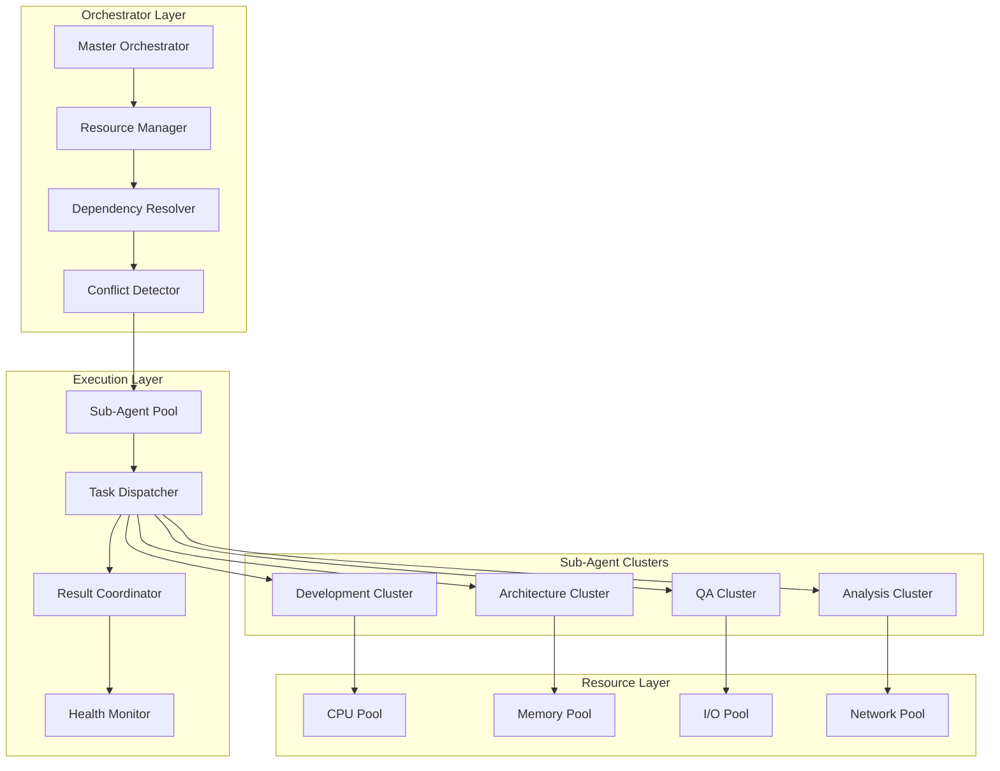

# Advanced Parallel Orchestration

This guide covers sophisticated parallel execution patterns, coordination strategies, and optimization techniques for maximum APM performance.

## Overview

Advanced parallel orchestration in APM v4.0.0 provides:
- **Native Sub-Agent Coordination** with 8-12x performance improvements
- **Intelligent Resource Management** with dynamic allocation
- **Advanced Dependency Resolution** for complex task graphs
- **Real-time Conflict Detection** and automatic resolution
- **Adaptive Load Balancing** based on performance metrics
- **Distributed Execution** across multiple environments

## Parallel Architecture Deep Dive

### Native Sub-Agent Architecture



### Advanced Execution Patterns

#### 1. Hierarchical Parallel Execution

```python
class HierarchicalOrchestrator:
    """Advanced hierarchical parallel execution coordinator"""
    
    def __init__(self, config):
        self.execution_tree = ExecutionTree()
        self.resource_manager = ResourceManager(config['resources'])
        self.dependency_graph = DependencyGraph()
        self.performance_monitor = PerformanceMonitor()
        
    def execute_hierarchical_workflow(self, workflow_definition):
        """Execute complex hierarchical workflows with optimal parallelization"""
        
        # Build execution tree
        execution_tree = self._build_execution_tree(workflow_definition)
        
        # Optimize execution plan
        optimized_plan = self._optimize_execution_plan(execution_tree)
        
        # Execute with dynamic coordination
        execution_result = self._execute_with_coordination(optimized_plan)
        
        return execution_result
        
    def _build_execution_tree(self, workflow_definition):
        """Build hierarchical execution tree from workflow"""
        
        tree_nodes = {}
        
        for level, tasks in enumerate(workflow_definition['levels']):
            level_nodes = []
            
            for task in tasks:
                node = ExecutionNode(
                    task_id=task['id'],
                    task_type=task['type'],
                    persona=task['persona'],
                    dependencies=task.get('dependencies', []),
                    parallel_groups=task.get('parallel_groups', []),
                    resource_requirements=task.get('resources', {}),
                    priority=task.get('priority', 'normal')
                )
                
                level_nodes.append(node)
                tree_nodes[task['id']] = node
                
            self.execution_tree.add_level(level, level_nodes)
            
        # Build dependency relationships
        for task_id, node in tree_nodes.items():
            for dep_id in node.dependencies:
                if dep_id in tree_nodes:
                    self.dependency_graph.add_dependency(node, tree_nodes[dep_id])
                    
        return self.execution_tree
        
    def _optimize_execution_plan(self, execution_tree):
        """Optimize execution plan for maximum parallelization"""
        
        optimization_strategies = [
            self._optimize_for_critical_path(),
            self._optimize_for_resource_utilization(),
            self._optimize_for_dependency_chains(),
            self._optimize_for_load_balancing()
        ]
        
        best_plan = None
        best_score = 0
        
        for strategy in optimization_strategies:
            candidate_plan = strategy(execution_tree)
            score = self._evaluate_execution_plan(candidate_plan)
            
            if score > best_score:
                best_score = score
                best_plan = candidate_plan
                
        return best_plan
        
    def _execute_with_coordination(self, execution_plan):
        """Execute plan with real-time coordination and adaptation"""
        
        execution_context = ExecutionContext(
            plan=execution_plan,
            resources=self.resource_manager.get_available_resources(),
            start_time=datetime.utcnow()
        )
        
        # Launch execution monitors
        monitors = [
            self._start_resource_monitor(execution_context),
            self._start_performance_monitor(execution_context),
            self._start_dependency_monitor(execution_context),
            self._start_conflict_monitor(execution_context)
        ]
        
        # Execute levels in parallel where possible
        results = {}
        for level in execution_plan.levels:
            level_results = self._execute_level_parallel(level, execution_context)
            results[level.id] = level_results
            
            # Update context with results
            execution_context.update_with_results(level_results)
            
        # Stop monitors
        for monitor in monitors:
            monitor.stop()
            
        return ExecutionResult(
            results=results,
            performance_metrics=self.performance_monitor.get_metrics(),
            resource_utilization=self.resource_manager.get_utilization_stats(),
            execution_time=datetime.utcnow() - execution_context.start_time
        )
```

#### 2. Dynamic Load Balancing

```python
class DynamicLoadBalancer:
    """Intelligent load balancing for parallel sub-agent execution"""
    
    def __init__(self):
        self.agent_pool = SubAgentPool()
        self.performance_tracker = PerformanceTracker()
        self.load_predictor = LoadPredictor()
        self.resource_monitor = ResourceMonitor()
        
    def balance_workload(self, task_queue, available_agents):
        """Dynamically balance workload across available sub-agents"""
        
        # Analyze current system state
        system_state = self._analyze_system_state(available_agents)
        
        # Predict load requirements
        load_predictions = self.load_predictor.predict_task_loads(task_queue)
        
        # Calculate optimal distribution
        distribution_plan = self._calculate_optimal_distribution(
            task_queue, available_agents, load_predictions, system_state
        )
        
        # Apply load balancing
        balanced_assignments = self._apply_load_balancing(distribution_plan)
        
        return balanced_assignments
        
    def _analyze_system_state(self, available_agents):
        """Analyze current system state for load balancing decisions"""
        
        system_metrics = {}
        
        for agent in available_agents:
            agent_metrics = {
                'cpu_usage': self.resource_monitor.get_cpu_usage(agent.id),
                'memory_usage': self.resource_monitor.get_memory_usage(agent.id),
                'current_tasks': len(agent.current_tasks),
                'average_response_time': self.performance_tracker.get_avg_response_time(agent.id),
                'success_rate': self.performance_tracker.get_success_rate(agent.id),
                'specialization_match': agent.specialization_score
            }
            
            # Calculate agent capacity score
            agent_metrics['capacity_score'] = self._calculate_capacity_score(agent_metrics)
            
            system_metrics[agent.id] = agent_metrics
            
        return system_metrics
        
    def _calculate_optimal_distribution(self, tasks, agents, predictions, system_state):
        """Calculate optimal task distribution using optimization algorithms"""
        
        # Define optimization problem
        optimization_problem = {
            'objective': 'minimize_total_execution_time',
            'constraints': [
                'respect_agent_capacity',
                'maintain_quality_standards',
                'honor_task_dependencies',
                'balance_resource_usage'
            ],
            'variables': {
                'task_assignments': self._create_assignment_variables(tasks, agents),
                'execution_order': self._create_ordering_variables(tasks),
                'resource_allocation': self._create_resource_variables(agents)
            }
        }
        
        # Solve optimization problem
        solution = self._solve_optimization_problem(optimization_problem)
        
        return solution
        
    def adaptive_rebalancing(self, current_assignments, performance_feedback):
        """Adaptively rebalance workload based on real-time feedback"""
        
        # Analyze performance deviations
        deviations = self._analyze_performance_deviations(
            current_assignments, performance_feedback
        )
        
        # Identify rebalancing opportunities
        rebalancing_opportunities = self._identify_rebalancing_opportunities(deviations)
        
        # Execute adaptive rebalancing
        if rebalancing_opportunities:
            rebalancing_actions = self._plan_rebalancing_actions(rebalancing_opportunities)
            self._execute_rebalancing(rebalancing_actions)
            
            return {
                'rebalanced': True,
                'actions_taken': rebalancing_actions,
                'expected_improvement': self._estimate_improvement(rebalancing_actions)
            }
        else:
            return {'rebalanced': False, 'reason': 'no_opportunities_found'}
```

#### 3. Intelligent Dependency Resolution

```python
class IntelligentDependencyResolver:
    """Advanced dependency resolution with conflict detection and optimization"""
    
    def __init__(self):
        self.dependency_analyzer = DependencyAnalyzer()
        self.conflict_detector = ConflictDetector()
        self.resolution_optimizer = ResolutionOptimizer()
        
    def resolve_complex_dependencies(self, task_graph, constraints):
        """Resolve complex task dependencies with optimization"""
        
        # Analyze dependency structure
        dependency_analysis = self.dependency_analyzer.analyze(task_graph)
        
        # Detect potential conflicts
        conflicts = self.conflict_detector.detect_all_conflicts(
            task_graph, dependency_analysis
        )
        
        # Generate resolution strategies
        resolution_strategies = self._generate_resolution_strategies(
            dependency_analysis, conflicts, constraints
        )
        
        # Optimize resolution plan
        optimal_resolution = self.resolution_optimizer.optimize(resolution_strategies)
        
        return optimal_resolution
        
    def _generate_resolution_strategies(self, analysis, conflicts, constraints):
        """Generate multiple strategies for dependency resolution"""
        
        strategies = []
        
        # Strategy 1: Critical Path Optimization
        critical_path_strategy = self._create_critical_path_strategy(
            analysis, constraints
        )
        strategies.append(critical_path_strategy)
        
        # Strategy 2: Resource-Constrained Optimization
        resource_strategy = self._create_resource_constrained_strategy(
            analysis, constraints
        )
        strategies.append(resource_strategy)
        
        # Strategy 3: Conflict Minimization
        conflict_strategy = self._create_conflict_minimization_strategy(
            analysis, conflicts, constraints
        )
        strategies.append(conflict_strategy)
        
        # Strategy 4: Parallel Maximization
        parallel_strategy = self._create_parallel_maximization_strategy(
            analysis, constraints
        )
        strategies.append(parallel_strategy)
        
        return strategies
        
    def real_time_dependency_monitoring(self, active_execution):
        """Monitor dependencies in real-time during execution"""
        
        monitoring_result = {
            'dependency_violations': [],
            'circular_dependencies': [],
            'orphaned_tasks': [],
            'resource_conflicts': [],
            'performance_bottlenecks': []
        }
        
        # Check for dependency violations
        violations = self._check_dependency_violations(active_execution)
        monitoring_result['dependency_violations'] = violations
        
        # Detect circular dependencies
        circular_deps = self._detect_circular_dependencies(active_execution.task_graph)
        monitoring_result['circular_dependencies'] = circular_deps
        
        # Find orphaned tasks
        orphaned = self._find_orphaned_tasks(active_execution)
        monitoring_result['orphaned_tasks'] = orphaned
        
        # Detect resource conflicts
        resource_conflicts = self._detect_resource_conflicts(active_execution)
        monitoring_result['resource_conflicts'] = resource_conflicts
        
        # Identify performance bottlenecks
        bottlenecks = self._identify_dependency_bottlenecks(active_execution)
        monitoring_result['performance_bottlenecks'] = bottlenecks
        
        return monitoring_result
        
    def auto_resolve_dependency_issues(self, monitoring_result, execution_context):
        """Automatically resolve dependency issues during execution"""
        
        resolution_actions = []
        
        # Resolve dependency violations
        for violation in monitoring_result['dependency_violations']:
            action = self._create_violation_resolution_action(violation, execution_context)
            resolution_actions.append(action)
            
        # Break circular dependencies
        for circular_dep in monitoring_result['circular_dependencies']:
            action = self._create_circular_dependency_resolution(circular_dep, execution_context)
            resolution_actions.append(action)
            
        # Handle orphaned tasks
        for orphaned_task in monitoring_result['orphaned_tasks']:
            action = self._create_orphaned_task_resolution(orphaned_task, execution_context)
            resolution_actions.append(action)
            
        # Resolve resource conflicts
        for conflict in monitoring_result['resource_conflicts']:
            action = self._create_resource_conflict_resolution(conflict, execution_context)
            resolution_actions.append(action)
            
        # Execute resolution actions
        execution_results = []
        for action in resolution_actions:
            result = self._execute_resolution_action(action, execution_context)
            execution_results.append(result)
            
        return {
            'actions_taken': resolution_actions,
            'results': execution_results,
            'success_rate': self._calculate_success_rate(execution_results)
        }
```

## Advanced Coordination Patterns

### 1. Master-Worker Pattern with Intelligence

```python
class IntelligentMasterWorkerCoordinator:
    """Enhanced master-worker pattern with AI-driven coordination"""
    
    def __init__(self, config):
        self.worker_pool = IntelligentWorkerPool(config['workers'])
        self.task_analyzer = TaskAnalyzer()
        self.workload_optimizer = WorkloadOptimizer()
        self.quality_monitor = QualityMonitor()
        
    def coordinate_intelligent_execution(self, complex_task, execution_parameters):
        """Coordinate execution with intelligent task decomposition and assignment"""
        
        # Analyze and decompose complex task
        task_decomposition = self.task_analyzer.decompose_task(
            complex_task, execution_parameters
        )
        
        # Optimize workload distribution
        workload_plan = self.workload_optimizer.create_optimal_plan(
            task_decomposition.subtasks,
            self.worker_pool.get_available_workers(),
            execution_parameters
        )
        
        # Execute with intelligent coordination
        execution_result = self._execute_with_intelligence(workload_plan)
        
        return execution_result
        
    def _execute_with_intelligence(self, workload_plan):
        """Execute workload plan with intelligent coordination"""
        
        coordinator = ExecutionCoordinator(
            plan=workload_plan,
            quality_threshold=0.95,
            performance_target=workload_plan.performance_target
        )
        
        # Start execution with monitoring
        execution_id = coordinator.start_execution()
        
        # Intelligent monitoring and adaptation
        while not coordinator.is_complete():
            # Monitor execution progress
            progress = coordinator.get_progress()
            
            # Check quality metrics
            quality_metrics = self.quality_monitor.assess_progress(progress)
            
            # Adapt execution if needed
            if quality_metrics['needs_adaptation']:
                adaptation_actions = self._plan_execution_adaptation(
                    progress, quality_metrics
                )
                coordinator.apply_adaptations(adaptation_actions)
                
            # Check for optimization opportunities
            optimization_opportunities = self._identify_optimization_opportunities(progress)
            if optimization_opportunities:
                coordinator.apply_optimizations(optimization_opportunities)
                
            # Brief pause before next monitoring cycle
            time.sleep(1)
            
        # Gather results
        final_results = coordinator.get_final_results()
        
        return final_results
```

### 2. Pipeline Pattern with Adaptive Stages

```python
class AdaptivePipelineCoordinator:
    """Adaptive pipeline execution with dynamic stage optimization"""
    
    def __init__(self):
        self.stage_optimizer = StageOptimizer()
        self.pipeline_analyzer = PipelineAnalyzer()
        self.performance_predictor = PerformancePredictor()
        
    def execute_adaptive_pipeline(self, pipeline_definition, input_data):
        """Execute pipeline with adaptive stage optimization"""
        
        # Analyze pipeline characteristics
        pipeline_analysis = self.pipeline_analyzer.analyze(
            pipeline_definition, input_data
        )
        
        # Optimize pipeline stages
        optimized_pipeline = self.stage_optimizer.optimize_pipeline(
            pipeline_definition, pipeline_analysis
        )
        
        # Execute with adaptive coordination
        pipeline_result = self._execute_adaptive_stages(
            optimized_pipeline, input_data
        )
        
        return pipeline_result
        
    def _execute_adaptive_stages(self, pipeline, input_data):
        """Execute pipeline stages with adaptive optimization"""
        
        execution_context = PipelineExecutionContext(
            pipeline=pipeline,
            input_data=input_data,
            start_time=datetime.utcnow()
        )
        
        stage_results = {}
        current_data = input_data
        
        for stage in pipeline.stages:
            # Predict stage performance
            performance_prediction = self.performance_predictor.predict_stage_performance(
                stage, current_data, execution_context
            )
            
            # Adapt stage configuration if needed
            if performance_prediction['needs_adaptation']:
                adapted_stage = self._adapt_stage_configuration(
                    stage, performance_prediction, execution_context
                )
            else:
                adapted_stage = stage
                
            # Execute stage with monitoring
            stage_result = self._execute_monitored_stage(
                adapted_stage, current_data, execution_context
            )
            
            # Update execution context
            execution_context.update_with_stage_result(stage_result)
            
            # Prepare data for next stage
            current_data = stage_result.output_data
            stage_results[stage.name] = stage_result
            
            # Learn from stage execution
            self._learn_from_stage_execution(stage, stage_result, execution_context)
            
        return PipelineResult(
            stage_results=stage_results,
            final_output=current_data,
            execution_metrics=execution_context.get_metrics(),
            performance_analysis=self._analyze_pipeline_performance(execution_context)
        )
```

### 3. Event-Driven Coordination

```python
class EventDrivenCoordinator:
    """Event-driven coordination for reactive parallel execution"""
    
    def __init__(self):
        self.event_bus = EventBus()
        self.event_handlers = {}
        self.coordination_rules = CoordinationRuleEngine()
        
    def setup_event_driven_coordination(self, coordination_config):
        """Setup event-driven coordination system"""
        
        # Register event handlers
        for event_type, handler_config in coordination_config['event_handlers'].items():
            handler = self._create_event_handler(event_type, handler_config)
            self.event_handlers[event_type] = handler
            self.event_bus.subscribe(event_type, handler)
            
        # Load coordination rules
        self.coordination_rules.load_rules(coordination_config['rules'])
        
        # Setup event routing
        self._setup_event_routing(coordination_config['routing'])
        
    def handle_coordination_event(self, event):
        """Handle coordination events with intelligent routing"""
        
        # Analyze event context
        event_context = self._analyze_event_context(event)
        
        # Apply coordination rules
        applicable_rules = self.coordination_rules.find_applicable_rules(event, event_context)
        
        # Execute coordination actions
        coordination_actions = []
        for rule in applicable_rules:
            actions = rule.generate_actions(event, event_context)
            coordination_actions.extend(actions)
            
        # Execute actions in optimal order
        execution_plan = self._optimize_action_execution_order(coordination_actions)
        results = self._execute_coordination_actions(execution_plan)
        
        return CoordinationResult(
            event=event,
            rules_applied=applicable_rules,
            actions_taken=coordination_actions,
            results=results
        )
        
    def create_reactive_workflow(self, workflow_definition):
        """Create reactive workflow that responds to events"""
        
        reactive_workflow = ReactiveWorkflow(
            definition=workflow_definition,
            event_bus=self.event_bus,
            coordinator=self
        )
        
        # Setup event triggers
        for trigger in workflow_definition['triggers']:
            self.event_bus.subscribe(
                trigger['event_type'],
                lambda event: reactive_workflow.handle_trigger(event, trigger)
            )
            
        # Setup completion handlers
        for completion_handler in workflow_definition['completion_handlers']:
            self.event_bus.subscribe(
                'workflow_completed',
                lambda event: self._handle_workflow_completion(event, completion_handler)
            )
            
        return reactive_workflow
```

## Performance Optimization

### 1. Resource Pool Management

```python
class AdvancedResourcePoolManager:
    """Advanced resource pool management for optimal performance"""
    
    def __init__(self, config):
        self.cpu_pool = CPUResourcePool(config['cpu'])
        self.memory_pool = MemoryResourcePool(config['memory'])
        self.io_pool = IOResourcePool(config['io'])
        self.network_pool = NetworkResourcePool(config['network'])
        
    def optimize_resource_allocation(self, execution_plan):
        """Optimize resource allocation for execution plan"""
        
        # Analyze resource requirements
        resource_analysis = self._analyze_resource_requirements(execution_plan)
        
        # Predict resource utilization
        utilization_predictions = self._predict_resource_utilization(
            execution_plan, resource_analysis
        )
        
        # Optimize allocation strategy
        allocation_strategy = self._optimize_allocation_strategy(
            resource_analysis, utilization_predictions
        )
        
        # Apply resource allocation
        allocation_result = self._apply_resource_allocation(allocation_strategy)
        
        return allocation_result
        
    def dynamic_resource_scaling(self, current_execution, performance_metrics):
        """Dynamically scale resources based on performance"""
        
        # Analyze current resource usage
        usage_analysis = self._analyze_current_usage(current_execution)
        
        # Identify scaling opportunities
        scaling_opportunities = self._identify_scaling_opportunities(
            usage_analysis, performance_metrics
        )
        
        # Plan scaling actions
        scaling_plan = self._plan_scaling_actions(scaling_opportunities)
        
        # Execute scaling
        scaling_results = []
        for scaling_action in scaling_plan:
            result = self._execute_scaling_action(scaling_action)
            scaling_results.append(result)
            
        return ScalingResult(
            actions=scaling_plan,
            results=scaling_results,
            impact_analysis=self._analyze_scaling_impact(scaling_results)
        )
        
    def predictive_resource_provisioning(self, future_workload_forecast):
        """Predictively provision resources based on forecasted workload"""
        
        # Analyze workload patterns
        workload_patterns = self._analyze_workload_patterns(future_workload_forecast)
        
        # Predict resource needs
        resource_predictions = {}
        resource_predictions['cpu'] = self._predict_cpu_needs(workload_patterns)
        resource_predictions['memory'] = self._predict_memory_needs(workload_patterns)
        resource_predictions['io'] = self._predict_io_needs(workload_patterns)
        resource_predictions['network'] = self._predict_network_needs(workload_patterns)
        
        # Plan provisioning actions
        provisioning_plan = self._create_provisioning_plan(resource_predictions)
        
        # Execute provisioning
        provisioning_result = self._execute_provisioning_plan(provisioning_plan)
        
        return provisioning_result
```

### 2. Performance Monitoring and Adaptation

```python
class PerformanceAdaptationEngine:
    """Real-time performance monitoring and automatic adaptation"""
    
    def __init__(self):
        self.metrics_collector = MetricsCollector()
        self.performance_analyzer = PerformanceAnalyzer()
        self.adaptation_planner = AdaptationPlanner()
        
    def monitor_and_adapt(self, parallel_execution):
        """Monitor performance and adapt execution in real-time"""
        
        monitoring_session = MonitoringSession(
            execution=parallel_execution,
            metrics_interval=1.0,  # Collect metrics every second
            adaptation_threshold=0.8  # Adapt when performance drops below 80%
        )
        
        while not parallel_execution.is_complete():
            # Collect performance metrics
            current_metrics = self.metrics_collector.collect_real_time_metrics(
                parallel_execution
            )
            
            # Analyze performance
            performance_analysis = self.performance_analyzer.analyze(
                current_metrics, monitoring_session.baseline_metrics
            )
            
            # Check if adaptation is needed
            if performance_analysis['performance_score'] < monitoring_session.adaptation_threshold:
                # Plan adaptation actions
                adaptation_plan = self.adaptation_planner.plan_adaptations(
                    performance_analysis, parallel_execution.current_state
                )
                
                # Execute adaptations
                adaptation_results = self._execute_adaptations(
                    adaptation_plan, parallel_execution
                )
                
                # Update monitoring session
                monitoring_session.record_adaptation(adaptation_results)
                
            # Brief pause before next monitoring cycle
            time.sleep(monitoring_session.metrics_interval)
            
        return monitoring_session.get_final_report()
        
    def _execute_adaptations(self, adaptation_plan, execution):
        """Execute performance adaptation actions"""
        
        adaptation_results = []
        
        for adaptation in adaptation_plan.adaptations:
            try:
                if adaptation.type == 'resource_reallocation':
                    result = self._execute_resource_reallocation(adaptation, execution)
                elif adaptation.type == 'task_redistribution':
                    result = self._execute_task_redistribution(adaptation, execution)
                elif adaptation.type == 'priority_adjustment':
                    result = self._execute_priority_adjustment(adaptation, execution)
                elif adaptation.type == 'parallelism_adjustment':
                    result = self._execute_parallelism_adjustment(adaptation, execution)
                else:
                    result = AdaptationResult(
                        success=False,
                        error=f"Unknown adaptation type: {adaptation.type}"
                    )
                    
                adaptation_results.append(result)
                
            except Exception as e:
                error_result = AdaptationResult(
                    success=False,
                    error=str(e),
                    adaptation=adaptation
                )
                adaptation_results.append(error_result)
                
        return adaptation_results
```

## Configuration and Tuning

### Advanced Configuration

```yaml
# Advanced parallel orchestration configuration
parallel_orchestration:
  execution_engine:
    type: "native_sub_agents"
    max_concurrent_agents: 16
    agent_spawn_strategy: "demand_based"
    resource_allocation_strategy: "dynamic"
    
  coordination_patterns:
    default_pattern: "intelligent_master_worker"
    fallback_pattern: "simple_parallel"
    adaptive_switching: true
    
  performance_optimization:
    enable_predictive_scaling: true
    enable_adaptive_load_balancing: true
    enable_intelligent_caching: true
    enable_resource_pooling: true
    
  dependency_resolution:
    strategy: "intelligent_optimization"
    conflict_detection: "real_time"
    circular_dependency_prevention: true
    auto_resolution: true
    
  monitoring:
    metrics_collection_interval: 1.0
    performance_threshold: 0.8
    adaptation_enabled: true
    alert_thresholds:
      critical: 0.5
      warning: 0.7
      
  resource_management:
    cpu_allocation:
      strategy: "dynamic"
      max_utilization: 85
      scaling_factor: 1.5
      
    memory_allocation:
      strategy: "predictive"
      max_utilization: 80
      gc_optimization: true
      
    io_optimization:
      buffer_size: 64kb
      concurrent_operations: 8
      compression: true
      
  quality_assurance:
    quality_gates_enabled: true
    minimum_quality_score: 0.9
    automatic_retry: true
    max_retry_attempts: 3
```

### Performance Tuning Guidelines

```python
class PerformanceTuningAdvisor:
    """Advisor for performance tuning of parallel orchestration"""
    
    def __init__(self):
        self.performance_database = PerformanceDatabase()
        self.tuning_analyzer = TuningAnalyzer()
        
    def analyze_performance_profile(self, execution_history):
        """Analyze execution history to provide tuning recommendations"""
        
        # Analyze historical performance data
        performance_profile = self.performance_database.analyze_history(execution_history)
        
        # Identify performance bottlenecks
        bottlenecks = self._identify_bottlenecks(performance_profile)
        
        # Generate tuning recommendations
        recommendations = self._generate_tuning_recommendations(
            performance_profile, bottlenecks
        )
        
        # Prioritize recommendations by impact
        prioritized_recommendations = self._prioritize_recommendations(recommendations)
        
        return TuningReport(
            performance_profile=performance_profile,
            bottlenecks=bottlenecks,
            recommendations=prioritized_recommendations,
            estimated_improvements=self._estimate_improvements(prioritized_recommendations)
        )
        
    def _generate_tuning_recommendations(self, profile, bottlenecks):
        """Generate specific tuning recommendations"""
        
        recommendations = []
        
        # CPU optimization recommendations
        if 'cpu_bottleneck' in bottlenecks:
            cpu_recommendations = self._generate_cpu_recommendations(profile['cpu_metrics'])
            recommendations.extend(cpu_recommendations)
            
        # Memory optimization recommendations
        if 'memory_bottleneck' in bottlenecks:
            memory_recommendations = self._generate_memory_recommendations(profile['memory_metrics'])
            recommendations.extend(memory_recommendations)
            
        # I/O optimization recommendations
        if 'io_bottleneck' in bottlenecks:
            io_recommendations = self._generate_io_recommendations(profile['io_metrics'])
            recommendations.extend(io_recommendations)
            
        # Coordination optimization recommendations
        if 'coordination_bottleneck' in bottlenecks:
            coordination_recommendations = self._generate_coordination_recommendations(
                profile['coordination_metrics']
            )
            recommendations.extend(coordination_recommendations)
            
        return recommendations
```

## Best Practices

### 1. Design Principles

- **Loose Coupling**: Design sub-agents with minimal dependencies
- **High Cohesion**: Group related functionality within single agents
- **Fault Tolerance**: Implement graceful degradation and recovery
- **Resource Efficiency**: Optimize resource usage across all agents
- **Observability**: Include comprehensive monitoring and logging

### 2. Performance Guidelines

- **Optimal Parallelism**: Use 1.5-2x CPU cores for CPU-intensive tasks
- **Memory Management**: Implement memory pooling and garbage collection optimization
- **I/O Optimization**: Use asynchronous I/O and connection pooling
- **Network Efficiency**: Batch operations and compress data when possible
- **Caching Strategy**: Implement multi-level caching for frequently accessed data

### 3. Monitoring and Debugging

```python
# Example monitoring configuration
monitoring_config = {
    'metrics': [
        'execution_time',
        'resource_utilization', 
        'task_throughput',
        'error_rates',
        'quality_scores'
    ],
    'alerts': [
        {
            'condition': 'execution_time > baseline * 1.5',
            'action': 'trigger_performance_analysis'
        },
        {
            'condition': 'error_rate > 0.05',
            'action': 'initiate_debug_session'
        }
    ],
    'dashboards': [
        'real_time_performance',
        'resource_utilization',
        'quality_metrics'
    ]
}
```

---

**Next Steps**: Review [Debugging Agents](debugging-agents.md) for comprehensive monitoring and troubleshooting capabilities.