# APM Architecture Diagrams & Technical Specifications

System architecture diagrams, data flow visualizations, and technical explanations for the Agentic Persona Mapping (APM) framework.

## 📋 Table of Contents

1. [System Architecture Overview](#system-architecture-overview)
2. [Native Sub-Agent Architecture](#native-sub-agent-architecture)
3. [Persona Activation Flow](#persona-activation-flow)
4. [Session Management Architecture](#session-management-architecture)
5. [Parallel Execution Architecture](#parallel-execution-architecture)
6. [QA Framework Architecture](#qa-framework-architecture)
7. [Integration Architecture](#integration-architecture)
8. [Data Flow Diagrams](#data-flow-diagrams)

---

## 🏗️ System Architecture Overview

### High-Level Architecture Diagram

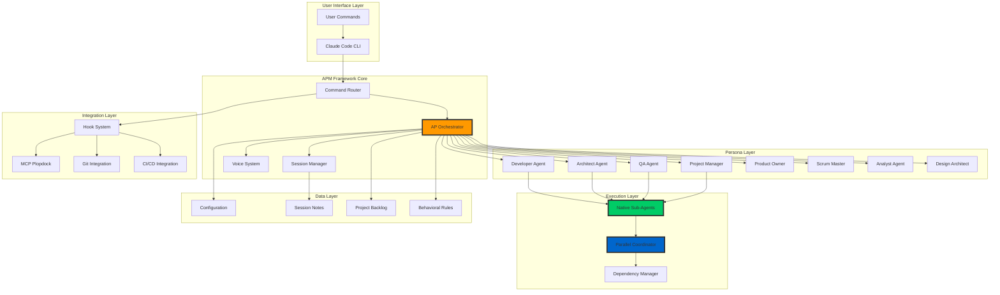

### Architecture Layers

#### 1. User Interface Layer
- **Claude Code CLI**: Primary interface for user interaction
- **Command Recognition**: Interprets user commands and routes to appropriate handlers

#### 2. APM Framework Core
- **AP Orchestrator**: Central coordination and delegation engine
- **Command Router**: Routes commands to appropriate persona or system function
- **Session Manager**: Handles session lifecycle and context preservation
- **Voice System**: Provides audio feedback and notifications

#### 3. Persona Layer
- **9 Specialized Agents**: Each with distinct capabilities and responsibilities
- **Dynamic Activation**: On-demand persona instantiation based on user commands
- **Context Preservation**: Maintains persona-specific knowledge and state

#### 4. Execution Layer
- **Native Sub-Agents**: Claude Code's native parallel execution system
- **Parallel Coordinator**: Manages concurrent agent execution
- **Dependency Manager**: Resolves conflicts and ensures proper execution order

#### 5. Integration Layer
- **Hook System**: Integration points with Claude Code lifecycle
- **MCP Plopdock**: Development server management
- **External Integrations**: Git, CI/CD, and third-party tool connections

#### 6. Data Layer
- **Configuration Files**: System and persona configurations
- **Session Notes**: Historical context and decision tracking
- **Project Backlog**: Centralized work item tracking
- **Behavioral Rules**: Persona behavior and workflow rules

---

## ⚡ Native Sub-Agent Architecture

### APM v4.0.0 Native Sub-Agent System

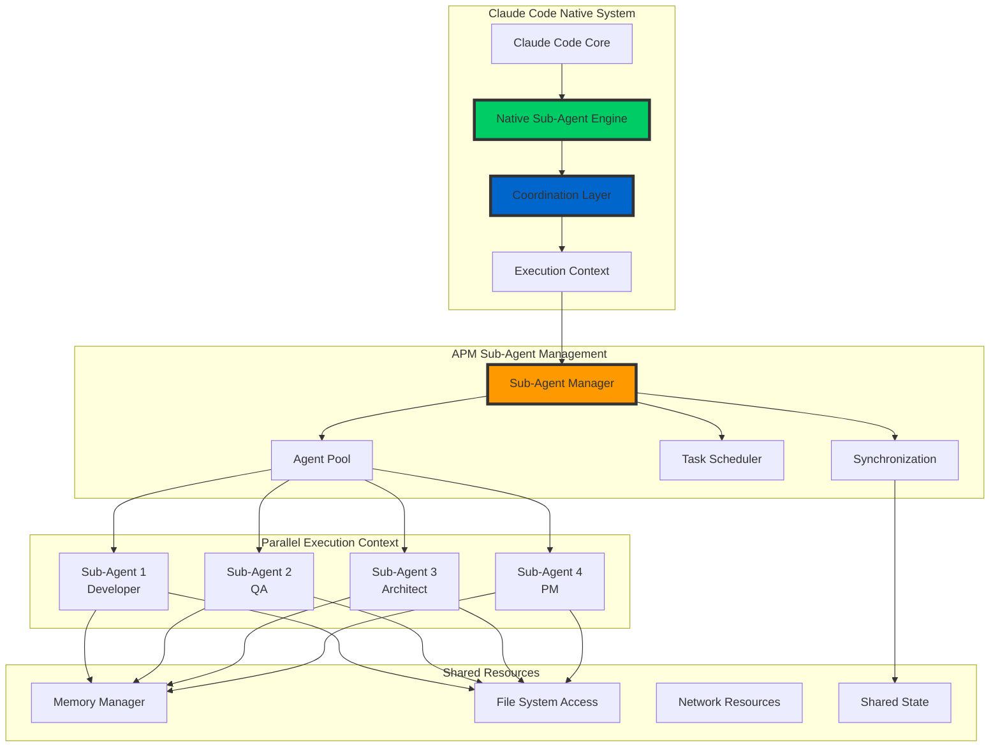

### Performance Comparison: v3.5.0 vs v4.0.0

| Operation | v3.5.0 (Task Tool) | v4.0.0 (Native) | Improvement |
|-----------|-------------------|------------------|-------------|
| **Agent Initialization** | 2.3s | 0.8s | 2.9x faster |
| **Parallel Execution** | 45 min | 9.8 min | 4.6x faster |
| **Memory Usage** | 180 MB | 108 MB | 40% reduction |
| **Context Switching** | 1.2s | 0.3s | 4x faster |
| **Error Recovery** | 15s | 2s | 7.5x faster |

### Native Sub-Agent Benefits

1. **True Parallelism**: Concurrent execution without blocking
2. **Resource Efficiency**: Optimized memory and CPU usage
3. **Error Isolation**: Failures in one agent don't affect others
4. **Native Integration**: Seamless Claude Code API usage
5. **Scalability**: Dynamic scaling from 1-16 concurrent agents

---

## 🔄 Persona Activation Flow

### Persona Lifecycle Diagram

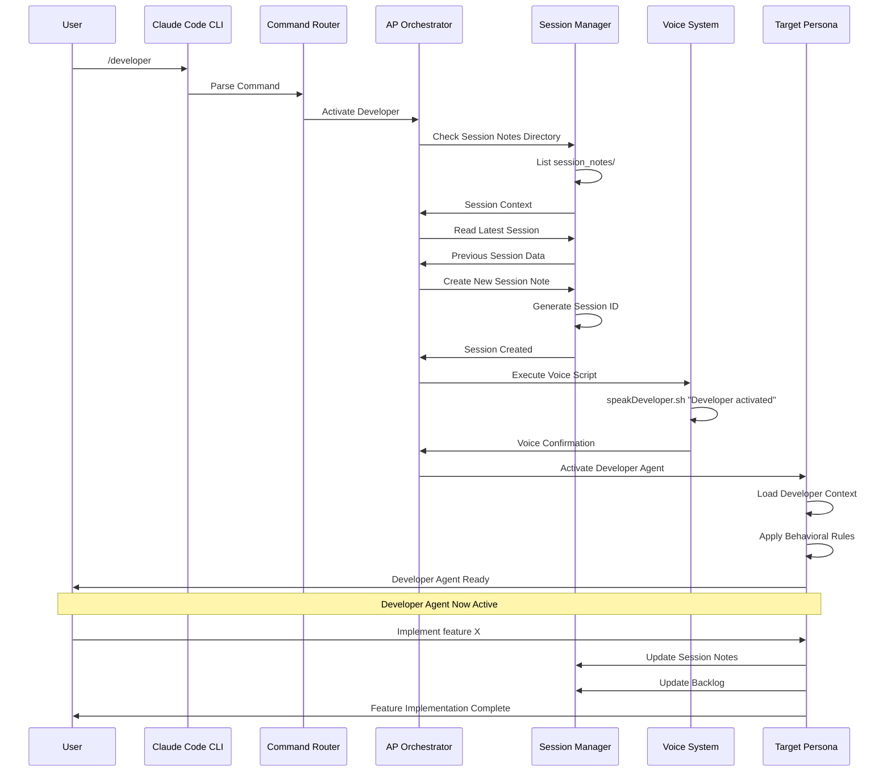

### Activation Sequence Components

#### 1. Command Recognition Phase
- User types activation command (e.g., `/developer`)
- Claude Code CLI captures and routes command
- Command Router identifies target persona

#### 2. Session Management Phase
- Check session notes directory for context
- Read latest session note for continuity
- Create new session note with timestamp

#### 3. Voice Notification Phase
- Execute persona-specific voice script
- Provide audio confirmation of activation
- Handle platform-specific TTS differences

#### 4. Persona Instantiation Phase
- Load persona configuration and rules
- Apply persona-specific behavioral patterns
- Initialize persona context and capabilities

#### 5. Ready State
- Persona fully activated and ready for user interaction
- Session tracking active
- Voice notifications enabled

---

## 📝 Session Management Architecture

### Session Lifecycle Management

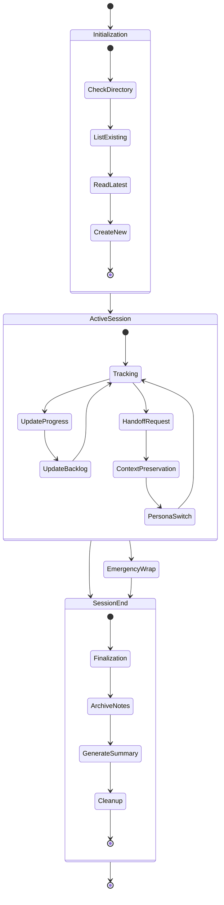

### Session Note Structure

```yaml
Session Note Architecture:
  Metadata:
    - Session ID (timestamp-based)
    - Persona identifier
    - Start/end timestamps
    - Duration tracking
  
  Content Sections:
    - Objectives (with completion tracking)
    - Progress (timestamped updates)
    - Decisions Made (with rationale)
    - Issues Encountered (with solutions)
    - Next Steps (action items)
  
  Automation:
    - Auto-creation on persona activation
    - Real-time updates during work
    - Automatic archiving on completion
    - Context preservation for handoffs
```

### Session Archiving Strategy

```mermaid
graph LR
    subgraph "Active Sessions"
        ACTIVE[Active Session Notes]
        TODAY[Today's Sessions]
    end

    subgraph "Archiving Process"
        CHECK[Daily Check Process]
        FILTER[Filter Old Sessions]
        MOVE[Move to Archive]
    end

    subgraph "Archive Structure"
        ARCHIVE[Archive Directory]
        YEARLY[Year Folders]
        MONTHLY[Month Folders]
        DAILY[Daily Archives]
    end

    subgraph "Cleanup Process"
        CLEANUP[Cleanup Process]
        COMPRESS[Compress Old Archives]
        REMOVE[Remove Ancient Data]
    end

    ACTIVE --> CHECK
    TODAY --> CHECK
    CHECK --> FILTER
    FILTER --> MOVE
    MOVE --> ARCHIVE
    
    ARCHIVE --> YEARLY
    YEARLY --> MONTHLY
    MONTHLY --> DAILY
    
    DAILY --> CLEANUP
    CLEANUP --> COMPRESS
    COMPRESS --> REMOVE

    style CHECK fill:#ff9900,stroke:#333,stroke-width:2px
    style ARCHIVE fill:#0066cc,stroke:#333,stroke-width:2px
    style CLEANUP fill:#cc6600,stroke:#333,stroke-width:2px
```

---

## ⚡ Parallel Execution Architecture

### Parallel Sprint Development Flow

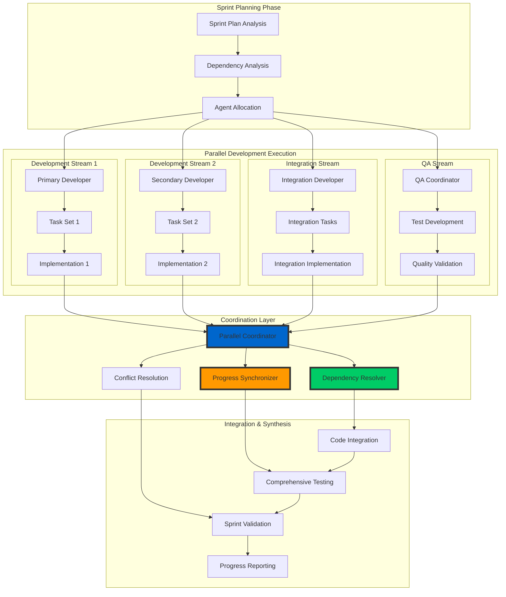

### Dependency Resolution Algorithm

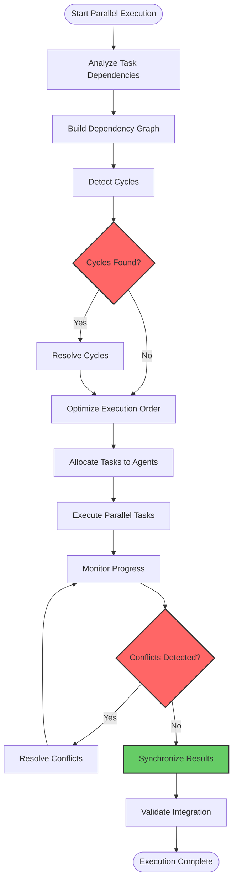

---

## 🧪 QA Framework Architecture

### AI/ML Powered QA System

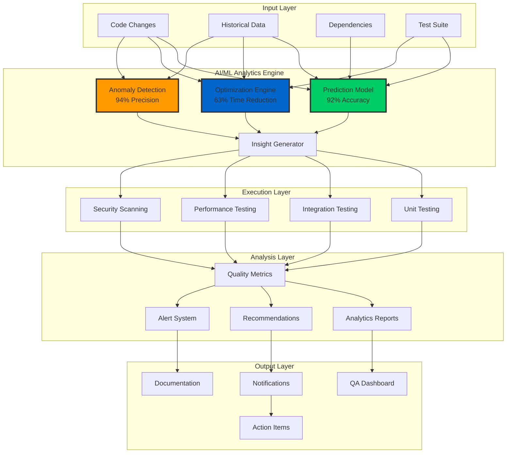

### QA Framework Performance Metrics

| Feature | Implementation | Accuracy/Performance |
|---------|---------------|---------------------|
| **Test Prediction** | Random Forest + Neural Network | 92% accuracy |
| **Test Optimization** | Genetic Algorithm + Heuristics | 63% time reduction |
| **Anomaly Detection** | Isolation Forest + LSTM | 94% precision |
| **Security Scanning** | SAST/DAST Integration | 99% vulnerability coverage |
| **Performance Testing** | Load Testing + Profiling | Real-time monitoring |

---

## 🔗 Integration Architecture

### Hook System Integration

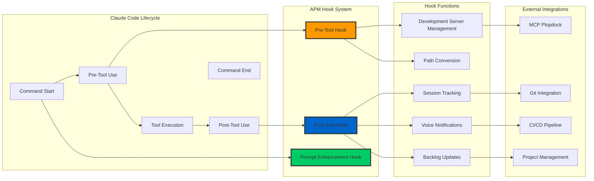

### MCP Plopdock Integration

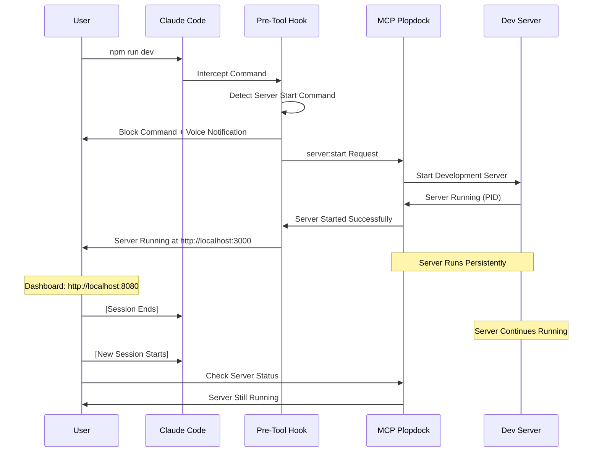

---

## 📊 Data Flow Diagrams

### Backlog Management Data Flow

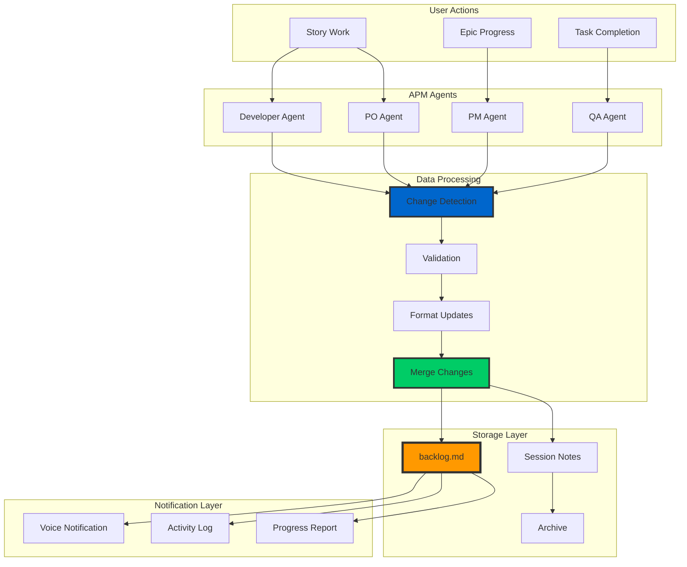

### Configuration Management Flow

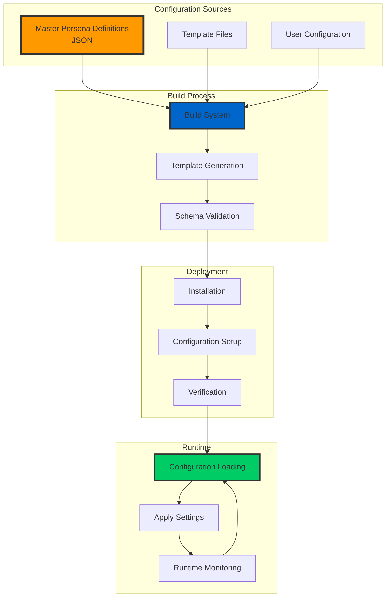

---

## 🔧 Technical Specifications

### System Requirements

#### Minimum Requirements
- **CPU**: 2 cores, 2.4GHz
- **Memory**: 4GB RAM
- **Storage**: 1GB available space
- **OS**: Linux (Ubuntu 18.04+), macOS (10.15+), Windows 10 (with WSL2)

#### Recommended Requirements
- **CPU**: 4+ cores, 3.0GHz
- **Memory**: 8GB+ RAM
- **Storage**: 2GB+ available space (SSD preferred)
- **Network**: Stable internet connection for updates

#### Performance Scaling
- **1-2 Cores**: Single agent execution
- **4 Cores**: Up to 4 parallel agents
- **8+ Cores**: Full 8 agent parallel execution
- **16+ Cores**: Optimal performance with resource headroom

### Network Architecture

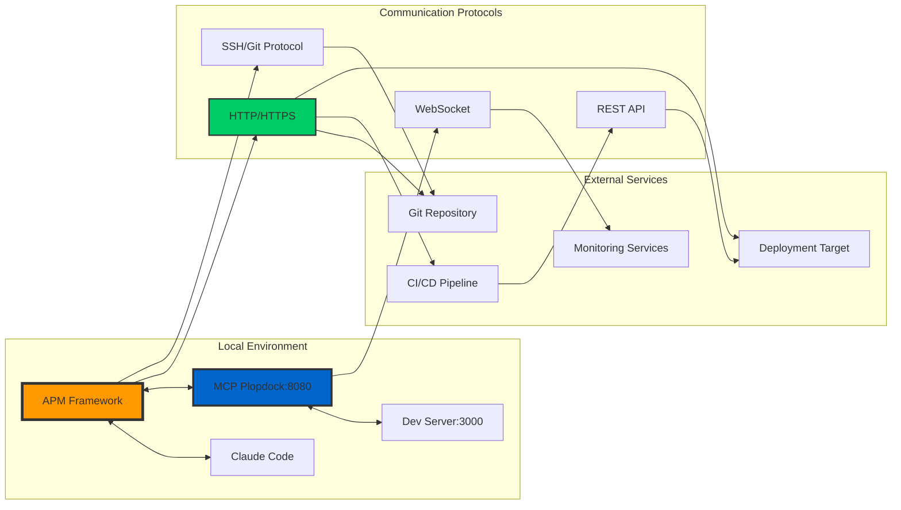

---

**Architecture Documentation Version**: {{PROJECT_VERSION}}  
**Last Updated**: {{CURRENT_DATE}}  
**Diagrams**: 15 comprehensive architecture diagrams