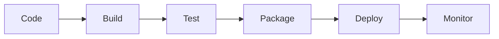

# APM Development Commands
## Implementation, Coding, and Technical Execution

The Development commands provide comprehensive tools for code implementation, technical architecture, and software construction within the APM framework.

---

## 🏗️ `/architecture`
### System Architecture Design

**Purpose**: Design comprehensive system architecture with technical specifications and implementation patterns.

**What it does**:
1. Creates architecture documentation
2. Defines system components
3. Specifies integration patterns
4. Documents technology choices
5. Establishes design patterns

**Options**:
- `--style=microservices|monolithic|serverless|hybrid` - Architecture style
- `--depth=high-level|detailed|implementation` - Detail level
- `--diagrams=true|false` - Include architecture diagrams
- `--patterns="patterns_list"` - Specific patterns to use

**Parallel Version Available**:
- `/parallel-architecture` - Design system 4.0x faster with parallel component design

**Suggested Use Cases**:
- System design
- Technical planning
- Architecture reviews
- Technology selection
- Pattern documentation

**Example Usage**:
```bash
# Microservices architecture
/architecture --style=microservices

# Detailed serverless design
/architecture --style=serverless --depth=detailed

# Hybrid with diagrams
/architecture --style=hybrid --diagrams=true
```

**Output**:
- Architecture document
- Component specifications
- Integration patterns
- Technology stack
- Design diagrams

---

## 🎨 `/frontend-architecture`
### Frontend and UI Architecture

**Purpose**: Design frontend architecture including component structure, state management, and UI patterns.

**What it does**:
1. Defines component hierarchy
2. Specifies state management
3. Documents UI patterns
4. Establishes styling architecture
5. Plans performance optimization

**Options**:
- `--framework=react|vue|angular|next` - Frontend framework
- `--state=redux|context|zustand|mobx` - State management
- `--styling=css-modules|styled|tailwind` - Styling approach
- `--ssr=true|false` - Server-side rendering

**Parallel Version Available**:
- `/parallel-frontend-architecture` - Design frontend 3.7x faster

**Suggested Use Cases**:
- Frontend planning
- Component design
- State architecture
- Performance planning
- UI/UX implementation

**Example Usage**:
```bash
# React with Redux
/frontend-architecture --framework=react --state=redux

# Next.js with SSR
/frontend-architecture --framework=next --ssr=true

# Vue with Tailwind
/frontend-architecture --framework=vue --styling=tailwind
```

**Output**:
- Frontend architecture doc
- Component structure
- State flow diagrams
- Styling guidelines
- Performance strategy

---

## 🤖 `/automation-plan`
### Test and Process Automation Strategy

**Purpose**: Create comprehensive automation plans for testing, deployment, and operational processes.

**What it does**:
1. Defines automation scope
2. Selects automation tools
3. Creates implementation roadmap
4. Specifies CI/CD integration
5. Establishes success metrics

**Options**:
- `--scope=testing|deployment|monitoring|all` - Automation scope
- `--tools="jest,cypress,jenkins"` - Tool selection
- `--timeline=sprint|quarter|year` - Implementation timeline
- `--roi=true|false` - Include ROI analysis

**Parallel Version Available**:
- `/parallel-automation-plan` - Plan automation 3.7x faster

**Suggested Use Cases**:
- Test automation planning
- CI/CD setup
- DevOps implementation
- Process optimization
- Tool selection

**Example Usage**:
```bash
# Complete automation plan
/automation-plan --scope=all

# Testing automation with ROI
/automation-plan --scope=testing --roi=true

# Quarterly deployment automation
/automation-plan --scope=deployment --timeline=quarter
```

**Output**:
- Automation strategy
- Tool recommendations
- Implementation roadmap
- Integration plan
- Success metrics

---

## 🧠 `/ai-prompt`
### AI Integration and Prompt Engineering

**Purpose**: Design and implement AI/ML integrations with optimized prompts and workflows.

**What it does**:
1. Creates AI integration strategies
2. Designs optimized prompts
3. Implements AI workflows
4. Defines evaluation criteria
5. Establishes safety guidelines

**Options**:
- `--model=gpt4|claude|llama|custom` - AI model selection
- `--use-case=generation|analysis|automation` - Primary use case
- `--safety=basic|standard|strict` - Safety level
- `--evaluation=true|false` - Include evaluation framework

**Parallel Version Available**:
- `/parallel-ai-prompt` - Generate AI prompts 4.5x faster

**Suggested Use Cases**:
- AI feature development
- Prompt optimization
- Chatbot implementation
- Content generation
- Automated analysis

**Example Usage**:
```bash
# GPT-4 integration
/ai-prompt --model=gpt4 --use-case=generation

# Claude with strict safety
/ai-prompt --model=claude --safety=strict

# Custom model with evaluation
/ai-prompt --model=custom --evaluation=true
```

**Output**:
- AI integration plan
- Optimized prompts
- Workflow definitions
- Safety guidelines
- Evaluation metrics

---

## 🔄 `/git-commit-all`
### Version Control and Git Management

**Purpose**: Manage Git commits with comprehensive change documentation and conventional commit standards.

**What it does**:
1. Stages all changes
2. Creates descriptive commit messages
3. Follows commit conventions
4. Updates change logs
5. Manages branch operations

**Options**:
- `--type=feat|fix|docs|refactor|test` - Commit type
- `--scope="component"` - Change scope
- `--breaking=true|false` - Breaking change flag
- `--push=true|false` - Auto-push to remote

**Suggested Use Cases**:
- Code commits
- Feature completion
- Bug fixes
- Documentation updates
- Release preparation

**Example Usage**:
```bash
# Feature commit
/git-commit-all --type=feat --scope="auth"

# Bug fix with push
/git-commit-all --type=fix --push=true

# Breaking change
/git-commit-all --type=feat --breaking=true
```

**Output**:
- Commit confirmation
- Change summary
- Branch status
- Remote sync status
- Commit hash

---

## 📦 `/buildit`
### Build and Distribution Package Creation

**Purpose**: Build distribution packages with all necessary components and documentation.

**What it does**:
1. Compiles source code
2. Bundles dependencies
3. Generates documentation
4. Creates distribution archive
5. Validates package integrity

**Options**:
- `--target=dev|staging|prod` - Build target
- `--optimize=true|false` - Production optimization
- `--docs=true|false` - Include documentation
- `--version="x.y.z"` - Version number

**Suggested Use Cases**:
- Release builds
- Distribution creation
- Package validation
- Deployment preparation
- Archive generation

**Example Usage**:
```bash
# Production build
/buildit --target=prod --optimize=true

# Development build with docs
/buildit --target=dev --docs=true

# Versioned release
/buildit --version="2.0.0" --target=prod
```

**Output**:
- Distribution package
- Build report
- Package manifest
- Validation results
- Archive location

---

## 🏷️ `/version`
### Version Management and Tagging

**Purpose**: Manage software versions, create tags, and maintain version consistency.

**What it does**:
1. Updates version numbers
2. Creates Git tags
3. Updates package files
4. Generates changelogs
5. Manages version history

**Options**:
- `--bump=major|minor|patch|custom` - Version bump type
- `--tag=true|false` - Create Git tag
- `--changelog=true|false` - Update changelog
- `--dry-run=true|false` - Preview changes

**Suggested Use Cases**:
- Release versioning
- Semantic versioning
- Tag management
- Changelog generation
- Version tracking

**Example Usage**:
```bash
# Minor version bump
/version --bump=minor

# Major release with tag
/version --bump=major --tag=true

# Custom version dry run
/version --bump=custom --dry-run=true
```

**Output**:
- New version number
- Updated files list
- Git tag created
- Changelog entry
- Version history

---

## 📝 `/update-all-documentation`
### Comprehensive Documentation Updates

**Purpose**: Update all project documentation to reflect current code state and features.

**What it does**:
1. Scans codebase for changes
2. Updates API documentation
3. Refreshes README files
4. Synchronizes examples
5. Validates documentation links

**Options**:
- `--scope=api|guides|readme|all` - Update scope
- `--format=markdown|html|both` - Output format
- `--validate=true|false` - Validate links
- `--auto-commit=true|false` - Auto-commit changes

**Suggested Use Cases**:
- Release documentation
- API updates
- README maintenance
- Documentation sync
- Link validation

**Example Usage**:
```bash
# Update all documentation
/update-all-documentation

# API docs only with validation
/update-all-documentation --scope=api --validate=true

# README update with commit
/update-all-documentation --scope=readme --auto-commit=true
```

**Output**:
- Updated documentation
- Change summary
- Validation report
- Commit status
- Documentation index

---

## 🔧 Development Workflow Integration

### Code Generation Features
Development commands support various code generation patterns:
- **Boilerplate Generation**: Component templates
- **Scaffold Creation**: Project structure
- **Pattern Implementation**: Design patterns
- **Test Generation**: Unit and integration tests
- **Documentation Generation**: Code comments and docs

### Development Environment Support
- **IDE Integration**: VSCode, IntelliJ, Vim configurations
- **Debugging Setup**: Debugger configurations
- **Linting Rules**: ESLint, Prettier, language-specific
- **Pre-commit Hooks**: Quality gates
- **Environment Variables**: Configuration management

### Build and Deployment Pipeline


---

## 📊 Development Metrics

### Code Quality Metrics
| Metric | Target | Tool | Command Integration |
|--------|--------|------|-------------------|
| Coverage | >80% | Jest/Pytest | `/automation-plan` |
| Complexity | <10 | SonarQube | `/architecture` |
| Duplication | <3% | CPD | `/update-all-documentation` |
| Tech Debt | <5% | SonarQube | `/version` |

### Performance Benchmarks
| Operation | Sequential | Parallel | Improvement |
|-----------|------------|----------|-------------|
| Architecture Design | 60 min | 15 min | 4.0x |
| Frontend Design | 45 min | 12 min | 3.7x |
| Automation Planning | 40 min | 11 min | 3.7x |
| AI Integration | 30 min | 7 min | 4.5x |

---

## 💡 Best Practices

### Architecture Phase
1. Start with `/architecture` for system design
2. Use `/frontend-architecture` for UI planning
3. Plan with `/automation-plan` early
4. Consider `/ai-prompt` for intelligent features

### Implementation Phase
1. Regular `/git-commit-all` for version control
2. Use conventional commit messages
3. Maintain documentation with `/update-all-documentation`
4. Version properly with `/version`

### Build Phase
1. Use `/buildit` for consistent builds
2. Validate packages before distribution
3. Include documentation in builds
4. Tag releases with `/version --tag=true`

### Quality Assurance
1. Implement automation from `/automation-plan`
2. Maintain architecture documentation
3. Regular documentation updates
4. Version control discipline

---

## 🚀 Advanced Development Patterns

### Microservices Development
```bash
# Design microservices architecture
/architecture --style=microservices --patterns="saga,cqrs"

# Plan service automation
/automation-plan --scope=deployment --tools="kubernetes,helm"

# Build service packages
/buildit --target=prod --optimize=true
```

### Frontend Application
```bash
# Design frontend architecture
/frontend-architecture --framework=react --ssr=true

# Plan test automation
/automation-plan --scope=testing --tools="jest,cypress"

# Update documentation
/update-all-documentation --scope=all
```

### AI-Enhanced Features
```bash
# Design AI integration
/ai-prompt --model=gpt4 --safety=strict

# Architecture for AI services
/architecture --style=serverless

# Automation for AI pipelines
/automation-plan --scope=all
```

---

## 🚨 Troubleshooting

### Build Issues
```bash
# Clean build
/buildit --target=dev --optimize=false

# Validate architecture
/architecture --diagrams=true

# Check dependencies
/update-all-documentation --validate=true
```

### Version Conflicts
```bash
# Dry run version bump
/version --bump=patch --dry-run=true

# Fix commit history
/git-commit-all --type=fix

# Rebuild with new version
/buildit --version="fixed"
```

### Documentation Sync
```bash
# Force documentation update
/update-all-documentation --scope=all --validate=true

# Regenerate API docs
/update-all-documentation --scope=api --format=both

# Commit documentation
/git-commit-all --type=docs --scope="documentation"
```

---

## 🔗 Related Commands

- **Planning**: `/prd`, `/epic`, `/stories`
- **Testing**: `/qa`, `/test-plan`, `/automation-plan`
- **Project Management**: `/release`, `/prioritization`
- **Documentation**: `/doc-sharding`, `/library-indexing`
- **Parallel Execution**: All commands have parallel variants

---

*APM Development Commands - v4.0.0*
*Comprehensive Implementation and Technical Tools*
*Native Sub-Agent Architecture*