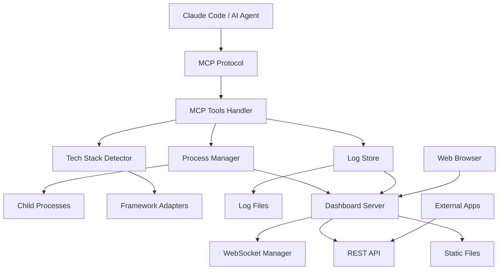
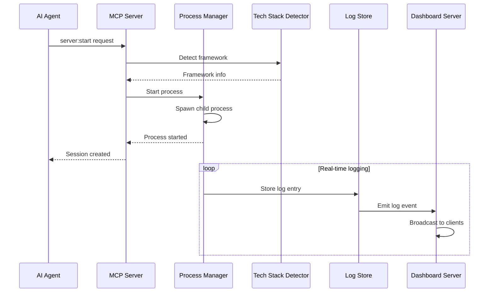

# Developer Guide

Welcome to the MCP Debug Host Server Developer Guide! This comprehensive resource is designed for developers who want to extend, customize, or contribute to the MCP Debug Host Server.

## 🎯 What You'll Learn

This guide covers:
- **🏗️ Architecture Overview** - Understand the system design
- **🔧 Extension Development** - Create custom adapters and plugins
- **🤝 Contributing Guidelines** - Join the development community
- **🧪 Testing & Debugging** - Ensure quality and reliability
- **📦 Building & Deployment** - Package and distribute your changes

## 🚀 Quick Start for Developers

### Development Environment Setup

```bash
# Clone the repository
git clone https://github.com/your-org/agentic-persona-mapping.git
cd agentic-persona-mapping/installer/mcp-host

# Install dependencies
npm install --include=dev

# Set up development environment
cp .env.example .env.development
npm run setup:dev

# Start in development mode
npm run dev
```

### Project Structure

```
mcp-host/
├── src/                          # Source code
│   ├── index.js                 # Main MCP server entry point
│   ├── process-manager.js       # Process lifecycle management
│   ├── log-store.js            # Log storage and retrieval
│   ├── mcp-tools.js            # MCP tool definitions
│   ├── tech-stack-detector.js  # Framework detection
│   ├── config-manager.js       # Configuration handling
│   ├── adapters/               # Framework adapters
│   │   ├── base-adapter.js     # Base adapter class
│   │   ├── node-adapter.js     # Node.js projects
│   │   ├── php-adapter.js      # PHP projects
│   │   └── python-adapter.js   # Python projects
│   └── dashboard/              # Web dashboard
│       ├── server.js           # Express server
│       ├── websocket-manager.js # WebSocket handling
│       └── public/             # Frontend assets
├── tests/                       # Test suites
├── docs/                       # Documentation
├── templates/                  # Service templates
└── package.json               # Dependencies and scripts
```

## 🏗️ Architecture Overview

### System Components



### Core Architecture Principles

**1. Modular Design**
- Each component has a single responsibility
- Clean interfaces between modules
- Easy to test and maintain independently

**2. Plugin Architecture** 
- Framework detection via adapter pattern
- Easy to add new framework support
- Extensible without core changes

**3. Event-Driven Communication**
- Loose coupling between components
- Real-time updates via events
- Scalable message passing

**4. Robust Error Handling**
- Graceful degradation on failures
- Comprehensive error reporting
- Recovery mechanisms

### Data Flow



## 🔧 Extension Development

### Creating Custom Framework Adapters

Framework adapters detect and configure specific technologies. Here's how to create one:

#### 1. Basic Adapter Structure

```javascript
// src/adapters/my-framework-adapter.js
const BaseAdapter = require('./base-adapter');

class MyFrameworkAdapter extends BaseAdapter {
  constructor() {
    super();
    this.name = 'My Framework';
    this.priority = 50; // Higher = checked first
  }

  /**
   * Determine if this adapter can handle the project
   * @param {string} projectPath - Absolute path to project
   * @returns {boolean} - True if this adapter can handle the project
   */
  canHandle(projectPath) {
    // Check for framework-specific files
    return this.fileExists(projectPath, 'my-framework.config.js') ||
           this.hasPackageDependency(projectPath, 'my-framework');
  }

  /**
   * Detect framework details and configuration
   * @param {string} projectPath - Absolute path to project
   * @returns {Object} - Detection result
   */
  detect(projectPath) {
    const packageJson = this.readPackageJson(projectPath);
    const version = this.getPackageVersion(projectPath, 'my-framework');

    return {
      framework: 'my-framework',
      version: version,
      startCommand: this.detectStartCommand(projectPath),
      buildCommand: 'npm run build',
      testCommand: 'npm test',
      defaultPort: 4000,
      env: {
        NODE_ENV: 'development',
        MY_FRAMEWORK_ENV: 'dev'
      },
      configFiles: this.findConfigFiles(projectPath),
      confidence: this.calculateConfidence(projectPath)
    };
  }

  /**
   * Detect the appropriate start command
   * @param {string} projectPath - Absolute path to project
   * @returns {string} - Start command
   */
  detectStartCommand(projectPath) {
    const packageJson = this.readPackageJson(projectPath);
    
    if (packageJson?.scripts?.dev) {
      return 'npm run dev';
    } else if (packageJson?.scripts?.start) {
      return 'npm start';
    } else {
      return 'my-framework serve';
    }
  }

  /**
   * Find framework-specific configuration files
   * @param {string} projectPath - Absolute path to project
   * @returns {string[]} - Array of config file paths
   */
  findConfigFiles(projectPath) {
    const possibleConfigs = [
      'my-framework.config.js',
      'my-framework.config.json',
      '.my-frameworkrc'
    ];

    return possibleConfigs.filter(config => 
      this.fileExists(projectPath, config)
    );
  }

  /**
   * Calculate confidence score for detection
   * @param {string} projectPath - Absolute path to project
   * @returns {number} - Confidence score (0-1)
   */
  calculateConfidence(projectPath) {
    let confidence = 0;

    if (this.fileExists(projectPath, 'my-framework.config.js')) confidence += 0.4;
    if (this.hasPackageDependency(projectPath, 'my-framework')) confidence += 0.3;
    if (this.hasPackageScript(projectPath, 'dev')) confidence += 0.2;
    if (this.directoryExists(projectPath, 'src')) confidence += 0.1;

    return Math.min(confidence, 1.0);
  }
}

module.exports = MyFrameworkAdapter;
```

#### 2. Register Your Adapter

```javascript
// src/tech-stack-detector.js
const MyFrameworkAdapter = require('./adapters/my-framework-adapter');

class TechStackDetector {
  constructor() {
    this.adapters = [
      new MyFrameworkAdapter(),
      // ... other adapters
    ];
  }
  // ... rest of class
}
```

#### 3. Test Your Adapter

```javascript
// tests/adapters/my-framework-adapter.test.js
const MyFrameworkAdapter = require('../../src/adapters/my-framework-adapter');
const path = require('path');
const fs = require('fs');

describe('MyFrameworkAdapter', () => {
  let adapter;
  let testProjectPath;

  beforeEach(() => {
    adapter = new MyFrameworkAdapter();
    testProjectPath = path.join(__dirname, '../fixtures/my-framework-project');
  });

  describe('canHandle', () => {
    it('should detect my-framework projects', () => {
      expect(adapter.canHandle(testProjectPath)).toBe(true);
    });

    it('should reject non-my-framework projects', () => {
      const reactProject = path.join(__dirname, '../fixtures/react-project');
      expect(adapter.canHandle(reactProject)).toBe(false);
    });
  });

  describe('detect', () => {
    it('should return correct framework details', () => {
      const result = adapter.detect(testProjectPath);
      
      expect(result.framework).toBe('my-framework');
      expect(result.startCommand).toBe('npm run dev');
      expect(result.defaultPort).toBe(4000);
      expect(result.confidence).toBeGreaterThan(0.5);
    });
  });
});
```

### Creating Custom MCP Tools

Add new functionality by creating custom MCP tools:

#### 1. Define the Tool

```javascript
// src/tools/my-custom-tool.js
class MyCustomTool {
  constructor(processManager, logStore) {
    this.processManager = processManager;
    this.logStore = logStore;
  }

  get name() {
    return 'custom:action';
  }

  get description() {
    return 'Performs a custom action on development servers';
  }

  get inputSchema() {
    return {
      type: 'object',
      properties: {
        sessionId: {
          type: 'string',
          description: 'Session ID to act upon'
        },
        action: {
          type: 'string',
          enum: ['analyze', 'optimize', 'report'],
          description: 'Action to perform'
        },
        options: {
          type: 'object',
          description: 'Additional options'
        }
      },
      required: ['sessionId', 'action']
    };
  }

  async execute(params) {
    const { sessionId, action, options = {} } = params;

    // Validate session exists
    const session = this.processManager.getSession(sessionId);
    if (!session) {
      throw new Error(`Session ${sessionId} not found`);
    }

    switch (action) {
      case 'analyze':
        return await this.analyzeSession(session);
      case 'optimize':
        return await this.optimizeSession(session, options);
      case 'report':
        return await this.generateReport(session);
      default:
        throw new Error(`Unknown action: ${action}`);
    }
  }

  async analyzeSession(session) {
    // Get recent logs
    const logs = await this.logStore.getLogs(session.id, { tail: 1000 });
    
    // Analyze for patterns
    const analysis = {
      errors: logs.filter(log => log.level === 'error').length,
      warnings: logs.filter(log => log.level === 'warn').length,
      performance: this.analyzePerformance(logs),
      recommendations: this.generateRecommendations(logs)
    };

    return {
      success: true,
      data: {
        sessionId: session.id,
        analysis: analysis,
        timestamp: new Date().toISOString()
      }
    };
  }

  analyzePerformance(logs) {
    // Extract performance metrics from logs
    const buildTimes = logs
      .filter(log => log.message.includes('webpack compiled'))
      .map(log => this.extractBuildTime(log.message))
      .filter(time => time !== null);

    return {
      averageBuildTime: buildTimes.reduce((a, b) => a + b, 0) / buildTimes.length || 0,
      buildCount: buildTimes.length,
      slowBuilds: buildTimes.filter(time => time > 5000).length
    };
  }

  generateRecommendations(logs) {
    const recommendations = [];
    
    // Check for common issues
    if (logs.some(log => log.message.includes('Source map'))) {
      recommendations.push({
        type: 'performance',
        message: 'Consider disabling source maps in production',
        priority: 'medium'
      });
    }

    if (logs.filter(log => log.level === 'error').length > 10) {
      recommendations.push({
        type: 'reliability',
        message: 'High error rate detected - review error logs',
        priority: 'high'
      });
    }

    return recommendations;
  }
}

module.exports = MyCustomTool;
```

#### 2. Register the Tool

```javascript
// src/mcp-tools.js
const MyCustomTool = require('./tools/my-custom-tool');

class MCPToolsHandler {
  constructor(processManager, logStore, techStackDetector) {
    this.processManager = processManager;
    this.logStore = logStore;
    this.techStackDetector = techStackDetector;
    
    // Register tools
    this.tools = new Map();
    this.registerDefaultTools();
    this.registerCustomTools();
  }

  registerCustomTools() {
    const customTool = new MyCustomTool(this.processManager, this.logStore);
    this.tools.set(customTool.name, customTool);
  }
  
  // ... rest of class
}
```

### Creating Dashboard Plugins

Extend the web dashboard with custom functionality:

#### 1. Backend Plugin API

```javascript
// src/dashboard/plugins/my-plugin.js
class MyDashboardPlugin {
  constructor(app, io, processManager) {
    this.app = app; // Express app
    this.io = io;   // Socket.io instance
    this.processManager = processManager;
    
    this.setupRoutes();
    this.setupSocketHandlers();
  }

  setupRoutes() {
    // Add custom REST endpoints
    this.app.get('/api/my-plugin/stats', (req, res) => {
      const stats = this.generateStats();
      res.json({ success: true, data: stats });
    });

    this.app.post('/api/my-plugin/action', (req, res) => {
      const result = this.performAction(req.body);
      res.json(result);
    });
  }

  setupSocketHandlers() {
    // Handle custom WebSocket events
    this.io.on('connection', (socket) => {
      socket.on('my-plugin:request', (data) => {
        const response = this.handleRequest(data);
        socket.emit('my-plugin:response', response);
      });
    });
  }

  generateStats() {
    const sessions = this.processManager.getAllSessions();
    return {
      totalSessions: sessions.length,
      customMetric: this.calculateCustomMetric(sessions),
      timestamp: new Date().toISOString()
    };
  }
}

module.exports = MyDashboardPlugin;
```

#### 2. Frontend Plugin

```javascript
// src/dashboard/public/plugins/my-plugin.js
class MyPlugin {
  constructor(dashboard) {
    this.dashboard = dashboard;
    this.socket = dashboard.socket;
    
    this.init();
  }

  init() {
    this.createUI();
    this.setupEventHandlers();
  }

  createUI() {
    // Add plugin UI to dashboard
    const pluginContainer = document.createElement('div');
    pluginContainer.id = 'my-plugin';
    pluginContainer.innerHTML = `
      <div class="plugin-card">
        <h3>My Plugin</h3>
        <div id="plugin-stats">Loading...</div>
        <button id="plugin-action">Perform Action</button>
      </div>
    `;
    
    document.querySelector('.plugins-container').appendChild(pluginContainer);
  }

  setupEventHandlers() {
    // Button click handler
    document.getElementById('plugin-action').addEventListener('click', () => {
      this.performAction();
    });

    // Socket event handlers
    this.socket.on('my-plugin:response', (data) => {
      this.updateUI(data);
    });

    // Auto-refresh stats
    setInterval(() => {
      this.refreshStats();
    }, 5000);
  }

  async refreshStats() {
    try {
      const response = await fetch('/api/my-plugin/stats');
      const data = await response.json();
      
      if (data.success) {
        document.getElementById('plugin-stats').innerHTML = `
          <p>Total Sessions: ${data.data.totalSessions}</p>
          <p>Custom Metric: ${data.data.customMetric}</p>
        `;
      }
    } catch (error) {
      console.error('Failed to refresh stats:', error);
    }
  }

  performAction() {
    this.socket.emit('my-plugin:request', {
      action: 'perform_action',
      timestamp: Date.now()
    });
  }
}

// Auto-register plugin when dashboard loads
document.addEventListener('DOMContentLoaded', () => {
  if (window.dashboard) {
    new MyPlugin(window.dashboard);
  }
});
```

## 🤝 Contributing Guidelines

### Getting Started with Contributions

1. **Fork the Repository**
   ```bash
   git fork https://github.com/your-org/agentic-persona-mapping.git
   cd agentic-persona-mapping
   ```

2. **Set Up Development Environment**
   ```bash
   cd installer/mcp-host
   npm install --include=dev
   cp .env.example .env.development
   ```

3. **Create Feature Branch**
   ```bash
   git checkout -b feature/my-awesome-feature
   ```

4. **Make Your Changes**
   - Follow coding standards (see below)
   - Add tests for new functionality
   - Update documentation as needed

5. **Test Your Changes**
   ```bash
   npm test
   npm run lint
   npm run coverage
   ```

6. **Submit Pull Request**
   - Clear description of changes
   - Reference related issues
   - Include test results

### Coding Standards

#### JavaScript Style Guide

We follow a modified Airbnb style guide:

```javascript
// Use const/let, not var
const config = require('./config');
let sessionCount = 0;

// Use arrow functions for callbacks
sessions.map(session => session.id);

// Use template literals
const message = `Session ${session.id} started on port ${session.port}`;

// Use async/await over promises
async function startSession(config) {
  try {
    const process = await processManager.start(config);
    return process;
  } catch (error) {
    logger.error('Failed to start session', error);
    throw error;
  }
}

// Destructure when appropriate
const { sessionId, port, framework } = request.body;

// Use meaningful variable names
const isSessionRunning = session.status === 'running';
const maxConcurrentSessions = config.limits.sessions;
```

#### Documentation Standards

**JSDoc Comments:**
```javascript
/**
 * Starts a new development server session
 * @param {Object} config - Session configuration
 * @param {string} config.cwd - Working directory
 * @param {number} [config.port] - Port number (auto-assigned if not specified)
 * @param {string} [config.framework] - Framework override
 * @returns {Promise<Object>} Session information
 * @throws {Error} When session fails to start
 * @example
 * const session = await startSession({
 *   cwd: '/path/to/project',
 *   port: 3000,
 *   framework: 'react'
 * });
 */
async function startSession(config) {
  // Implementation
}
```

**README Updates:**
- Update relevant documentation
- Add examples for new features
- Include migration notes for breaking changes

#### Git Commit Messages

Follow conventional commits:

```bash
# Feature additions
feat: add support for Rust projects
feat(adapter): implement Go framework detection

# Bug fixes
fix: resolve WebSocket connection issues
fix(dashboard): correct log filtering logic

# Documentation
docs: update API reference for new tools
docs(readme): add installation troubleshooting

# Tests
test: add unit tests for process manager
test(integration): add full workflow tests

# Refactoring
refactor: simplify tech stack detection logic
refactor(dashboard): extract WebSocket handling

# Performance improvements
perf: optimize log storage and retrieval
perf(dashboard): reduce memory usage in UI
```

### Code Review Process

#### Review Checklist

**Functionality:**
- [ ] Code works as intended
- [ ] Handles edge cases appropriately
- [ ] Error handling is comprehensive
- [ ] Performance is acceptable

**Code Quality:**
- [ ] Follows coding standards
- [ ] Is well-documented
- [ ] Has appropriate test coverage
- [ ] No code duplication

**Security:**
- [ ] No security vulnerabilities
- [ ] Input validation is present
- [ ] No sensitive data exposure
- [ ] Authentication/authorization correct

**Compatibility:**
- [ ] Works across supported platforms
- [ ] Maintains backward compatibility
- [ ] Database migrations included (if needed)
- [ ] API changes are documented

#### Review Guidelines

**For Reviewers:**
- Be constructive and specific in feedback
- Focus on code quality, not personal preferences
- Ask questions to understand the approach
- Suggest improvements with examples

**For Contributors:**
- Respond to feedback promptly
- Ask for clarification when needed
- Make requested changes in separate commits
- Update PR description as changes are made

### Issue Reporting

#### Bug Reports

Use this template for bug reports:

```markdown
## Bug Description
Brief description of what's wrong

## Steps to Reproduce
1. Go to...
2. Click on...
3. See error...

## Expected Behavior
What should happen

## Actual Behavior
What actually happens

## Environment
- OS: [e.g. Ubuntu 20.04]
- Node.js: [e.g. 18.16.0]
- MCP Debug Host: [e.g. 1.2.3]
- Browser: [e.g. Chrome 91] (if dashboard issue)

## Additional Context
Screenshots, logs, etc.
```

#### Feature Requests

Use this template for feature requests:

```markdown
## Feature Description
Clear description of the proposed feature

## Use Case
Why is this feature needed? What problem does it solve?

## Proposed Solution
How should this feature work?

## Alternatives Considered
Other approaches you've thought about

## Additional Context
Mockups, examples, etc.
```

## 🧪 Testing & Debugging

### Test Structure

```
tests/
├── unit/                       # Unit tests
│   ├── process-manager.test.js
│   ├── log-store.test.js
│   └── adapters/
├── integration/                # Integration tests
│   ├── mcp-tools.test.js
│   └── dashboard-api.test.js
├── e2e/                       # End-to-end tests
│   └── complete-workflow.test.js
├── fixtures/                  # Test data
│   ├── react-project/
│   ├── django-project/
│   └── sample-logs.json
└── helpers/                   # Test utilities
    └── test-server.js
```

### Running Tests

```bash
# Run all tests
npm test

# Run specific test suite
npm run test:unit
npm run test:integration
npm run test:e2e

# Run tests with coverage
npm run test:coverage

# Run tests in watch mode
npm run test:watch

# Run specific test file
npm test -- --grep "ProcessManager"
```

### Writing Tests

#### Unit Test Example

```javascript
// tests/unit/process-manager.test.js
const ProcessManager = require('../../src/process-manager');
const EventEmitter = require('events');

describe('ProcessManager', () => {
  let processManager;
  let mockLogStore;

  beforeEach(() => {
    mockLogStore = {
      addLog: jest.fn(),
      getLogs: jest.fn()
    };
    processManager = new ProcessManager(mockLogStore);
  });

  afterEach(async () => {
    await processManager.stopAllSessions();
  });

  describe('startSession', () => {
    it('should start a new session successfully', async () => {
      const config = {
        cwd: '/path/to/project',
        command: 'echo "Hello World"',
        port: 3000
      };

      const session = await processManager.startSession(config);

      expect(session).toHaveProperty('id');
      expect(session).toHaveProperty('pid');
      expect(session.status).toBe('running');
      expect(session.port).toBe(3000);
    });

    it('should auto-assign port when not specified', async () => {
      const config = {
        cwd: '/path/to/project',
        command: 'echo "Hello World"'
      };

      const session = await processManager.startSession(config);

      expect(session.port).toBeGreaterThan(0);
      expect(session.port).toBeLessThan(65536);
    });

    it('should throw error for invalid working directory', async () => {
      const config = {
        cwd: '/nonexistent/path',
        command: 'echo "Hello World"'
      };

      await expect(processManager.startSession(config))
        .rejects.toThrow('Working directory does not exist');
    });
  });

  describe('stopSession', () => {
    it('should stop a running session gracefully', async () => {
      const session = await processManager.startSession({
        cwd: process.cwd(),
        command: 'sleep 10'
      });

      const result = await processManager.stopSession(session.id);

      expect(result.success).toBe(true);
      expect(result.graceful).toBe(true);
    });

    it('should force kill unresponsive processes', async () => {
      const session = await processManager.startSession({
        cwd: process.cwd(),
        command: 'sleep 10'
      });

      const result = await processManager.stopSession(session.id, { 
        force: true,
        timeout: 1000 
      });

      expect(result.success).toBe(true);
    });
  });
});
```

#### Integration Test Example

```javascript
// tests/integration/mcp-tools.test.js
const MCPToolsHandler = require('../../src/mcp-tools');
const ProcessManager = require('../../src/process-manager');
const LogStore = require('../../src/log-store');
const TechStackDetector = require('../../src/tech-stack-detector');

describe('MCP Tools Integration', () => {
  let mcpTools;
  let processManager;
  let logStore;
  let testProjectPath;

  beforeAll(async () => {
    testProjectPath = path.join(__dirname, '../fixtures/react-project');
    logStore = new LogStore();
    processManager = new ProcessManager(logStore);
    const techStackDetector = new TechStackDetector();
    mcpTools = new MCPToolsHandler(processManager, logStore, techStackDetector);
  });

  afterAll(async () => {
    await processManager.stopAllSessions();
    await logStore.close();
  });

  describe('server workflow', () => {
    it('should complete full session lifecycle', async () => {
      // 1. Detect framework
      const detection = await mcpTools.callTool('framework:detect', {
        projectPath: testProjectPath
      });
      expect(detection.success).toBe(true);
      expect(detection.data.framework).toBe('react');

      // 2. Start server
      const startResult = await mcpTools.callTool('server:start', {
        cwd: testProjectPath,
        framework: detection.data.framework,
        port: 3001
      });
      expect(startResult.success).toBe(true);
      const sessionId = startResult.data.sessionId;

      // 3. Check status
      const statusResult = await mcpTools.callTool('server:status', {
        sessionId: sessionId
      });
      expect(statusResult.success).toBe(true);
      expect(statusResult.data.status).toBe('running');

      // 4. Get logs
      await new Promise(resolve => setTimeout(resolve, 2000)); // Wait for logs
      const logsResult = await mcpTools.callTool('server:logs', {
        sessionId: sessionId,
        tail: 10
      });
      expect(logsResult.success).toBe(true);
      expect(logsResult.data.logs.length).toBeGreaterThan(0);

      // 5. Stop server
      const stopResult = await mcpTools.callTool('server:stop', {
        sessionId: sessionId
      });
      expect(stopResult.success).toBe(true);
    });
  });
});
```

### Debugging Techniques

#### Development Debugging

```javascript
// Use debug module for structured logging
const debug = require('debug')('mcp-debug-host:process-manager');

class ProcessManager {
  startSession(config) {
    debug('Starting session with config: %O', config);
    
    // ... implementation
    
    debug('Session started with ID: %s, PID: %d', session.id, session.pid);
    return session;
  }
}

// Enable debugging output
// DEBUG=mcp-debug-host:* npm run dev
```

#### Production Debugging

```javascript
// Use structured logging for production
const winston = require('winston');

const logger = winston.createLogger({
  level: process.env.LOG_LEVEL || 'info',
  format: winston.format.combine(
    winston.format.timestamp(),
    winston.format.errors({ stack: true }),
    winston.format.json()
  ),
  transports: [
    new winston.transports.File({ filename: 'error.log', level: 'error' }),
    new winston.transports.File({ filename: 'combined.log' })
  ]
});

// Add correlation IDs for request tracking
logger.child({ sessionId: 'abc-123' }).info('Session started');
```

#### Debugging Dashboard Issues

```javascript
// Browser debugging
console.group('Dashboard Debug');
console.log('WebSocket state:', ws.readyState);
console.log('Active sessions:', sessions);
console.log('Last update:', lastUpdate);
console.groupEnd();

// Performance monitoring
console.time('Session list update');
updateSessionList();
console.timeEnd('Session list update');

// Memory usage tracking
console.log('Memory usage:', {
  used: process.memoryUsage(),
  heap: v8.getHeapStatistics()
});
```

### Performance Testing

#### Load Testing

```javascript
// tests/performance/load-test.js
const { Worker, isMainThread, parentPort, workerData } = require('worker_threads');

if (isMainThread) {
  // Main thread - orchestrate load test
  async function runLoadTest() {
    const workers = [];
    const numWorkers = 10;
    const sessionsPerWorker = 5;

    for (let i = 0; i < numWorkers; i++) {
      const worker = new Worker(__filename, {
        workerData: { workerId: i, sessionsPerWorker }
      });
      workers.push(worker);
    }

    // Wait for all workers to complete
    await Promise.all(workers.map(worker => 
      new Promise(resolve => worker.on('message', resolve))
    ));

    console.log('Load test completed');
  }

  runLoadTest();
} else {
  // Worker thread - simulate load
  const MCPToolsHandler = require('../../src/mcp-tools');
  
  async function simulateLoad() {
    const { workerId, sessionsPerWorker } = workerData;
    const mcpTools = new MCPToolsHandler(/* ... */);

    const sessions = [];
    const startTime = Date.now();

    // Start multiple sessions
    for (let i = 0; i < sessionsPerWorker; i++) {
      const session = await mcpTools.callTool('server:start', {
        cwd: '/path/to/test/project',
        port: 3000 + (workerId * 100) + i
      });
      sessions.push(session.data.sessionId);
    }

    // Simulate activity
    await new Promise(resolve => setTimeout(resolve, 10000));

    // Stop all sessions
    for (const sessionId of sessions) {
      await mcpTools.callTool('server:stop', { sessionId });
    }

    const duration = Date.now() - startTime;
    parentPort.postMessage({ workerId, duration, sessions: sessions.length });
  }

  simulateLoad();
}
```

#### Memory Leak Detection

```javascript
// tests/performance/memory-leak-test.js
const v8 = require('v8');
const ProcessManager = require('../../src/process-manager');

describe('Memory Leak Detection', () => {
  it('should not leak memory during session lifecycle', async () => {
    const processManager = new ProcessManager();
    
    // Get baseline memory usage
    const baseline = process.memoryUsage().heapUsed;
    
    // Run many session lifecycles
    for (let i = 0; i < 100; i++) {
      const session = await processManager.startSession({
        cwd: process.cwd(),
        command: 'echo "test"'
      });
      
      await new Promise(resolve => setTimeout(resolve, 100));
      
      await processManager.stopSession(session.id);
    }
    
    // Force garbage collection
    if (global.gc) {
      global.gc();
    }
    
    // Check memory usage
    const current = process.memoryUsage().heapUsed;
    const growth = current - baseline;
    const growthMB = growth / 1024 / 1024;
    
    // Should not grow by more than 50MB
    expect(growthMB).toBeLessThan(50);
  });
});
```

---

**👨‍💻 Developer Guide Complete!** You now have comprehensive knowledge to extend, customize, and contribute to the MCP Debug Host Server.

**Next Steps:**
- 🎓 [Training Materials](../training/README.md) - Learn best practices
- 🔧 [API Reference](../api/README.md) - Detailed API documentation
- 🌟 [Best Practices](../training/best-practices.md) - Optimization techniques